Compliance and filing management is the final phase of your STaaS platform. This phase handles tracking tax filings, reviewing filing details, and approving submissions to tax authorities. These endpoints can be accessed via HTTP REST or the optional Kintsugi SDK.

## Compliance & Filing Flow

```mermaid
%%{init: {'theme':'base', 'themeVariables': {'primaryColor':'#FFFFFF','primaryTextColor':'#213331','primaryBorderColor':'#213331','lineColor':'#213331','secondaryColor':'#FFFFFF','tertiaryColor':'#213331','edgeLabelBackground':'#FFFFFF','edgeLabelColor':'#213331','edgeStrokeWidth':'2px','edgeStroke':'#213331','arrowheadColor':'#213331','clusterBkg':'transparent','clusterBorder':'#213331','defaultLinkColor':'#213331'}}}%%
flowchart TD
    Start["📊 Transactions Synced"] --> Generate["🔄 Kintsugi Generates Filings<br/>(Automatic)"]
    Generate --> Ready["📋 Filing Status: READY"]
    Ready --> ListFilings["Get Filings List<br/>SDK: filings.list()"]
    ListFilings --> Display["📊 Display in Dashboard"]
    Display --> Review["👁️ Review Filing Details<br/>SDK: filings.get()"]
    Review --> Approve{"Client<br/>Approves?"}
    Approve -->|Yes| ApproveAPI["Approve Filing<br/>PUT /v1/filings/{id}/approve"]
    Approve -->|No| Revise["🔧 Revise or Hold"]
    ApproveAPI --> Submitted["📤 Status: FILED<br/>Submitted to Tax Authority"]
    Submitted --> Accepted["✅ Status: ACCEPTED<br/>Tax Authority Confirmed"]
    
    style Start fill:#e8f5e9,stroke:#213331,stroke-width:2px,color:#000000
    style Generate fill:#213331,stroke:#213331,stroke-width:3px,color:#FFFFFF
    style Ready fill:#4a7c59,stroke:#213331,stroke-width:3px,color:#FFFFFF
    style ListFilings fill:#4a7c59,stroke:#213331,stroke-width:3px,color:#FFFFFF
    style Display fill:#FFFFFF,stroke:#213331,stroke-width:2px,color:#000000
    style Review fill:#4a7c59,stroke:#213331,stroke-width:3px,color:#FFFFFF
    style Approve fill:#FFFFFF,stroke:#213331,stroke-width:2px,color:#000000
    style ApproveAPI fill:#4a7c59,stroke:#213331,stroke-width:3px,color:#FFFFFF
    style Submitted fill:#213331,stroke:#213331,stroke-width:3px,color:#FFFFFF
    style Accepted fill:#213331,stroke:#213331,stroke-width:3px,color:#FFFFFF
    style Revise fill:#FFFFFF,stroke:#213331,stroke-width:2px,color:#000000
```

<Expandable title="📋 Complete Filing Workflow" icon="diagram">

</Expandable>

## Step 1: Get Filings

**Endpoint**: SDK Method - `kintsugi.filings.list()`  
**Access Method**: SDK  
**Purpose**: Retrieves a paginated list of tax filings for the organization.

**When to Use**:
- Displaying filing status in client dashboard
- Compliance monitoring
- Filing history views
- Upcoming filing reminders

**SDK Setup**:
```javascript
const kintsugi = new SDK({
  apiKey: organizationApiKey,
  organizationId: organizationId,
  serverURL: 'https://api.trykintsugi.com'
});
```

**SDK Usage**:
```javascript
const queryParams = {
  page: 1,
  size: 10,
  startDate: "2024-01-01",
  endDate: "2024-12-31",
  // Optional filters: state_code, country_code, status
};

const response = await kintsugi.filings.list(queryParams, {
  'x-organization-id': organizationId
});
```

**Key Parameters**:
- `page`: Page number (default: 1)
- `size`: Page size (default: 10, max: 100)
- `startDate`: Filter start date (ISO 8601)
- `endDate`: Filter end date (ISO 8601)
- Optional filters: `state_code`, `country_code`, `status`

**Integration Notes**:
- Returns paginated filing list
- Filter by date range for period-specific views
- Status indicates filing state: `PENDING`, `READY`, `APPROVED`, `FILED`, `ACCEPTED`
- Use for dashboard displays showing current and past filings
- Separate current month vs. past filings for better UX

**Filing Statuses**:
- `PENDING`: Filing being prepared
- `READY`: Ready for approval
- `APPROVED`: Approved, awaiting submission
- `FILED`: Submitted to tax authority
- `ACCEPTED`: Accepted by tax authority

**Example: Dashboard Display**:
```javascript
async function getFilingsForDashboard(organizationId, currentMonth = true) {
  const today = new Date();
  const startDate = currentMonth 
    ? new Date(today.getFullYear(), today.getMonth(), 1)
    : new Date(today.getFullYear(), 0, 1);
  
  const filings = await kintsugi.filings.list({
    page: 1,
    size: 50,
    startDate: startDate.toISOString().split('T')[0],
    endDate: today.toISOString().split('T')[0],
    status: currentMonth ? "READY" : undefined
  }, { 'x-organization-id': organizationId });
  
  return filings.data.map(filing => ({
    id: filing.id,
    state: filing.state_code,
    period: filing.period,
    status: filing.status,
    totalTax: filing.total_tax_amount,
    dueDate: filing.due_date
  }));
}
```

---

## Step 2: Get Filing by ID

**Endpoint**: SDK Method - `kintsugi.filings.get()`  
**Access Method**: SDK  
**Purpose**: Retrieves detailed information about a specific filing.

**When to Use**:
- Filing detail views
- Review before approval
- Dispute resolution
- Detailed filing reports

**SDK Usage**:
```javascript
const response = await kintsugi.filings.get({
  filingId: "fil_123456"
}, {
  'x-organization-id': organizationId
});
```

**Key Parameters**:
- `filingId`: Kintsugi filing ID (from filings list)

**Integration Notes**:
- Returns complete filing details including transactions, tax amounts, jurisdiction info
- Use for detailed filing review before approval
- Includes all line items and tax calculations
- Filing ID comes from the filings list endpoint

**Example: Filing Detail View**:
```javascript
async function getFilingDetails(filingId, organizationId) {
  const filing = await kintsugi.filings.get({
    filingId: filingId
  }, { 'x-organization-id': organizationId });
  
  return {
    id: filing.id,
    state: filing.state_code,
    period: filing.period,
    status: filing.status,
    totalSales: filing.total_sales_amount,
    totalTax: filing.total_tax_amount,
    transactionCount: filing.transaction_count,
    dueDate: filing.due_date,
    transactions: filing.transactions // Detailed transaction list
  };
}
```

---

## Step 3: Approve Filing

**Endpoint**: `PUT /v1/filings/{filing_id}/approve`  
**Access Method**: HTTP REST  
**Purpose**: Approves a filing, triggering submission to the tax authority.

**When to Use**:
- After client reviews and approves filing
- Final step before automatic submission
- Client approval workflow
- Manual filing approval process

**Request Example**:
```json
{}
```

**Headers Required**:
- `x-api-key`: Organization's API key
- `x-organization-id`: Organization ID
- `Content-Type`: `application/json`

**URL Parameters**:
- `filing_id`: The filing ID to approve (from filings list)

**Integration Notes**:
- Request body is typically empty `{}`
- Approval triggers automatic submission to tax authority
- Filing status changes from `READY` to `APPROVED` then `FILED`
- Should only be called after client review
- Implement confirmation dialogs to prevent accidental approvals
- Returns updated filing with new status

**Workflow**:
1. Filing status becomes `READY`
2. Client reviews filing details
3. Client approves → call this endpoint
4. Filing automatically submitted to tax authority
5. Status updates to `FILED` then `ACCEPTED`

**Example Implementation**:
```javascript
async function approveFiling(filingId, organizationId, apiKey) {
  const response = await fetch(
    `https://api.trykintsugi.com/v1/filings/${filingId}/approve`,
    {
      method: 'PUT',
      headers: {
        'x-api-key': apiKey,
        'x-organization-id': organizationId,
        'Content-Type': 'application/json'
      },
      body: JSON.stringify({})
    }
  );
  
  if (!response.ok) {
    throw new Error(`Failed to approve filing: ${response.statusText}`);
  }
  
  return await response.json();
}
```

**Example: Approval Workflow**:
```javascript
async function handleFilingApproval(filingId, organizationId, apiKey) {
  // 1. Get filing details for review
  const filing = await kintsugi.filings.get({
    filingId: filingId
  }, { 'x-organization-id': organizationId });
  
  // 2. Verify filing is ready for approval
  if (filing.status !== 'READY') {
    throw new Error(`Filing is not ready for approval. Status: ${filing.status}`);
  }
  
  // 3. Show confirmation dialog (in your UI)
  const confirmed = await showConfirmationDialog({
    title: 'Approve Filing',
    message: `Approve filing for ${filing.state_code} - ${filing.period}?`,
    details: {
      totalTax: filing.total_tax_amount,
      transactionCount: filing.transaction_count
    }
  });
  
  if (!confirmed) {
    return { cancelled: true };
  }
  
  // 4. Approve filing
  const approvedFiling = await approveFiling(filingId, organizationId, apiKey);
  
  // 5. Update UI with new status
  return {
    success: true,
    filing: approvedFiling,
    newStatus: approvedFiling.status
  };
}
```

## Data Flow: Filings to Tax Authority

```mermaid
%%{init: {'theme':'base', 'themeVariables': {'primaryColor':'#FFFFFF','primaryTextColor':'#213331','primaryBorderColor':'#213331','lineColor':'#213331','secondaryColor':'#FFFFFF','tertiaryColor':'#213331','edgeLabelBackground':'#FFFFFF','edgeLabelColor':'#213331','edgeStrokeWidth':'2px','edgeStroke':'#213331','arrowheadColor':'#213331','clusterBkg':'transparent','clusterBorder':'#213331','defaultLinkColor':'#213331'}}}%%
flowchart LR
    subgraph Partner["Partner Platform"]
        Dashboard["📊 Client Dashboard"]
        Review["👁️ Filing Review"]
        Approval["✅ Approval Action"]
    end
    
    subgraph SDK["Kintsugi SDK"]
        ListAPI["filings.list()"]
        GetAPI["filings.get()"]
    end
    
    subgraph API["Kintsugi API"]
        ApproveAPI["PUT /v1/filings/{id}/approve"]
    end
    
    subgraph Kintsugi["Kintsugi Platform"]
        FilingDB["🗄️ Filing Database"]
        Compliance["📋 Compliance Engine"]
        TaxAuth["🏛️ Tax Authority"]
    end
    
    Dashboard -->|"1. List Filings"| ListAPI
    ListAPI --> FilingDB
    Dashboard --> Review
    Review -->|"2. Get Details"| GetAPI
    GetAPI --> FilingDB
    Review --> Approval
    Approval -->|"3. Approve"| ApproveAPI
    ApproveAPI --> Compliance
    Compliance -->|"4. Submit"| TaxAuth
    TaxAuth -->|"5. Confirmation"| Compliance
    Compliance --> FilingDB
    
    style Dashboard fill:#e8f5e9,stroke:#213331,stroke-width:2px,color:#000000
    style Review fill:#FFFFFF,stroke:#213331,stroke-width:2px,color:#000000
    style Approval fill:#4a7c59,stroke:#213331,stroke-width:3px,color:#FFFFFF
    style ListAPI fill:#4a7c59,stroke:#213331,stroke-width:3px,color:#FFFFFF
    style GetAPI fill:#4a7c59,stroke:#213331,stroke-width:3px,color:#FFFFFF
    style ApproveAPI fill:#4a7c59,stroke:#213331,stroke-width:3px,color:#FFFFFF
    style FilingDB fill:#213331,stroke:#213331,stroke-width:3px,color:#FFFFFF
    style Compliance fill:#213331,stroke:#213331,stroke-width:3px,color:#FFFFFF
    style TaxAuth fill:#213331,stroke:#213331,stroke-width:3px,color:#FFFFFF
```

<Expandable title="🔄 Filing Approval Flow" icon="diagram">

</Expandable>

## Best Practices

1. **Regular Monitoring**: Check for new filings regularly (daily or weekly)
2. **Status Tracking**: Monitor filing status changes and notify clients
3. **Review Before Approval**: Always review filing details before approval
4. **Confirmation Dialogs**: Implement confirmation to prevent accidental approvals
5. **Error Handling**: Handle errors gracefully and provide clear feedback
6. **Status Updates**: Update UI when filing status changes
7. **Historical Records**: Maintain historical filing records for audit purposes

## Error Handling

**Common Errors**:
- **404 Not Found**: Filing doesn't exist - verify filing ID
- **400 Bad Request**: Filing not in correct status for approval
- **401 Unauthorized**: Invalid API key - verify credentials

**Example Error Handling**:
```javascript
async function approveFilingSafely(filingId, organizationId, apiKey) {
  try {
    // Verify filing exists and is ready
    const filing = await kintsugi.filings.get({
      filingId: filingId
    }, { 'x-organization-id': organizationId });
    
    if (filing.status !== 'READY') {
      return {
        success: false,
        error: `Filing cannot be approved. Current status: ${filing.status}`
      };
    }
    
    // Approve filing
    const approved = await approveFiling(filingId, organizationId, apiKey);
    
    return {
      success: true,
      filing: approved
    };
  } catch (error) {
    if (error.status === 404) {
      return {
        success: false,
        error: 'Filing not found'
      };
    }
    throw error;
  }
}
```

## Filing Status Workflow

Understanding the filing status lifecycle helps you build better UI and workflows:

1. **PENDING**: Filing is being prepared by Kintsugi
2. **READY**: Filing is ready for client review and approval
3. **APPROVED**: Client has approved, awaiting submission
4. **FILED**: Filing has been submitted to tax authority
5. **ACCEPTED**: Tax authority has accepted the filing

<Note>
**Automatic Submission**: Once a filing is approved, Kintsugi automatically submits it to the tax authority. You don't need to handle the submission process yourself.
</Note>

## Dashboard Integration Example

Here's how you might integrate filings into your client dashboard:

```javascript
async function buildFilingDashboard(organizationId) {
  // Get current month filings
  const currentFilings = await kintsugi.filings.list({
    page: 1,
    size: 10,
    status: "READY"
  }, { 'x-organization-id': organizationId });
  
  // Get past filings
  const pastFilings = await kintsugi.filings.list({
    page: 1,
    size: 20,
    status: "FILED"
  }, { 'x-organization-id': organizationId });
  
  return {
    readyForApproval: currentFilings.data.filter(f => f.status === 'READY'),
    pending: currentFilings.data.filter(f => f.status === 'PENDING'),
    filed: pastFilings.data,
    summary: {
      totalReady: currentFilings.data.filter(f => f.status === 'READY').length,
      totalPending: currentFilings.data.filter(f => f.status === 'PENDING').length,
      totalTaxDue: currentFilings.data
        .filter(f => f.status === 'READY')
        .reduce((sum, f) => sum + parseFloat(f.total_tax_amount), 0)
    }
  };
}
```

<CardGroup cols={2}>
  <Card title="Previous: Product Catalog" icon="arrow-left" href="/docs/api-guides-partners/product-catalog">
    Return to product catalog
  </Card>
  <Card title="Back to Overview" icon="home" href="/docs/api-guides-partners/overview">
    Return to the overview
  </Card>
</CardGroup>

