After completing organization setup, the next phase establishes where your clients have tax obligations. This involves creating physical nexus records and economic nexus registrations.

## Understanding Nexus

Tax nexus determines where a business has tax obligations. There are two types:

- **Physical Nexus**: Physical presence (warehouse, office, employees) in a jurisdiction
- **Economic Nexus**: Meeting sales thresholds in a jurisdiction without physical presence

<Note>
**Nexus determines tax obligations**: Once nexus is established, businesses must register, collect tax, and file returns in that jurisdiction. Kintsugi tracks both types to ensure complete compliance.
</Note>

## Nexus & Registration Flow

```mermaid
%%{init: {'theme':'base', 'themeVariables': {'primaryColor':'#FFFFFF','primaryTextColor':'#213331','primaryBorderColor':'#213331','lineColor':'#213331','secondaryColor':'#FFFFFF','tertiaryColor':'#213331','edgeLabelBackground':'#FFFFFF','edgeLabelColor':'#213331','edgeStrokeWidth':'2px','edgeStroke':'#213331','arrowheadColor':'#213331','clusterBkg':'transparent','clusterBorder':'#213331','defaultLinkColor':'#213331'}}}%%
flowchart TD
    Start["🏁 Organization Setup Complete"] --> HasPhysical{"Client has<br/>Physical Presence?"}
    HasPhysical -->|Yes| CreatePhysical["Create Physical Nexus<br/>SDK: nexus.createPhysical()"]
    HasPhysical -->|No| CheckEconomic{"Meets Economic<br/>Nexus Thresholds?"}
    
    CreatePhysical --> CheckEconomic
    CheckEconomic -->|Yes| CreateRegistration["Create Registration<br/>SDK: registrations.create()"]
    CheckEconomic -->|No| Monitor["📊 Monitor Sales<br/>for Future Nexus"]
    
    CreateRegistration --> AutoProducts["🔄 Auto-Create Products<br/>(in this application)"]
    AutoProducts --> Ready["✅ Registration Active<br/>Tax Collection Enabled"]
    
    Monitor --> TrackSales["Track Transactions"]
    TrackSales --> CheckEconomic
    
    style Start fill:#e8f5e9,stroke:#213331,stroke-width:2px,color:#000000
    style HasPhysical fill:#FFFFFF,stroke:#213331,stroke-width:2px,color:#000000
    style CreatePhysical fill:#4a7c59,stroke:#213331,stroke-width:3px,color:#FFFFFF
    style CheckEconomic fill:#FFFFFF,stroke:#213331,stroke-width:2px,color:#000000
    style CreateRegistration fill:#4a7c59,stroke:#213331,stroke-width:3px,color:#FFFFFF
    style AutoProducts fill:#213331,stroke:#213331,stroke-width:3px,color:#FFFFFF
    style Ready fill:#213331,stroke:#213331,stroke-width:3px,color:#FFFFFF
    style Monitor fill:#FFFFFF,stroke:#213331,stroke-width:2px,color:#000000
    style TrackSales fill:#FFFFFF,stroke:#213331,stroke-width:2px,color:#000000
```

<Expandable title="🗺️ Nexus & Registration Workflow" icon="diagram">

</Expandable>

## Step 1: Create Physical Nexus

**Endpoint**: SDK Method - `kintsugi.nexus.createPhysical()`  
**Access Method**: SDK  
**Purpose**: Establishes physical nexus presence in a jurisdiction (e.g., warehouse, office, employees).

**When to Use**:
- When client has physical presence in a state
- Required before creating registrations for that jurisdiction
- Can have multiple physical nexus locations

**SDK Setup**:
```javascript
const kintsugi = new SDK({
  apiKey: organizationApiKey, // From onboarding Step 2
  organizationId: organizationId, // From onboarding Step 1
  serverURL: 'https://api.trykintsugi.com'
});
```

**SDK Usage**:
```javascript
const nexusData = {
  country_code: "US",
  state_code: "CA",
  // Additional physical presence details
};

const response = await kintsugi.nexus.createPhysical(nexusData, {
  'x-organization-id': organizationId
});
```

**Key Parameters**:
- `country_code`: ISO 3166-1 alpha-2 format (e.g., "US")
- `state_code`: State abbreviation (e.g., "CA", "NY")
- Additional physical presence details as required

**Integration Notes**:
- Physical nexus creates tax obligations in that jurisdiction
- Must be created before registrations for the same jurisdiction
- Can have multiple physical nexus locations
- Used to determine where tax collection is required

**Example: Multiple Physical Locations**:
```javascript
// Create nexus for warehouse in California
await kintsugi.nexus.createPhysical({
  country_code: "US",
  state_code: "CA"
}, { 'x-organization-id': organizationId });

// Create nexus for office in New York
await kintsugi.nexus.createPhysical({
  country_code: "US",
  state_code: "NY"
}, { 'x-organization-id': organizationId });
```

---

## Step 2: Create Economic Nexus Registrations

**Endpoint**: SDK Method - `kintsugi.registrations.create()`  
**Access Method**: SDK  
**Purpose**: Creates tax registrations for jurisdictions where the organization has economic nexus (meets sales thresholds).

**When to Use**:
- When client meets economic nexus thresholds in states
- Required for tax collection and filing in those jurisdictions
- Automatically triggers product creation in this application

**SDK Usage**:
```javascript
const registrationData = {
  country_code: "US",
  state_code: "CA",
  filing_frequency: "MONTHLY",
  start_date: "2024-01-01",
  // Additional registration details
};

const response = await kintsugi.registrations.create(registrationData, {
  'x-organization-id': organizationId
});
```

**Key Parameters**:
- `country_code`: ISO 3166-1 alpha-2 format
- `state_code`: State abbreviation
- `filing_frequency`: `"MONTHLY"`, `"QUARTERLY"`, `"ANNUAL"`
- `start_date`: When registration becomes effective (ISO 8601 format)

**Integration Notes**:
- Economic nexus is triggered by sales volume thresholds
- Each state/jurisdiction requires separate registration
- Filing frequency depends on state requirements and sales volume
- In this application, creating registrations automatically triggers product catalog creation
- Registrations enable tax collection and filing for those jurisdictions

**Filing Frequencies**:
Valid values: `"MONTHLY"`, `"QUARTERLY"`, `"ANNUAL"`, `"ONE_TIME"`

**Example: Multiple State Registrations**:
```javascript
// Register in California (monthly filing)
await kintsugi.registrations.create({
  country_code: "US",
  state_code: "CA",
  filing_frequency: "MONTHLY",
  start_date: "2024-01-01"
}, { 'x-organization-id': organizationId });

// Register in Texas (quarterly filing)
await kintsugi.registrations.create({
  country_code: "US",
  state_code: "TX",
  filing_frequency: "QUARTERLY",
  start_date: "2024-01-01"
}, { 'x-organization-id': organizationId });
```

<Note>
**Automatic Product Creation**: In this STaaS application, creating economic nexus registrations automatically triggers product catalog creation. This ensures products are ready for tax calculations immediately after registration.
</Note>

---

## Step 3: Get Registrations

**Endpoint**: SDK Method - `kintsugi.registrations.get()`  
**Access Method**: SDK  
**Purpose**: Retrieves a paginated list of registrations for the organization.

**When to Use**:
- Displaying client's registration status in dashboard
- Verifying registration details
- Managing registration lifecycle
- Client profile views

**SDK Usage**:
```javascript
const queryParams = {
  page: 1,
  size: 10,
  // Optional filters: state_code, country_code, status, etc.
};

const response = await kintsugi.registrations.get(queryParams, {
  'x-organization-id': organizationId
});
```

**Key Parameters**:
- `page`: Page number (default: 1)
- `size`: Page size (default: 10, max: 100)
- Optional filters: `state_code`, `country_code`, `status`, `filing_frequency`

**Integration Notes**:
- Returns paginated results
- Use for displaying registration status in client dashboards
- Filter by state/country for jurisdiction-specific views
- Status indicates registration state (e.g., `"ACTIVE"`, `"PENDING"`, `"INACTIVE"`)

**Example: Dashboard Display**:
```javascript
// Get all active registrations for dashboard
const registrations = await kintsugi.registrations.get({
  page: 1,
  size: 50,
  status: "ACTIVE"
}, { 'x-organization-id': organizationId });

// Display in client dashboard
registrations.data.forEach(registration => {
  console.log(`${registration.state_code}: ${registration.filing_frequency}`);
});
```

## Data Flow: Partner Platform to Kintsugi

```mermaid
%%{init: {'theme':'base', 'themeVariables': {'primaryColor':'#FFFFFF','primaryTextColor':'#213331','primaryBorderColor':'#213331','lineColor':'#213331','secondaryColor':'#FFFFFF','tertiaryColor':'#213331','edgeLabelBackground':'#FFFFFF','edgeLabelColor':'#213331','edgeStrokeWidth':'2px','edgeStroke':'#213331','arrowheadColor':'#213331','clusterBkg':'transparent','clusterBorder':'#213331','defaultLinkColor':'#213331'}}}%%
flowchart LR
    subgraph Partner["Partner Platform"]
        Client["👤 Client Dashboard"]
        Form["📝 Registration Form"]
    end
    
    subgraph API["Kintsugi API"]
        NexusAPI["nexus.createPhysical()"]
        RegAPI["registrations.create()"]
        GetAPI["registrations.get()"]
    end
    
    subgraph Kintsugi["Kintsugi Platform"]
        NexusDB["🗄️ Nexus Database"]
        RegDB["🗄️ Registration Database"]
        Compliance["📋 Compliance Engine"]
    end
    
    Client --> Form
    Form -->|"1. Create Physical Nexus"| NexusAPI
    NexusAPI --> NexusDB
    Form -->|"2. Create Registration"| RegAPI
    RegAPI --> RegDB
    RegDB --> Compliance
    Client -->|"3. View Status"| GetAPI
    GetAPI --> RegDB
    
    style Client fill:#e8f5e9,stroke:#213331,stroke-width:2px,color:#000000
    style Form fill:#FFFFFF,stroke:#213331,stroke-width:2px,color:#000000
    style NexusAPI fill:#4a7c59,stroke:#213331,stroke-width:3px,color:#FFFFFF
    style RegAPI fill:#4a7c59,stroke:#213331,stroke-width:3px,color:#FFFFFF
    style GetAPI fill:#4a7c59,stroke:#213331,stroke-width:3px,color:#FFFFFF
    style NexusDB fill:#213331,stroke:#213331,stroke-width:3px,color:#FFFFFF
    style RegDB fill:#213331,stroke:#213331,stroke-width:3px,color:#FFFFFF
    style Compliance fill:#213331,stroke:#213331,stroke-width:3px,color:#FFFFFF
```

<Expandable title="🔄 Registration Data Flow" icon="diagram">

</Expandable>

## Best Practices

1. **Check Before Creating**: Verify if nexus/registration already exists before creating
2. **Handle Errors**: Implement error handling for duplicate registrations
3. **Store Registration IDs**: Save registration IDs for future reference
4. **Monitor Status**: Regularly check registration status for changes
5. **Update Filing Frequency**: Update filing frequency if sales volume changes significantly
6. **Track Thresholds**: Monitor sales to identify when new economic nexus is triggered

## Error Handling

**Common Errors**:
- **409 Conflict**: Registration already exists - check existing registrations first
- **400 Bad Request**: Invalid state code or filing frequency - validate before sending
- **404 Not Found**: Organization doesn't exist - verify organization_id

**Example Error Handling**:
```javascript
async function createRegistrationSafely(registrationData, organizationId) {
  try {
    // Check if registration already exists
    const existing = await kintsugi.registrations.get({
      state_code: registrationData.state_code,
      country_code: registrationData.country_code
    }, { 'x-organization-id': organizationId });
    
    if (existing.data.length > 0) {
      console.log('Registration already exists');
      return existing.data[0];
    }
    
    // Create new registration
    return await kintsugi.registrations.create(registrationData, {
      'x-organization-id': organizationId
    });
  } catch (error) {
    if (error.status === 409) {
      // Registration already exists, fetch it
      const existing = await kintsugi.registrations.get({
        state_code: registrationData.state_code
      }, { 'x-organization-id': organizationId });
      return existing.data[0];
    }
    throw error;
  }
}
```

<CardGroup cols={2}>
  <Card title="Next: Transaction Processing" icon="receipt" href="/docs/api-guides-partners/transaction-processing">
    Learn how to calculate tax and sync transactions
  </Card>
  <Card title="Previous: Organization Setup" icon="arrow-left" href="/docs/api-guides-partners/organization-setup">
    Return to organization setup
  </Card>
</CardGroup>

