Organization setup is the foundation of every client relationship in your STaaS platform. This phase establishes the client's organization in Kintsugi, generates secure API credentials, and configures all business details required for tax compliance. These endpoints can be accessed via HTTP REST or the optional Kintsugi SDK.

## Onboarding Sequence

The onboarding process consists of 8 sequential API calls that must be completed in order. Each step depends on the previous one completing successfully.

```mermaid
%%{init: {'theme':'base', 'themeVariables': {'primaryColor':'#FFFFFF','primaryTextColor':'#213331','primaryBorderColor':'#213331','lineColor':'#213331','secondaryColor':'#FFFFFF','tertiaryColor':'#213331','edgeLabelBackground':'#FFFFFF','edgeLabelColor':'#213331','edgeStrokeWidth':'2px','edgeStroke':'#213331','arrowheadColor':'#213331','clusterBkg':'transparent','clusterBorder':'#213331','defaultLinkColor':'#213331'}}}%%
flowchart TD
    Start["🏁 Client Signs Up"] --> CreateOrg["1️⃣ Create Organization<br/>POST /v1/organizations"]
    CreateOrg --> StoreOrgID["💾 Store organization_id"]
    StoreOrgID --> CreateKey["2️⃣ Create API Key<br/>POST /v1/organizations/api_keys"]
    CreateKey --> StoreKey["💾 Store api_key securely"]
    StoreKey --> BusinessDetails["3️⃣ Set Business Details<br/>PUT /v1/organization_details/business_details/"]
    BusinessDetails --> BusinessAddress["4️⃣ Set Business Address<br/>PUT /v1/organization_details/business_address/"]
    BusinessAddress --> BusinessInfo["5️⃣ Set Business Information<br/>PUT /v1/organization_details/business_information/"]
    BusinessInfo --> BusinessContact["6️⃣ Set Business Contact<br/>PUT /v1/organization_details/business_contact/"]
    BusinessContact --> BusinessOwners["7️⃣ Set Business Owners<br/>PUT /v1/organization_details/business_owners/"]
    BusinessOwners --> BankDetails["8️⃣ Set Bank Details<br/>PUT /v1/bank_details/"]
    BankDetails --> Complete["✅ Onboarding Complete"]
    
    style Start fill:#e8f5e9,stroke:#213331,stroke-width:2px,color:#000000
    style CreateOrg fill:#4a7c59,stroke:#213331,stroke-width:3px,color:#FFFFFF
    style StoreOrgID fill:#FFFFFF,stroke:#213331,stroke-width:2px,color:#000000
    style CreateKey fill:#4a7c59,stroke:#213331,stroke-width:3px,color:#FFFFFF
    style StoreKey fill:#FFFFFF,stroke:#213331,stroke-width:2px,color:#000000
    style BusinessDetails fill:#4a7c59,stroke:#213331,stroke-width:3px,color:#FFFFFF
    style BusinessAddress fill:#4a7c59,stroke:#213331,stroke-width:3px,color:#FFFFFF
    style BusinessInfo fill:#4a7c59,stroke:#213331,stroke-width:3px,color:#FFFFFF
    style BusinessContact fill:#4a7c59,stroke:#213331,stroke-width:3px,color:#FFFFFF
    style BusinessOwners fill:#4a7c59,stroke:#213331,stroke-width:3px,color:#FFFFFF
    style BankDetails fill:#4a7c59,stroke:#213331,stroke-width:3px,color:#FFFFFF
    style Complete fill:#213331,stroke:#213331,stroke-width:3px,color:#FFFFFF
```

<Expandable title="📋 Complete Onboarding Flow" icon="diagram">

</Expandable>

## Step 1: Create Organization

**Endpoint**: `POST /v1/organizations`  
**Purpose**: Creates a new organization entity in Kintsugi for each client.

**When to Use**:
- Immediately when a new client signs up for tax services
- First step in the client onboarding workflow
- Must be completed before any other organization-specific operations

**Request Example**:
```json
{
  "name": "Acme Corporation",
  "is_test": true
}
```

**Headers Required**:
- `x-api-key`: Your parent organization's API key
- `x-organization-id`: Your parent organization ID
- `Content-Type`: `application/json`

**Key Points**:
- The `name` parameter should be the client's legal business name
- Set `is_test: true` for development/staging environments
- The response includes an `organization_id` that must be stored
- Implement retry logic for duplicate name conflicts (409 status code)

**Response Handling**:
```javascript
// Store the organization_id in your client record
const response = await createOrganization(clientData);
const organizationId = response.organization_id;

// Save to your database
await db.clients.update(clientId, {
  kintsugiOrganizationId: organizationId
});
```

---

## Step 2: Create API Key

**Endpoint**: `POST /v1/organizations/api_keys`  
**Purpose**: Generates a secure API key for programmatic access to the newly created organization.

**When to Use**:
- Immediately after organization creation (Step 2 in onboarding)
- Required before any organization-specific API operations can be performed
- Each organization needs its own API key for secure access

**Request Example**:
```json
{
  "expires_at_seconds": 1735689600,
  "metadata": {
    "purpose": "production_api",
    "created_by": "user@example.com"
  }
}
```

**Headers Required**:
- `x-api-key`: Your parent organization's API key
- `x-organization-id`: The newly created organization ID
- `Content-Type`: `application/json`

**Key Points**:
- The API key returned must be securely stored (never expose in client-side code)
- Store alongside the `organization_id` in your client record
- This key is used for all subsequent API calls for this specific organization
- Consider implementing key rotation policies for production environments

**Response Handling**:
```javascript
// Store the API key securely (encrypted at rest)
const response = await createApiKey(organizationId);
const apiKey = response.api_key;

// Save securely to your database
await db.clients.update(clientId, {
  kintsugiApiKey: encrypt(apiKey), // Encrypt before storing
  kintsugiOrganizationId: organizationId
});
```

<Warning>
**Never expose API keys**: API keys should never be exposed in client-side code, logs, or error messages. Store them encrypted at rest and only decrypt when making API calls.
</Warning>

---

## Step 3: Set Business Details

**Endpoint**: `PUT /v1/organization_details/business_details/`  
**Purpose**: Configures core business information including legal entity type, EIN, incorporation details, and business description.

**When to Use**:
- Step 3 in the onboarding sequence (after organization and API key creation)
- Required for tax compliance setup
- Contains fundamental business identification information

**Request Example**:
```json
{
  "business_name": "Acme Corporation LLC",
  "entity_type": "LLC",
  "dba": "Acme Corp",
  "incorporation_state": "Delaware",
  "incorporation_country": "US",
  "ein": "12-3456789",
  "company_address_1": "123 Business St",
  "company_city": "San Francisco",
  "company_state": "California",
  "company_postal_code": "94105",
  "company_country_code": "US",
  "business_description": "Software development services",
  "tax_id": "123456789",
  "home_state_registration": "12345678",
  "first_operations_date": "2023-01-15",
  "auto_register": true,
  "auto_file": true
}
```

**Headers Required**:
- `x-api-key`: Organization's API key (from Step 2)
- `x-organization-id`: Organization ID (from Step 1)
- `Content-Type`: `application/json`

**Key Points**:
- `entity_type` must be a valid EntityTypeEnum value (e.g., "LLC", "CORPORATION", "S_CORPORATION")
- `incorporation_country` and `company_country_code` must be ISO 3166-1 alpha-2 format
- Dates must be in ISO 8601 format (YYYY-MM-DD)
- `auto_register` and `auto_file` flags enable automated compliance features

**Valid Entity Types**:
`C_CORPORATION`, `LLC`, `S_CORPORATION`, `SOLE_PROPRIETORSHIP`, `PARTNERSHIP`, etc.

---

## Step 4: Set Business Address

**Endpoint**: `PUT /v1/organization_details/business_address/`  
**Purpose**: Sets the primary business address for the organization.

**When to Use**:
- Step 4 in onboarding sequence
- Required for tax registration and filing purposes
- May differ from incorporation address

**Request Example**:
```json
{
  "business_name": "Acme Corporation LLC",
  "company_address_1": "456 Main Street",
  "company_address_2": "Floor 2",
  "company_city": "New York",
  "company_state": "New York",
  "company_postal_code": "10001",
  "company_country_code": "US"
}
```

**Headers Required**:
- `x-api-key`: Organization's API key
- `x-organization-id`: Organization ID
- `Content-Type`: `application/json`

**Key Points**:
- `company_country_code` must be ISO 3166-1 alpha-2 format
- Address validation may occur server-side
- This address is used for tax authority communications

---

## Step 5: Set Business Information

**Endpoint**: `PUT /v1/organization_details/business_information/`  
**Purpose**: Configures operational business details including contact information, mailing address, fiscal year, and accounting method.

**When to Use**:
- Step 5 in onboarding sequence
- Required for complete organization setup
- Contains information needed for tax filings

**Request Example**:
```json
{
  "business_phone": "+1-555-123-4567",
  "business_email": "contact@acmecorp.com",
  "business_address_1": "789 Business Ave",
  "business_city": "Los Angeles",
  "business_state": "California",
  "business_postal_code": "90210",
  "business_country_code": "US",
  "business_mailing_address_1": "PO Box 12345",
  "business_mailing_city": "Los Angeles",
  "business_mailing_state": "California",
  "business_mailing_postal_code": "90211",
  "business_mailing_country_code": "US",
  "business_fiscal_year_end": "2023-12-31",
  "accounting_model": "ACCRUAL"
}
```

**Headers Required**:
- `x-api-key`: Organization's API key
- `x-organization-id`: Organization ID
- `Content-Type`: `application/json`

**Key Points**:
- `accounting_model` must be either `"ACCRUAL"` or `"CASH"`
- `business_fiscal_year_end` must be ISO 8601 format (YYYY-MM-DD)
- Mailing address can differ from business address
- Email and phone formats are validated

---

## Step 6: Set Business Contact

**Endpoint**: `PUT /v1/organization_details/business_contact/`  
**Purpose**: Sets the primary contact person for the organization, including personal identification details required for tax compliance.

**When to Use**:
- Step 6 in onboarding sequence
- Required for tax authority communications
- Contains sensitive personal information (SSN, DOB)

**Request Example**:
```json
{
  "business_contact_name": "John Smith",
  "business_contact_phone": "+1-555-987-6543",
  "business_contact_email": "john.smith@acmecorp.com",
  "business_contact_dob": "1980-05-15",
  "business_contact_title": "CEO",
  "business_contact_address_1": "123 Executive Blvd",
  "business_contact_city": "Miami",
  "business_contact_state": "Florida",
  "business_contact_postal_code": "33101",
  "business_contact_country_code": "US",
  "business_contact_ssn": "123-45-6789",
  "business_contact_dl": "D123456789"
}
```

**Headers Required**:
- `x-api-key`: Organization's API key
- `x-organization-id`: Organization ID
- `Content-Type`: `application/json`

<Warning>
**PII Handling**: This endpoint contains Personally Identifiable Information (PII). Ensure secure handling, encryption at rest, and compliance with data protection regulations (GDPR, CCPA, etc.).
</Warning>

**Key Points**:
- Contains PII - ensure secure handling
- SSN and driver's license numbers are required for tax compliance
- Date of birth must be ISO 8601 format
- Contact address may differ from business address

---

## Step 7: Set Business Owners

**Endpoint**: `PUT /v1/organization_details/business_owners/`  
**Purpose**: Configures ownership structure with details for up to 3 business owners, including ownership percentages and personal information.

**When to Use**:
- Step 7 in onboarding sequence
- Required for entities with multiple owners
- Used for tax compliance and registration purposes

**Request Example**:
```json
{
  "business_owner1_name": "Jane Doe",
  "business_owner1_phone": "+1-555-111-2222",
  "business_owner1_email": "jane.doe@acmecorp.com",
  "business_owner1_dob": "1975-08-20",
  "business_owner1_title": "Founder",
  "business_owner1_address_1": "456 Owner Lane",
  "business_owner1_city": "Austin",
  "business_owner1_state": "Texas",
  "business_owner1_postal_code": "73301",
  "business_owner1_country_code": "US",
  "business_owner1_ssn": "987-65-4321",
  "business_owner1_dl": "TX987654321",
  "business_owner1_percent_ownership": "60",
  "business_owner2_name": "Bob Johnson",
  "business_owner2_percent_ownership": "40"
}
```

**Headers Required**:
- `x-api-key`: Organization's API key
- `x-organization-id`: Organization ID
- `Content-Type`: `application/json`

**Key Points**:
- Supports up to 3 owners (owner1, owner2, owner3)
- Ownership percentages should sum to 100%
- All owner fields follow the same pattern with numeric suffix (1, 2, 3)
- Contains sensitive PII - handle securely
- Required for multi-member entities (LLCs, partnerships)

---

## Step 8: Set Bank Details

**Endpoint**: `PUT /v1/bank_details/`  
**Purpose**: Configures bank account information for tax payment processing and refunds.

**When to Use**:
- Step 8 in onboarding sequence (final step)
- Required for automated tax payments
- Used for ACH transactions with tax authorities

**Request Example**:
```json
{
  "bank_name": "Chase Bank",
  "account_number": "1234567890",
  "account_type": "CHECKING",
  "account_holder_name": "Acme Corporation LLC",
  "routing_number": "021000021"
}
```

**Headers Required**:
- `x-api-key`: Organization's API key
- `x-organization-id`: Organization ID
- `Content-Type`: `application/json`

<Warning>
**Financial Data Security**: Bank details are highly sensitive. Encrypt at rest, use secure transmission (HTTPS), and comply with PCI DSS and other financial data protection standards.
</Warning>

**Key Points**:
- `account_type` must be either `"CHECKING"` or `"SAVINGS"`
- Routing number must be valid 9-digit US routing number
- Account holder name should match business legal name
- Highly sensitive financial data - encrypt at rest and in transit
- Required for automated filing and payment features

---

## Error Handling

Implement robust error handling for each step:

**Common Errors**:
- **409 Conflict**: Duplicate organization name - implement retry with modified name
- **400 Bad Request**: Invalid data format - validate before sending
- **401 Unauthorized**: Invalid API key - verify credentials
- **404 Not Found**: Organization doesn't exist - verify organization_id

**Retry Logic**:
```javascript
async function createOrganizationWithRetry(clientData, maxRetries = 3) {
  for (let i = 0; i < maxRetries; i++) {
    try {
      return await createOrganization(clientData);
    } catch (error) {
      if (error.status === 409 && i < maxRetries - 1) {
        // Duplicate name - append suffix and retry
        clientData.name = `${clientData.name} (${i + 1})`;
        continue;
      }
      throw error;
    }
  }
}
```

## Best Practices

1. **Sequential Execution**: Complete each step before moving to the next
2. **Store Credentials**: Save `organization_id` and `api_key` immediately after creation
3. **Error Recovery**: Implement retry logic for transient failures
4. **Data Validation**: Validate all data before sending to API
5. **Security**: Encrypt sensitive data (API keys, PII, bank details) at rest
6. **Progress Tracking**: Show progress to users during multi-step onboarding
7. **Rollback**: Implement rollback logic if onboarding fails mid-process

<CardGroup cols={2}>
  <Card title="Next: Nexus & Registration" icon="map-pin" href="/docs/api-guides-partners/nexus-registration">
    Learn how to establish tax nexus and create registrations
  </Card>
  <Card title="Previous: Overview" icon="arrow-left" href="/docs/api-guides-partners/overview">
    Return to the overview
  </Card>
</CardGroup>

