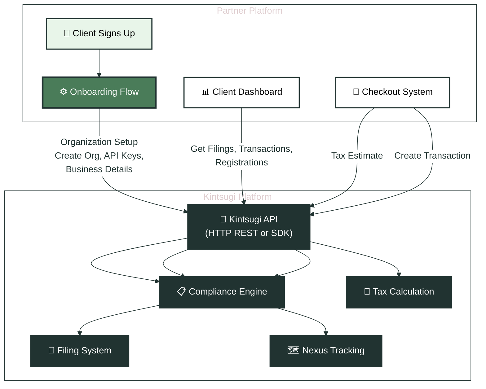

<Note>
**What is Sales Tax as a Service?** A white label tax compliance platform allows you to offer automated sales tax management to your clients. Your platform handles client onboarding, tax calculations, compliance tracking, and filing management—all powered by Kintsugi's API.
</Note>

Building a Sales Tax as a Service (STaaS) platform enables you to offer comprehensive tax compliance solutions to your clients without building the complex tax logic yourself. This guide series walks through building a complete white label tax compliance application using Kintsugi's API.

## What You'll Build

A complete STaaS platform includes:

- **Client Onboarding**: Automated organization setup with business details, addresses, and banking information
- **Nexus Management**: Track physical and economic nexus across jurisdictions
- **Registration Management**: Automate tax registrations in states where clients have nexus
- **Product Catalog**: Manage product tax classifications for accurate calculations
- **Transaction Processing**: L1 (sync transactions for compliance) and L2 (calculate tax at checkout when the tax engine is enabled)
- **Compliance Management**: Track filings, approvals, and compliance status

## Integration Architecture

<Expandable title="🏗️ STaaS Platform Architecture" icon="diagram">

```mermaid
%%{init: {'theme':'base', 'themeVariables': {'primaryColor':'#FFFFFF','primaryTextColor':'#213331','primaryBorderColor':'#213331','lineColor':'#213331','secondaryColor':'#FFFFFF','tertiaryColor':'#213331','edgeLabelBackground':'#FFFFFF','edgeLabelColor':'#213331','edgeStrokeWidth':'2px','edgeStroke':'#213331','arrowheadColor':'#213331','clusterBkg':'transparent','clusterBorder':'#213331','defaultLinkColor':'#213331'}}}%%
flowchart TB
    subgraph Partner["Partner Platform"]
        Client["👤 Client Signs Up"]
        Dashboard["📊 Client Dashboard"]
        Onboarding["⚙️ Onboarding Flow"]
        Checkout["🛒 Checkout System"]
    end
    
    subgraph Kintsugi["Kintsugi Platform"]
        API["🔌 Kintsugi API<br/>(HTTP REST or SDK)"]
        Compliance["📋 Compliance Engine"]
        Filing["📄 Filing System"]
        Nexus["🗺️ Nexus Tracking"]
        TaxCalc["🧮 Tax Calculation"]
    end
    
    Client --> Onboarding
    Onboarding -->|"Organization Setup<br/>Create Org, API Keys,<br/>Business Details"| API
    API --> Compliance
    Dashboard -->|"Get Filings, Transactions,<br/>Registrations"| API
    API --> Compliance
    Checkout -->|"Tax Estimate"| API
    API --> TaxCalc
    Checkout -->|"Create Transaction"| API
    API --> Compliance
    Compliance --> Nexus
    Compliance --> Filing
    
    style Client fill:#e8f5e9,stroke:#213331,stroke-width:2px,color:#000000
    style Dashboard fill:#FFFFFF,stroke:#213331,stroke-width:2px,color:#000000
    style Onboarding fill:#4a7c59,stroke:#213331,stroke-width:3px,color:#FFFFFF
    style Checkout fill:#FFFFFF,stroke:#213331,stroke-width:2px,color:#000000
    style API fill:#213331,stroke:#213331,stroke-width:3px,color:#FFFFFF
    style Compliance fill:#213331,stroke:#213331,stroke-width:3px,color:#FFFFFF
    style Filing fill:#213331,stroke:#213331,stroke-width:3px,color:#FFFFFF
    style Nexus fill:#213331,stroke:#213331,stroke-width:3px,color:#FFFFFF
    style TaxCalc fill:#213331,stroke:#213331,stroke-width:3px,color:#FFFFFF
```
</Expandable>

## API Endpoints Overview

A complete STaaS integration uses **19 distinct API endpoints** across 5 phases:

### Phase 1: Organization Setup & Onboarding (8 endpoints)
Initial client setup endpoints:
- Create organization
- Generate API keys
- Configure business details, addresses, contacts, owners
- Set banking information

### Phase 2: Product Catalog Management (1 endpoint)
- Create and manage products with tax classifications

### Phase 3: Nexus & Registration Management (3 endpoints)
- Physical nexus creation
- Economic nexus registrations
- Registration status tracking

### Phase 4: Transaction Processing (4 endpoints)
- Tax calculation
- Transaction creation
- Transaction retrieval

### Phase 5: Compliance & Filing Management (3 endpoints)
- Filing list retrieval
- Filing details
- Filing approval

## Integration Patterns

### Choosing HTTP REST or SDK

All Kintsugi API endpoints are accessible via HTTP REST. The SDK is an optional wrapper that provides convenience methods and built-in error handling, but it calls the same REST API endpoints under the hood.

**You can use either approach:**
- **HTTP REST**: Direct API calls using your preferred HTTP client. Gives you full control over requests and responses.
- **SDK**: Optional convenience wrapper around the REST API. Provides type safety, built-in pagination helpers, and simplified error handling.

**Choose based on your preference:**
- Use HTTP REST if you prefer direct control, want to use your existing HTTP client, or are building in a language without an SDK
- Use the SDK if you want convenience methods, type safety, and built-in helpers for pagination and error handling

Both approaches access the same API endpoints and provide the same functionality.

### Sequential Setup Pattern

Organization onboarding requires sequential API calls. Each step depends on the previous one:

1. Create organization → Get `organization_id`
2. Create API key → Get `api_key`
3. Use both for all subsequent operations

<Warning>
**Store credentials securely**: The `organization_id` and `api_key` returned during onboarding must be stored securely in your database. These credentials are required for all subsequent API calls for that client.
</Warning>

## Complete Integration Workflow

<Expandable title="🔄 Complete Client Lifecycle" icon="diagram">

```mermaid
%%{init: {'theme':'base', 'themeVariables': {'primaryColor':'#FFFFFF','primaryTextColor':'#213331','primaryBorderColor':'#213331','lineColor':'#213331','secondaryColor':'#FFFFFF','tertiaryColor':'#213331','edgeLabelBackground':'#FFFFFF','edgeLabelColor':'#213331','edgeStrokeWidth':'2px','edgeStroke':'#213331','arrowheadColor':'#213331','clusterBkg':'transparent','clusterBorder':'#213331','defaultLinkColor':'#213331'}}}%%
flowchart TD
    Start["🏁 Client Signs Up"] --> Onboard["1️⃣ Organization Setup<br/>8 API endpoints"]
    Onboard --> Products["2️⃣ Product Catalog<br/>Create products"]
    Products --> Nexus["3️⃣ Nexus & Registration<br/>3 API endpoints"]
    Nexus --> Ready["✅ Platform Ready"]
    
    Ready --> Checkout["🛒 Client Checkout"]
    Checkout --> TaxEst["Calculate Tax<br/>POST /v1/tax/estimate"]
    TaxEst --> Payment["💳 Process Payment"]
    Payment --> CreateTxn["Create Transaction<br/>POST /v1/transactions"]
    
    CreateTxn --> Compliance["📋 Compliance Tracking"]
    Compliance --> Filings["Get Filings<br/>GET /v1/filings"]
    Filings --> Approve["Approve Filing<br/>PUT /v1/filings/{id}/approve"]
    Approve --> Filed["✅ Filed with Tax Authority"]
    
    style Start fill:#e8f5e9,stroke:#213331,stroke-width:2px,color:#000000
    style Onboard fill:#4a7c59,stroke:#213331,stroke-width:3px,color:#FFFFFF
    style Products fill:#4a7c59,stroke:#213331,stroke-width:3px,color:#FFFFFF
    style Nexus fill:#4a7c59,stroke:#213331,stroke-width:3px,color:#FFFFFF
    style Ready fill:#213331,stroke:#213331,stroke-width:3px,color:#FFFFFF
    style Checkout fill:#FFFFFF,stroke:#213331,stroke-width:2px,color:#000000
    style TaxEst fill:#FFFFFF,stroke:#213331,stroke-width:2px,color:#000000
    style Payment fill:#FFFFFF,stroke:#213331,stroke-width:2px,color:#000000
    style CreateTxn fill:#213331,stroke:#213331,stroke-width:3px,color:#FFFFFF
    style Compliance fill:#213331,stroke:#213331,stroke-width:3px,color:#FFFFFF
    style Filings fill:#213331,stroke:#213331,stroke-width:3px,color:#FFFFFF
    style Approve fill:#213331,stroke:#213331,stroke-width:3px,color:#FFFFFF
    style Filed fill:#213331,stroke:#213331,stroke-width:3px,color:#FFFFFF
```
</Expandable>

## What's Next?

This guide series is organized into 6 articles:

1. **Overview** (this article) - Understanding the complete integration
2. **Organization Setup & Onboarding** - Setting up new clients with 8 sequential API calls
3. **Nexus & Registration Management** - Establishing tax presence and registrations
4. **Transaction Processing** - Calculating tax and syncing transactions
5. **Product Catalog Management** - Managing product tax classifications
6. **Compliance & Filing Management** - Tracking and approving tax filings

Each guide includes:
- Step-by-step instructions
- Code examples
- Mermaid diagrams showing data flow
- Best practices and error handling
- Integration patterns specific to STaaS platforms

## Prerequisites

Before starting, ensure you have:

- **Kintsugi Partner Account**: Access to the Partner API. Partner organizations are their own organizations in PropelAuth (separate from client organizations) and are provisioned for you; there is no manual org-creation step, and partner-user invite emails are sent automatically when a user is added to the Partner Experience.
- **API Credentials**: A Client API key. Manage keys in the Partner Experience under {/* TODO: confirm exact PX label */} **Settings → API Keys**, or programmatically via `POST /v2/partner/api_keys` (see [Authentication and API keys](#authentication-and-api-keys)).
- **Development Environment**: Ability to make HTTP REST calls (SDK is optional)
- **Database**: Storage for client records, organization IDs, and API keys

## Authentication and API keys

All requests authenticate with the `x-api-key` header. Requests against a specific organization also send `x-organization-id`. Kintsugi uses header-based API keys, not bearer tokens.

Client API keys come in two scopes:

| Scope | Created with | Use against | `x-organization-id` |
| --- | --- | --- | --- |
| **Partner** | `POST /v2/partner/api_keys` with no `clientOrganizationId` | Partner APIs (`/v2/partner/*`), portfolio-wide | Not required for portfolio endpoints |
| **Client** | `POST /v2/partner/api_keys` with a `clientOrganizationId` in your portfolio | Main organization APIs, scoped to that client | Set to that client organization |

Key management (owner/admin role required):

| Operation | Endpoint |
| --- | --- |
| Create | [`POST /v2/partner/api_keys`](/reference/partners/partner-management/api-keys/create-client-api-key) |
| List | [`GET /v2/partner/api_keys`](/reference/partners/partner-management/api-keys/list-client-api-keys) |
| Delete | [`DELETE /v2/partner/api_keys/{api_key_id}`](/reference/partners/partner-management/api-keys/delete-client-api-key) |

The create response returns `apiKeyId` and `apiKeyToken`; the token is shown once. When operating across multiple partners with a bearer session, select the active partner with the `x-partner-id` header.

For programmatic client onboarding, `POST /v1/organizations/api_keys` also remains available to mint a per-client org key (see [Organization Setup, Step 2](/docs/api-guides-partners/organization-setup)).

<CardGroup cols={2}>
  <Card title="Next: Organization Setup" icon="rocket" href="/docs/api-guides-partners/organization-setup">
    Learn how to onboard new clients with 8 sequential API calls
  </Card>
  <Card title="API Reference" icon="code" href="/reference">
    Explore the complete API documentation
  </Card>
</CardGroup>

