Product catalog management ensures accurate tax calculations by defining tax classifications for each product. Products determine whether items are taxable in specific jurisdictions and at what rates. In this STaaS application, products are automatically created after economic nexus registrations, but you can also manage them manually.

## Product Catalog Flow

```mermaid
%%{init: {'theme':'base', 'themeVariables': {'primaryColor':'#FFFFFF','primaryTextColor':'#213331','primaryBorderColor':'#213331','lineColor':'#213331','secondaryColor':'#FFFFFF','tertiaryColor':'#213331','edgeLabelBackground':'#FFFFFF','edgeLabelColor':'#213331','edgeStrokeWidth':'2px','edgeStroke':'#213331','arrowheadColor':'#213331','clusterBkg':'transparent','clusterBorder':'#213331','defaultLinkColor':'#213331'}}}%%
flowchart TD
    Start["🏁 Registration Created"] --> AutoCreate["🔄 Auto-Create Products<br/>(in this application)"]
    AutoCreate --> ManualCreate["📝 Manual Product Creation<br/>POST /v1/products"]
    ManualCreate --> Validate["✅ Validate Product Data"]
    Validate --> Create["📤 Create Product"]
    Create --> Success{"Creation<br/>Successful?"}
    Success -->|Yes| Ready["✅ Product Ready<br/>for Tax Calculations"]
    Success -->|No| Error["❌ Handle Error"]
    Error --> Retry{"Retry<br/>Appropriate?"}
    Retry -->|Yes| Create
    Retry -->|No| Fix["🔧 Fix Data Issues"]
    Fix --> Validate
    
    Ready --> UseInTxn["🛒 Use in Transactions<br/>Reference by external_product_id"]
    
    style Start fill:#e8f5e9,stroke:#213331,stroke-width:2px,color:#000000
    style AutoCreate fill:#213331,stroke:#213331,stroke-width:3px,color:#FFFFFF
    style ManualCreate fill:#4a7c59,stroke:#213331,stroke-width:3px,color:#FFFFFF
    style Validate fill:#FFFFFF,stroke:#213331,stroke-width:2px,color:#000000
    style Create fill:#4a7c59,stroke:#213331,stroke-width:3px,color:#FFFFFF
    style Success fill:#FFFFFF,stroke:#213331,stroke-width:2px,color:#000000
    style Ready fill:#213331,stroke:#213331,stroke-width:3px,color:#FFFFFF
    style Error fill:#FFFFFF,stroke:#213331,stroke-width:2px,color:#000000
    style UseInTxn fill:#213331,stroke:#213331,stroke-width:3px,color:#FFFFFF
```

<Expandable title="📦 Product Management Workflow" icon="diagram">

</Expandable>

## Understanding Product Records

Product records in Kintsugi map your catalog items to tax classifications. Each product record includes:

- **Product identifiers**: External ID, name, description
- **Tax classification**: Category, taxability rules
- **Physical or digital designation**: Affects taxability in some jurisdictions
- **Custom tax codes**: If applicable

Products are referenced in tax estimates and transactions through their `external_product_id`. Kintsugi uses the product's tax classification to determine whether the item is taxable in the customer's jurisdiction.

<Note>
**Product records are required**: You cannot calculate tax or sync transactions without product records. Create products before calling `/v1/tax/estimate` or `/v1/transactions`.
</Note>

## Create Products

**Endpoint**: `POST /v1/products`  
**Access Method**: HTTP REST  
**Purpose**: Creates products in the organization's catalog with tax classification rules.

**When to Use**:
- During initial onboarding (after organization setup)
- When adding new products to the catalog
- Bulk product creation for catalog setup
- Automatically triggered after economic nexus registrations in this application

**Request Example**:
```json
{
  "external_id": "PROD-001",
  "name": "Widget Pro",
  "description": "Professional widget for business use",
  "status": "APPROVED",
  "product_category": "PHYSICAL",
  "product_subcategory": "ELECTRONICS",
  "source": "OTHER",
  "tax_exempt": false
}
```

**Headers Required**:
- `x-api-key`: Organization's API key
- `x-organization-id`: Organization ID
- `Content-Type`: `application/json`

**Key Parameters**:
- `external_id`: Your internal product identifier (must be unique)
- `name`: Product name
- `product_category`: Product category that determines taxability rules
- `status`: Typically set to `"APPROVED"` for active products
- `product_subcategory`: More specific classification
- `source`: Origin indicator (e.g., `"OTHER"`, `"SHOPIFY"`, `"WOOCOMMERCE"`)
- `tax_exempt`: Flag indicating if product is exempt from sales tax

**Integration Notes**:
- `external_id` should be your internal product identifier
- `status` typically set to `"APPROVED"` for active products
- `product_category` and `product_subcategory` determine tax rules
- `source` indicates origin (e.g., `"OTHER"`, `"SHOPIFY"`, `"WOOCOMMERCE"`)
- `tax_exempt` flag indicates if product is exempt from sales tax
- Products are referenced in transactions for accurate tax calculation
- In this application, products are created automatically after economic nexus registrations

**Product Categories**:
Common categories include: `PHYSICAL`, `DIGITAL`, `SERVICE`, `SOFTWARE`, etc.

**Example Implementation**:
```javascript
async function createProduct(productData, organizationId, apiKey) {
  const response = await fetch('https://api.trykintsugi.com/v1/products', {
    method: 'POST',
    headers: {
      'x-api-key': apiKey,
      'x-organization-id': organizationId,
      'Content-Type': 'application/json'
    },
    body: JSON.stringify({
      external_id: productData.sku,
      name: productData.name,
      description: productData.description,
      status: "APPROVED",
      product_category: productData.category,
      product_subcategory: productData.subcategory,
      source: "OTHER",
      tax_exempt: productData.isTaxExempt || false
    })
  });
  
  return await response.json();
}
```

## Bulk Product Creation

For platforms with large product catalogs, create products in batches:

**Example: Batch Creation**:
```javascript
async function createProductsInBatches(products, organizationId, apiKey, batchSize = 50) {
  const results = [];
  
  for (let i = 0; i < products.length; i += batchSize) {
    const batch = products.slice(i, i + batchSize);
    
    // Create products in parallel within batch
    const batchPromises = batch.map(product => 
      createProduct(product, organizationId, apiKey)
    );
    
    const batchResults = await Promise.allSettled(batchPromises);
    results.push(...batchResults);
    
    // Rate limiting: wait between batches
    if (i + batchSize < products.length) {
      await new Promise(resolve => setTimeout(resolve, 1000));
    }
  }
  
  return results;
}
```

## Product Data Flow

```mermaid
%%{init: {'theme':'base', 'themeVariables': {'primaryColor':'#FFFFFF','primaryTextColor':'#213331','primaryBorderColor':'#213331','lineColor':'#213331','secondaryColor':'#FFFFFF','tertiaryColor':'#213331','edgeLabelBackground':'#FFFFFF','edgeLabelColor':'#213331','edgeStrokeWidth':'2px','edgeStroke':'#213331','arrowheadColor':'#213331','clusterBkg':'transparent','clusterBorder':'#213331','defaultLinkColor':'#213331'}}}%%
flowchart LR
    subgraph Partner["Partner Platform"]
        Catalog["📦 Product Catalog"]
        Registration["📝 Registration Created"]
    end
    
    subgraph API["Kintsugi API"]
        CreateProd["POST /v1/products"]
    end
    
    subgraph Kintsugi["Kintsugi Platform"]
        ProdDB["🗄️ Product Database"]
        TaxEngine["🧮 Tax Calculation Engine"]
    end
    
    subgraph Checkout["Checkout Flow"]
        TaxEst["POST /v1/tax/estimate"]
        CreateTxn["POST /v1/transactions"]
    end
    
    Registration -->|"Auto-Create"| CreateProd
    Catalog -->|"Manual Create"| CreateProd
    CreateProd --> ProdDB
    ProdDB --> TaxEngine
    TaxEst -->|"Reference Product"| ProdDB
    TaxEngine --> TaxEst
    CreateTxn -->|"Reference Product"| ProdDB
    
    style Catalog fill:#e8f5e9,stroke:#213331,stroke-width:2px,color:#000000
    style Registration fill:#FFFFFF,stroke:#213331,stroke-width:2px,color:#000000
    style CreateProd fill:#4a7c59,stroke:#213331,stroke-width:3px,color:#FFFFFF
    style ProdDB fill:#213331,stroke:#213331,stroke-width:3px,color:#FFFFFF
    style TaxEngine fill:#213331,stroke:#213331,stroke-width:3px,color:#FFFFFF
    style TaxEst fill:#4a7c59,stroke:#213331,stroke-width:3px,color:#FFFFFF
    style CreateTxn fill:#4a7c59,stroke:#213331,stroke-width:3px,color:#FFFFFF
```

<Expandable title="🔄 Product Creation to Tax Calculation" icon="diagram">

</Expandable>

## Automatic Product Creation

In this STaaS application, products are automatically created after economic nexus registrations. This ensures products are ready for tax calculations immediately after registration.

**When Auto-Creation Happens**:
- After creating an economic nexus registration
- Products are created with default classifications
- You can update product details later if needed

**Example: Auto-Creation Flow**:
```javascript
// After creating registration
const registration = await kintsugi.registrations.create({
  country_code: "US",
  state_code: "CA",
  filing_frequency: "MONTHLY",
  start_date: "2024-01-01"
}, { 'x-organization-id': organizationId });

// Products are automatically created
// You can then update product details if needed
await updateProductDetails(organizationId, apiKey);
```

## Best Practices

1. **Create Before Use**: Create products before using them in tax estimates or transactions
2. **Use Unique External IDs**: Use your SKU or product ID as `external_id` to prevent duplicates
3. **Set Appropriate Categories**: Choose categories that accurately reflect product taxability
4. **Batch Creation**: For large catalogs, create products in batches to avoid rate limiting
5. **Update When Needed**: Update product records if tax classifications change
6. **Verify Existence**: Check if product exists before creating to avoid duplicates
7. **Handle Errors**: Implement retry logic for transient failures

## Error Handling

**Common Errors**:
- **409 Conflict**: Product with same `external_id` already exists
- **400 Bad Request**: Invalid category or missing required fields
- **401 Unauthorized**: Invalid API key

**Example Error Handling**:
```javascript
async function createProductSafely(productData, organizationId, apiKey) {
  try {
    // Check if product already exists
    const existing = await getProductByExternalId(
      productData.external_id, 
      organizationId, 
      apiKey
    );
    
    if (existing) {
      console.log('Product already exists, updating...');
      return await updateProduct(existing.id, productData, organizationId, apiKey);
    }
    
    return await createProduct(productData, organizationId, apiKey);
  } catch (error) {
    if (error.status === 409) {
      // Product exists, fetch and return it
      return await getProductByExternalId(
        productData.external_id, 
        organizationId, 
        apiKey
      );
    }
    throw error;
  }
}
```

## Product Categories Reference

Common product categories and their tax implications:

- **PHYSICAL**: Tangible goods subject to sales tax
- **DIGITAL**: Digital products (may be exempt in some jurisdictions)
- **SERVICE**: Services (taxability varies by jurisdiction)
- **SOFTWARE**: Software products (may have special tax rules)
- **FOOD**: Food items (often exempt or reduced rate)
- **CLOTHING**: Clothing items (may be exempt in some states)

<AccordionGroup>
  <Accordion title="What if I have thousands of products?">
    Create products in batches using multiple API calls. Process products in chunks of 50-100 to avoid rate limiting. You can create products asynchronously before starting your tax calculation integration. Products don't expire, so you can create them well in advance of using them in transactions.
  </Accordion>
  
  <Accordion title="Do I need to update products if tax rules change?">
    Kintsugi manages tax rule changes automatically. Product records don't need updates when jurisdictions change taxability rules. However, if you change a product's category or type, update the product record to reflect the new classification.
  </Accordion>
  
  <Accordion title="Can I delete products?">
    Products can be archived but typically shouldn't be deleted if they've been used in transactions. Kintsugi maintains product history for compliance purposes. If you discontinue a product, you can stop creating new transactions with it without deleting the product record.
  </Accordion>
</AccordionGroup>

<CardGroup cols={2}>
  <Card title="Next: Compliance & Filing" icon="file-invoice" href="/docs/api-guides-partners/compliance-filing">
    Learn how to manage tax filings and compliance
  </Card>
  <Card title="Previous: Transaction Processing" icon="arrow-left" href="/docs/api-guides-partners/transaction-processing">
    Return to transaction processing
  </Card>
</CardGroup>

