Transaction processing is the core operational phase of your STaaS platform. This phase combines **L1** (transaction sync for compliance) and **L2** (real-time tax calculation during checkout). You sync completed transactions to Kintsugi and, when the tax engine is enabled, calculate tax at checkout. All endpoints can be accessed via HTTP REST or the optional Kintsugi SDK.

## Transaction Processing Flow

```mermaid
%%{init: {'theme':'base', 'themeVariables': {'primaryColor':'#FFFFFF','primaryTextColor':'#213331','primaryBorderColor':'#213331','lineColor':'#213331','secondaryColor':'#FFFFFF','tertiaryColor':'#213331','edgeLabelBackground':'#FFFFFF','edgeLabelColor':'#213331','edgeStrokeWidth':'2px','edgeStroke':'#213331','arrowheadColor':'#213331','clusterBkg':'transparent','clusterBorder':'#213331','defaultLinkColor':'#213331'}}}%%
flowchart TD
    Start["🛒 Customer Checkout"] --> Prepare["📋 Prepare Transaction Data<br/>products, amounts, addresses"]
    Prepare --> TaxEst["Calculate Tax Estimate<br/>POST /v1/tax/estimate"]
    TaxEst --> Display["💰 Display Tax to Customer"]
    Display --> Payment["💳 Process Payment"]
    Payment --> Success{"Payment<br/>Successful?"}
    Success -->|No| Cancel["❌ Cancel Order<br/>Don't Create Transaction"]
    Success -->|Yes| CreateTxn["Create Transaction<br/>POST /v1/transactions"]
    CreateTxn --> Store["💾 Store Transaction ID"]
    Store --> Compliance["📋 Available for Compliance<br/>Nexus Tracking & Filings"]
    
    Compliance --> GetTxn["Get Transactions<br/>SDK: transactions.get()"]
    GetTxn --> Dashboard["📊 Display in Dashboard"]
    
    style Start fill:#e8f5e9,stroke:#213331,stroke-width:2px,color:#000000
    style Prepare fill:#FFFFFF,stroke:#213331,stroke-width:2px,color:#000000
    style TaxEst fill:#4a7c59,stroke:#213331,stroke-width:3px,color:#FFFFFF
    style Display fill:#FFFFFF,stroke:#213331,stroke-width:2px,color:#000000
    style Payment fill:#FFFFFF,stroke:#213331,stroke-width:2px,color:#000000
    style Success fill:#FFFFFF,stroke:#213331,stroke-width:2px,color:#000000
    style Cancel fill:#FFFFFF,stroke:#213331,stroke-width:2px,color:#000000
    style CreateTxn fill:#4a7c59,stroke:#213331,stroke-width:3px,color:#FFFFFF
    style Store fill:#FFFFFF,stroke:#213331,stroke-width:2px,color:#000000
    style Compliance fill:#213331,stroke:#213331,stroke-width:3px,color:#FFFFFF
    style GetTxn fill:#4a7c59,stroke:#213331,stroke-width:3px,color:#FFFFFF
    style Dashboard fill:#213331,stroke:#213331,stroke-width:3px,color:#FFFFFF
```

<Expandable title="💳 Complete Transaction Flow" icon="diagram">

</Expandable>

## Step 1: Calculate Tax Estimate

**Endpoint**: `POST /v1/tax/estimate`  
**Access Method**: HTTP REST  
**Purpose**: Calculates estimated tax for a transaction before payment is processed.

**When to Use**:
- During checkout process (before payment)
- Quote generation
- Shopping cart tax calculation
- Real-time tax display for customers

**Request Example**:
```json
{
  "transaction_date": "2024-01-15",
  "customer": {
    "address": {
      "street1": "123 Main St",
      "city": "San Francisco",
      "state": "CA",
      "postal_code": "94105",
      "country": "US"
    }
  },
  "line_items": [
    {
      "product_id": "prod_123",
      "quantity": 2,
      "unit_price": 50.00
    }
  ],
  "shipping": {
    "amount": 10.00
  }
}
```

**Headers Required**:
- `x-api-key`: Organization's API key
- `x-organization-id`: Organization ID
- `Content-Type`: `application/json`

**Integration Notes**:
- Returns tax breakdown by jurisdiction
- Includes total tax amount and tax rates
- Used for display to customers before purchase
- Does not create a permanent transaction record
- Consider caching results for identical requests
- Address validation may occur during calculation

**Response Structure**:
```json
{
  "total_tax": 8.75,
  "tax_breakdown": [
    {
      "jurisdiction": "CA",
      "rate": 0.0875,
      "amount": 8.75
    }
  ],
  "line_items": [
    {
      "product_id": "prod_123",
      "tax": 8.75
    }
  ]
}
```

**Example Implementation**:
```javascript
async function calculateTax(checkoutData, organizationId, apiKey) {
  const response = await fetch('https://api.trykintsugi.com/v1/tax/estimate', {
    method: 'POST',
    headers: {
      'x-api-key': apiKey,
      'x-organization-id': organizationId,
      'Content-Type': 'application/json'
    },
    body: JSON.stringify({
      transaction_date: checkoutData.date,
      customer: {
        address: checkoutData.shippingAddress
      },
      line_items: checkoutData.items.map(item => ({
        product_id: item.productId,
        quantity: item.quantity,
        unit_price: item.price
      })),
      shipping: {
        amount: checkoutData.shippingAmount
      }
    })
  });
  
  return await response.json();
}
```

---

## Step 2: Create Transaction

**Endpoint**: `POST /v1/transactions`  
**Access Method**: HTTP REST  
**Purpose**: Records a completed transaction for tax compliance and filing purposes.

**When to Use**:
- After payment is confirmed
- Recording sales for tax compliance
- Creating audit trail for filings
- Must be called after tax estimate (if estimate was used)

**Request Example**:
```json
{
  "transaction_id": "TXN-001",
  "transaction_date": "2024-01-15",
  "customer": {
    "name": "John Doe",
    "email": "john@example.com",
    "address": {
      "street1": "123 Main St",
      "city": "San Francisco",
      "state": "CA",
      "postal_code": "94105",
      "country": "US"
    }
  },
  "line_items": [
    {
      "product_id": "prod_123",
      "quantity": 2,
      "unit_price": 50.00,
      "tax": 8.75
    }
  ],
  "subtotal": 100.00,
  "tax": 8.75,
  "total": 118.75,
  "shipping": {
    "amount": 10.00,
    "taxable": false
  }
}
```

**Headers Required**:
- `x-api-key`: Organization's API key
- `x-organization-id`: Organization ID
- `Content-Type`: `application/json`

**Integration Notes**:
- Creates permanent transaction record
- Transaction ID should be unique (use your order ID)
- Tax amounts should match calculated estimates
- Transactions are automatically included in filings
- Address validation occurs during creation
- Returns transaction with Kintsugi transaction ID

**Transaction States**:
Transactions can have statuses: `PENDING`, `COMMITTED`, `CANCELLED`, `REFUNDED`, etc.

**Example Implementation**:
```javascript
async function createTransaction(orderData, taxEstimate, organizationId, apiKey) {
  const response = await fetch('https://api.trykintsugi.com/v1/transactions', {
    method: 'POST',
    headers: {
      'x-api-key': apiKey,
      'x-organization-id': organizationId,
      'Content-Type': 'application/json'
    },
    body: JSON.stringify({
      external_id: orderData.orderId,
      date: orderData.date,
      type: "SALE",
      status: "COMMITTED",
      currency: "USD",
      total_amount: orderData.total,
      customer: {
        name: orderData.customerName,
        email: orderData.customerEmail,
        address: orderData.shippingAddress
      },
      addresses: [
        {
          type: "SHIP_TO",
          ...orderData.shippingAddress
        }
      ],
      transaction_items: orderData.items.map((item, index) => ({
        external_product_id: item.productId,
        quantity: item.quantity,
        amount: item.price * item.quantity,
        tax_amount_calculated: taxEstimate.line_items[index].tax
      }))
    })
  });
  
  const transaction = await response.json();
  
  // Store Kintsugi transaction ID
  await db.orders.update(orderData.orderId, {
    kintsugiTransactionId: transaction.id
  });
  
  return transaction;
}
```

---

## Step 3: Get Transactions

**Endpoint**: SDK Method - `kintsugi.transactions.get()`  
**Access Method**: SDK  
**Purpose**: Retrieves a paginated list of transactions for reporting and reconciliation.

**When to Use**:
- Client transaction history views
- Reconciliation reports
- Audit trail access
- Dashboard displays

**SDK Usage**:
```javascript
const kintsugi = new SDK({
  apiKey: organizationApiKey,
  organizationId: organizationId,
  serverURL: 'https://api.trykintsugi.com'
});

const queryParams = {
  limit: 50,
  offset: 0,
  startDate: "2024-01-01",
  endDate: "2024-12-31",
  // Optional filters: state_code, country, status, etc.
};

const response = await kintsugi.transactions.get(queryParams, {
  'x-organization-id': organizationId
});
```

**Key Parameters**:
- `limit`: Number of results (default: 50)
- `offset`: Pagination offset
- `startDate`: Filter start date (ISO 8601)
- `endDate`: Filter end date (ISO 8601)
- Optional filters: `state_code`, `country`, `status`, `transaction_type`

**Integration Notes**:
- Returns paginated results
- Use date ranges for period-specific reports
- Filter by status for reconciliation workflows
- Large result sets require pagination
- Used for transaction history displays in client dashboards

**Example: Dashboard Display**:
```javascript
async function getTransactionHistory(organizationId, startDate, endDate) {
  const transactions = await kintsugi.transactions.get({
    limit: 100,
    offset: 0,
    startDate: startDate,
    endDate: endDate,
    status: "COMMITTED"
  }, { 'x-organization-id': organizationId });
  
  return transactions.data.map(txn => ({
    id: txn.id,
    externalId: txn.external_id,
    date: txn.date,
    total: txn.total_amount,
    tax: txn.total_tax_amount_calculated,
    status: txn.status
  }));
}
```

---

## Step 4: Get Transaction by ID

**Endpoint**: SDK Method - `kintsugi.transactions.getById()`  
**Access Method**: SDK  
**Purpose**: Retrieves detailed information about a specific transaction.

**When to Use**:
- Transaction detail views
- Dispute resolution
- Audit inquiries
- Individual transaction lookup

**SDK Usage**:
```javascript
const response = await kintsugi.transactions.getById({
  transactionId: "txn_123456"
}, {
  'x-organization-id': organizationId
});
```

**Key Parameters**:
- `transactionId`: Kintsugi transaction ID (returned from create transaction)

**Integration Notes**:
- Returns full transaction details including line items, tax breakdown, customer info
- Use for detailed transaction views
- Transaction ID is Kintsugi's internal ID, not your external transaction ID

## Data Flow: Checkout to Compliance

```mermaid
%%{init: {'theme':'base', 'themeVariables': {'primaryColor':'#FFFFFF','primaryTextColor':'#213331','primaryBorderColor':'#213331','lineColor':'#213331','secondaryColor':'#FFFFFF','tertiaryColor':'#213331','edgeLabelBackground':'#FFFFFF','edgeLabelColor':'#213331','edgeStrokeWidth':'2px','edgeStroke':'#213331','arrowheadColor':'#213331','clusterBkg':'transparent','clusterBorder':'#213331','defaultLinkColor':'#213331'}}}%%
flowchart LR
    subgraph Partner["Partner Platform"]
        Checkout["🛒 Checkout System"]
        Payment["💳 Payment Gateway"]
        Dashboard["📊 Client Dashboard"]
    end
    
    subgraph API["Kintsugi API"]
        TaxEst["POST /v1/tax/estimate"]
        CreateTxn["POST /v1/transactions"]
    end
    
    subgraph SDK["Kintsugi SDK"]
        GetTxn["transactions.get()"]
        GetById["transactions.getById()"]
    end
    
    subgraph Kintsugi["Kintsugi Platform"]
        TxnDB["🗄️ Transaction Database"]
        Compliance["📋 Compliance Engine"]
        Nexus["🗺️ Nexus Tracking"]
    end
    
    Checkout -->|"1. Calculate Tax"| TaxEst
    TaxEst --> Checkout
    Checkout --> Payment
    Payment -->|"2. Create Transaction"| CreateTxn
    CreateTxn --> TxnDB
    TxnDB --> Compliance
    TxnDB --> Nexus
    Dashboard -->|"3. Get Transactions"| GetTxn
    GetTxn --> TxnDB
    Dashboard -->|"4. Get Details"| GetById
    GetById --> TxnDB
    
    style Checkout fill:#e8f5e9,stroke:#213331,stroke-width:2px,color:#000000
    style Payment fill:#FFFFFF,stroke:#213331,stroke-width:2px,color:#000000
    style Dashboard fill:#FFFFFF,stroke:#213331,stroke-width:2px,color:#000000
    style TaxEst fill:#4a7c59,stroke:#213331,stroke-width:3px,color:#FFFFFF
    style CreateTxn fill:#4a7c59,stroke:#213331,stroke-width:3px,color:#FFFFFF
    style GetTxn fill:#4a7c59,stroke:#213331,stroke-width:3px,color:#FFFFFF
    style GetById fill:#4a7c59,stroke:#213331,stroke-width:3px,color:#FFFFFF
    style TxnDB fill:#213331,stroke:#213331,stroke-width:3px,color:#FFFFFF
    style Compliance fill:#213331,stroke:#213331,stroke-width:3px,color:#FFFFFF
    style Nexus fill:#213331,stroke:#213331,stroke-width:3px,color:#FFFFFF
```

<Expandable title="🔄 Transaction Data Flow" icon="diagram">

</Expandable>

## Best Practices

1. **Match Tax Amounts**: Use tax amounts from estimate when creating transaction
2. **Store Transaction IDs**: Save Kintsugi transaction IDs for future reference
3. **Handle Errors**: Implement retry logic for transient failures
4. **Validate Before Sending**: Ensure all required fields are present
5. **Use Unique IDs**: Use your order ID as `external_id` to prevent duplicates
6. **Status Management**: Set appropriate transaction status (`COMMITTED` for completed sales)
7. **Address Validation**: Validate addresses before sending to improve tax accuracy

## Error Handling

**Common Errors**:
- **400 Bad Request**: Missing required fields or invalid data format
- **404 Not Found**: Product doesn't exist - create product first
- **409 Conflict**: Duplicate transaction ID - use unique external_id
- **401 Unauthorized**: Invalid API key - verify credentials

**Example Error Handling**:
```javascript
async function createTransactionWithRetry(transactionData, maxRetries = 3) {
  for (let i = 0; i < maxRetries; i++) {
    try {
      return await createTransaction(transactionData);
    } catch (error) {
      if (error.status === 409 && i < maxRetries - 1) {
        // Duplicate ID - append suffix
        transactionData.external_id = `${transactionData.external_id}-${i + 1}`;
        continue;
      }
      if (error.status === 404) {
        // Product missing - create it first
        await createProduct(transactionData.product);
        continue;
      }
      throw error;
    }
  }
}
```

<CardGroup cols={2}>
  <Card title="Next: Product Catalog" icon="box" href="/docs/api-guides-partners/product-catalog">
    Learn how to manage product tax classifications
  </Card>
  <Card title="Previous: Nexus & Registration" icon="arrow-left" href="/docs/api-guides-partners/nexus-registration">
    Return to nexus & registration
  </Card>
</CardGroup>

