Refunds require special handling in Kintsugi to maintain accurate compliance records. When customers return products or receive refunds, you need to create credit note transactions that link back to the original sale. This guide covers when to create credit notes, how to structure refund data, and best practices for partial and full refunds.

## Understanding Credit Notes

Credit notes in Kintsugi represent refunds, returns, or adjustments to original transactions. Each credit note:

- Links to the original transaction via `related_to`
- Has negative amounts (or positive amounts marked as refunds)
- Updates the original transaction's refund status
- Is included in compliance calculations to offset original sales

Credit notes maintain accurate sales records by reducing taxable amounts when refunds occur. This ensures your tax filings reflect net sales (sales minus refunds) rather than gross sales.

<Note>
**Credit notes are transactions**: Credit notes use the same transaction API endpoints as regular transactions, but with special fields indicating they're refunds. They're created using `POST /v1/transactions/{original_transaction_id}/credit_notes`.
</Note>

## When to Create Credit Notes

Create credit notes whenever you issue refunds, returns, or adjustments to completed sales. Common scenarios include:

- **Product returns**: Customer returns purchased items
- **Service cancellations**: Customer cancels a service and receives a refund
- **Billing adjustments**: Correcting overcharges or errors
- **Partial refunds**: Refunding specific line items rather than entire transactions

<Warning>
**Only create credit notes for COMMITTED transactions**: Credit notes can only be created for transactions with `status: "COMMITTED"`. If the original transaction is still PENDING, update it to COMMITTED first, or cancel it if the sale won't complete.
</Warning>

## Creating Credit Notes

Create credit notes using `POST /v1/transactions/{original_transaction_id}/credit_notes`. This endpoint requires:

- The original transaction's Kintsugi transaction ID (not external_id)
- Credit note details matching the refund structure
- Line items referencing the same products as the original transaction

### Required Fields

- `external_id`: Your unique identifier for this credit note (e.g., "CN-2025-001")
- `date`: Credit note date (usually the refund date)
- `status`: Credit note status ("PENDING" or "COMMITTED")
- `total_amount`: Total refund amount (negative value or positive value marked as refund)
- `transaction_items`: Array of refunded line items
- `description`: Reason for the refund

### Credit Note Workflow

```mermaid
%%{init: {'theme':'base', 'themeVariables': {'primaryColor':'#FFFFFF','primaryTextColor':'#213331','primaryBorderColor':'#213331','lineColor':'#213331','secondaryColor':'#FFFFFF','tertiaryColor':'#213331','edgeLabelBackground':'#FFFFFF','edgeLabelColor':'#213331','edgeStrokeWidth':'2px','edgeStroke':'#213331','arrowheadColor':'#213331','clusterBkg':'transparent','clusterBorder':'#213331','defaultLinkColor':'#213331'}}}%%
flowchart TD
    Refund["💰 Refund Requested"] --> Find["🔍 Find Original Transaction<br/>GET /v1/transactions/external/{external_id}"]
    Find --> Check{"Transaction<br/>COMMITTED?"}
    Check -->|No| Update["🔄 Update to COMMITTED<br/>or Cancel"]
    Check -->|Yes| Prepare["📋 Prepare Credit Note Data<br/>match products, calculate amounts"]
    Update --> Prepare
    Prepare --> Validate["✅ Validate Amounts<br/>don't exceed original"]
    Validate --> Create["📤 POST /v1/transactions/{id}/credit_notes<br/>Create Credit Note"]
    Create --> Success{"Creation<br/>Successful?"}
    Success -->|Yes| Updated["✅ Original Transaction<br/>Refund Status Updated"]
    Success -->|No| Error["❌ Handle Error"]
    Error --> Retry{"Retry<br/>Appropriate?"}
    Retry -->|Yes| Create
    Retry -->|No| Fix["🔧 Fix Data Issues"]
    Fix --> Prepare
    Updated --> Complete["✅ Refund Recorded"]
    
    style Refund fill:#e8f5e9,stroke:#213331,stroke-width:2px,color:#000000
    style Find fill:#4a7c59,stroke:#213331,stroke-width:3px,color:#FFFFFF
    style Check fill:#FFFFFF,stroke:#213331,stroke-width:2px,color:#000000
    style Update fill:#FFFFFF,stroke:#213331,stroke-width:2px,color:#000000
    style Prepare fill:#FFFFFF,stroke:#213331,stroke-width:2px,color:#000000
    style Validate fill:#4a7c59,stroke:#213331,stroke-width:3px,color:#FFFFFF
    style Create fill:#213331,stroke:#213331,stroke-width:3px,color:#FFFFFF
    style Success fill:#FFFFFF,stroke:#213331,stroke-width:2px,color:#000000
    style Updated fill:#4a7c59,stroke:#213331,stroke-width:3px,color:#FFFFFF
    style Error fill:#FFFFFF,stroke:#213331,stroke-width:2px,color:#000000
    style Retry fill:#FFFFFF,stroke:#213331,stroke-width:2px,color:#000000
    style Fix fill:#FFFFFF,stroke:#213331,stroke-width:2px,color:#000000
    style Complete fill:#213331,stroke:#213331,stroke-width:3px,color:#FFFFFF
```

<Expandable title="🔄 Credit Note Creation Flow" icon="receipt">

</Expandable>

## Full vs Partial Refunds

Credit notes support both full and partial refunds. Kintsugi automatically determines the refund type based on amounts.

### Full Refunds

A full refund occurs when the credit note amount equals the original transaction amount. Kintsugi sets:

- `type: "FULL_CREDIT_NOTE"`
- Original transaction `refund_status: "FULLY_REFUNDED"`

Full refunds completely offset the original sale for compliance purposes.

### Partial Refunds

A partial refund occurs when the credit note amount is less than the original transaction amount. Kintsugi sets:

- `type: "PARTIAL_CREDIT_NOTE"`
- Original transaction `refund_status: "PARTIALLY_REFUNDED"`

Partial refunds reduce but don't eliminate the original sale amount. You can create multiple partial credit notes for the same transaction until the total equals the original amount.

<Warning>
**Credit note amounts cannot exceed original**: The sum of all credit notes for a transaction cannot exceed the original transaction amount. Kintsugi validates this and returns an error if you attempt to create a credit note that would exceed the creditable amount.
</Warning>

## Credit Note Line Items

Credit note line items should match the structure of the original transaction's line items. Each credit note item:

- References the same product (`external_product_id`) as the original item
- Has a quantity and amount representing the refunded portion
- Can refund specific items rather than the entire transaction

### Matching Original Items

When creating credit notes, match line items to the original transaction:

- Use the same `external_product_id` values
- Refund quantities match or are less than original quantities
- Refund amounts match or are less than original amounts

This ensures accurate tracking of which products were refunded and maintains proper audit trails.

## Credit Note Statuses

Credit notes use the same status fields as regular transactions:

- `PENDING`: Credit note is created but refund isn't finalized
- `COMMITTED`: Refund is complete and credit note is included in compliance calculations
- `CANCELLED`: Credit note is cancelled (e.g., refund was reversed)

Set credit notes to `COMMITTED` after refunds are processed to ensure they're included in compliance calculations.

## Updating Credit Notes

Update credit notes using `PUT /v1/transactions/{original_transaction_id}/credit_notes/{credit_note_id}`. Common update scenarios include:

- **Status changes**: Update from PENDING to COMMITTED after refund processing
- **Amount corrections**: Fix incorrect refund amounts
- **Item adjustments**: Modify refunded line items

<Warning>
**Credit notes become locked**: Once the original transaction is included in a filing, credit notes become locked and cannot be updated. Update credit notes before filings are prepared to ensure accurate compliance data.
</Warning>

## Best Practices

Follow these practices for reliable refund handling:

### Creating Credit Notes

- **Match original transaction structure**: Use the same products and addresses as the original transaction
- **Validate amounts**: Ensure credit note amounts don't exceed original transaction amounts
- **Use descriptive external IDs**: Include refund identifiers in credit note external_ids (e.g., "CN-{original_id}")
- **Set status appropriately**: Use PENDING for pending refunds, COMMITTED for completed refunds

### Finding Original Transactions

- **Store Kintsugi transaction IDs**: After creating transactions, store the returned transaction ID for future credit note creation
- **Use external_id lookup**: If you don't have the Kintsugi ID, use `GET /v1/transactions/external/{external_id}` to find the original transaction
- **Handle not found errors**: Original transactions must exist and be COMMITTED before creating credit notes

### Error Handling

Common errors when creating credit notes:

- **Original transaction not found**: Ensure the original transaction exists and you're using the correct transaction ID
- **Amount exceeds creditable amount**: Check that credit note amounts don't exceed the original transaction amount minus existing credit notes
- **Transaction not COMMITTED**: Update the original transaction to COMMITTED before creating credit notes
- **Product mismatch**: Ensure credit note line items reference the same products as the original transaction

See the [Error Handling guide](/docs/error-handling) for detailed error handling strategies.

## Refund Scenarios

Different refund scenarios require different approaches.

### Single Item Return

When a customer returns one item from a multi-item order:

1. Find the original transaction
2. Create a credit note with only the returned item's line item
3. Set amounts to match the returned item's portion
4. Kintsugi automatically updates the original transaction to PARTIALLY_REFUNDED

### Full Order Refund

When an entire order is refunded:

1. Find the original transaction
2. Create a credit note with all line items matching the original
3. Set amounts to match the original transaction
4. Kintsugi automatically updates the original transaction to FULLY_REFUNDED

### Multiple Partial Refunds

When refunds happen over time:

1. Create the first credit note for the initial refund
2. Create additional credit notes for subsequent refunds
3. Kintsugi tracks the cumulative refund status
4. The original transaction remains PARTIALLY_REFUNDED until fully refunded

## Refund Status Tracking

Kintsugi automatically updates original transaction refund status based on credit notes:

```mermaid
%%{init: {'theme':'base', 'themeVariables': {'primaryColor':'#FFFFFF','primaryTextColor':'#213331','primaryBorderColor':'#213331','lineColor':'#213331','secondaryColor':'#FFFFFF','tertiaryColor':'#213331','edgeLabelBackground':'#FFFFFF','edgeLabelColor':'#213331','edgeStrokeWidth':'2px','edgeStroke':'#213331','arrowheadColor':'#213331','clusterBkg':'transparent','clusterBorder':'#213331','defaultLinkColor':'#213331'}}}%%
flowchart TD
    Original["📝 Original Transaction<br/>$100.00"] --> Refund1["💰 Credit Note 1<br/>$30.00"]
    Refund1 --> Status1["🔄 Status: PARTIALLY_REFUNDED<br/>Remaining: $70.00"]
    Status1 --> Refund2["💰 Credit Note 2<br/>$70.00"]
    Refund2 --> Status2["🔄 Status: FULLY_REFUNDED<br/>Remaining: $0.00"]
    
    style Original fill:#e8f5e9,stroke:#213331,stroke-width:2px,color:#000000
    style Refund1 fill:#213331,stroke:#213331,stroke-width:3px,color:#FFFFFF
    style Status1 fill:#4a7c59,stroke:#213331,stroke-width:3px,color:#FFFFFF
    style Refund2 fill:#213331,stroke:#213331,stroke-width:3px,color:#FFFFFF
    style Status2 fill:#4a7c59,stroke:#213331,stroke-width:3px,color:#FFFFFF
```

<Expandable title="📊 Refund Status Tracking" icon="chart">

</Expandable>

## Next Steps

With refund handling set up:

1. **Query credit notes**: Use GET endpoints to retrieve credit notes and verify refund records. See the [Get Transactions API reference](/reference/api/transactions/get-transactions).

2. **Monitor refund status**: Track refund status across transactions to maintain accurate compliance records.

3. **Handle edge cases**: Plan for scenarios like refund reversals (cancelling credit notes) and complex refund scenarios.

For detailed API reference, see:
- [Create Credit Note](/reference/api/transactions/create-credit-note-by-transaction-id)
- [Update Credit Note](/reference/api/transactions/update-credit-note-by-transaction-id)
- [Get Related Transactions](/reference/api/transactions/get-related-transactions)

