Before writing your first API call, it helps to take time to understand what you're building and why. Kintsugi's API supports two primary integration patterns: sales tax calculation only, and transaction sync for compliance tracking. Many teams need both. This guide helps you determine which endpoints you need and when to use them.

## Understanding Integration Types

Every Kintsugi integration falls into one of three categories based on your business requirements:

<CardGroup cols={3}>
  <Card title="Tax Calculation Only" icon="calculator">
    Calculate sales tax during checkout or billing. Use `/v1/tax/estimate` to get tax amounts before payment processing.
  </Card>
  
  <Card title="Transaction Sync Only" icon="database">
    Sync completed transactions for compliance tracking. Use `/v1/transactions` to record sales for nexus determination and filing preparation.
  </Card>
  
  <Card title="Both" icon="code">
    Calculate tax at checkout and sync transactions after completion. This provides real-time tax rates and maintains compliance records.
  </Card>
</CardGroup>

## Choosing Your Integration Pattern

Your choice depends on where you are in your business lifecycle and what compliance obligations you face.

### Tax Calculation Only

This pattern suits teams who need accurate tax rates during checkout but handle compliance reporting through other systems. You'll use:

- `POST /v1/products` to create product records with tax classifications
- `POST /v1/customers` (optional) if you sell to exempt entities like nonprofits or resellers
- `POST /v1/tax/estimate` to calculate tax before collecting payment

<Note>
**When to use this pattern**: You're replacing another tax calculation service, your compliance team handles filings separately, or you're a marketplace platform calculating tax for sellers but not handling their compliance.
</Note>

The tax estimate endpoint returns tax amounts, rates, and jurisdictions without creating permanent transaction records. This works well for shopping carts, subscription billing platforms, and point-of-sale systems that need real-time tax calculations.

### Transaction Sync Only

This pattern focuses on compliance tracking without real-time tax calculations. You'll use:

- `POST /v1/products` to sync your product catalog
- `POST /v1/customers` (optional) if you track exempt customers
- `POST /v1/transactions` to record completed sales

<Warning>
**Historical data requirement**: For transaction sync integrations, you must send historical transactions from the previous full calendar year to the present. Kintsugi uses this data to determine nexus liability. Without historical transactions, we cannot accurately identify when you crossed economic nexus thresholds or calculate your compliance obligations.
</Warning>

Transaction sync suits teams migrating from manual compliance processes, integrating after-the-fact from accounting systems, or building audit trails for existing sales data.

### Both: Tax Calculation and Transaction Sync

Most production integrations use both patterns. Calculate tax during checkout for accurate pricing, then sync the completed transaction for compliance tracking.

```mermaid
%%{init: {'theme':'base', 'themeVariables': {'primaryColor':'#FFFFFF','primaryTextColor':'#213331','primaryBorderColor':'#213331','lineColor':'#213331','secondaryColor':'#FFFFFF','tertiaryColor':'#213331','edgeLabelBackground':'#FFFFFF','edgeLabelColor':'#213331','edgeStrokeWidth':'2px','edgeStroke':'#213331','arrowheadColor':'#213331','clusterBkg':'transparent','clusterBorder':'#213331','defaultLinkColor':'#213331'}}}%%
flowchart TD
    Start["🏁 Start Planning"] --> NeedTax["Do you need<br/>real-time tax calculations?"]
    
    NeedTax -->|Yes| NeedSync["Do you need<br/>compliance tracking?"]
    NeedTax -->|No| SyncOnly["Transaction Sync Only<br/>Use /v1/products, /v1/customers,<br/>/v1/transactions"]
    
    NeedSync -->|Yes| Both["Both Patterns<br/>Use /v1/products, /v1/customers,<br/>/v1/tax/estimate, /v1/transactions"]
    NeedSync -->|No| TaxOnly["Tax Calculation Only<br/>Use /v1/products, /v1/customers,<br/>/v1/tax/estimate"]
    
    SyncOnly --> SetupSync["Setup: Create products,<br/>customers (if exempt),<br/>sync historical transactions"]
    TaxOnly --> SetupTax["Setup: Create products,<br/>customers (if exempt)"]
    Both --> SetupBoth["Setup: Create products,<br/>customers (if exempt),<br/>sync historical transactions"]
    
    SetupSync --> ReadySync["✅ Ready to sync<br/>new transactions"]
    SetupTax --> ReadyTax["✅ Ready to calculate<br/>tax at checkout"]
    SetupBoth --> ReadyBoth["✅ Ready for both<br/>calculation and sync"]
    
    style Start fill:#e8f5e9,stroke:#213331,stroke-width:2px,color:#000000
    style NeedTax fill:#FFFFFF,stroke:#213331,stroke-width:2px,color:#000000
    style NeedSync fill:#FFFFFF,stroke:#213331,stroke-width:2px,color:#000000
    style SyncOnly fill:#FFFFFF,stroke:#213331,stroke-width:2px,color:#000000
    style TaxOnly fill:#FFFFFF,stroke:#213331,stroke-width:2px,color:#000000
    style Both fill:#FFFFFF,stroke:#213331,stroke-width:2px,color:#000000
    style SetupSync fill:#4a7c59,stroke:#213331,stroke-width:3px,color:#FFFFFF
    style SetupTax fill:#4a7c59,stroke:#213331,stroke-width:3px,color:#FFFFFF
    style SetupBoth fill:#4a7c59,stroke:#213331,stroke-width:3px,color:#FFFFFF
    style ReadySync fill:#213331,stroke:#213331,stroke-width:3px,color:#FFFFFF
    style ReadyTax fill:#213331,stroke:#213331,stroke-width:3px,color:#FFFFFF
    style ReadyBoth fill:#213331,stroke:#213331,stroke-width:3px,color:#FFFFFF
```

<Expandable title="📊 Integration Pattern Decision Flow" icon="diagram">

</Expandable>

## Historical Transaction Requirements

If you're building a transaction sync integration or using both patterns, you must send historical transaction data covering the previous full calendar year through today.

### Why Historical Data Matters

Kintsugi determines nexus liability by analyzing your sales volume and transaction counts across jurisdictions. Economic nexus thresholds (like $100,000 in sales or 200 transactions) are evaluated using either rolling 12-month periods, or full calendar years. Some states, like New York, operate on a unique fiscal year (March 1st through the last day of February). Without historical data, we cannot:

- Determine when you crossed nexus thresholds
- Calculate accurate compliance start dates
- Prepare accurate tax filings
- Track nexus status changes over time

<AccordionGroup>
  <Accordion title="What if I don't have historical data?">
    If you cannot provide a full year of historical transactions, Kintsugi will still track your future transactions and calculate nexus going forward. However, you may need to manually set registration effective dates and nexus status based on your own records. Contact our support team to discuss your specific situation.
  </Accordion>
  
  <Accordion title="What date range should I sync?">
    Sync transactions from January 1st of the previous calendar year through today. For example, if you're integrating in March 2025, sync transactions from January 1, 2024 through March 2025. This ensures we have complete data for nexus calculations.
  </Accordion>
  
  <Accordion title="Do I need to sync transactions for tax calculation only?">
    No. Tax calculation only integrations don't require historical data. The `/v1/tax/estimate` endpoint calculates tax based on current nexus status and doesn't rely on historical transaction records.
  </Accordion>
</AccordionGroup>

## When to Use Each Endpoint

Understanding when to call each endpoint in your workflow prevents unnecessary API calls and ensures data consistency.

### Tax Estimate Endpoint (`POST /v1/tax/estimate`)

Call this endpoint during your checkout or billing flow, before payment is collected. Typical integration points include:

- **Shopping cart pages**: When customers review their order before payment
- **Checkout flows**: After address entry but before payment processing
- **Subscription billing**: When calculating tax for recurring charges
- **Quote generation**: When providing estimates to customers

The estimate endpoint is idempotent and doesn't create permanent records. You can call it multiple times as customers modify their cart or change addresses.

<Tip>
**Best practice**: Call `/v1/tax/estimate` after address validation but before final payment processing. This ensures you're calculating tax for a valid address and can display accurate totals to customers.
</Tip>

### Transaction Sync Endpoint (`POST /v1/transactions`)

Call this endpoint after a sale is completed and payment is confirmed. Typical integration points include:

- **Order confirmation**: After payment succeeds and order is finalized
- **Invoice creation**: When generating invoices for completed sales
- **Daily batch jobs**: Syncing transactions from your order management system
- **Webhook handlers**: Processing order completion events from e-commerce platforms

Transaction records should reflect actual completed sales, not estimates or pending orders. Sync transactions with `status: "COMMITTED"` to ensure they're included in compliance calculations.

<Warning>
**Don't sync pending orders**: Only sync transactions after payment is confirmed. Pending or cancelled orders should not be sent to Kintsugi. Use the transaction status field to indicate committed vs pending transactions.
</Warning>

## Integration Setup Workflow

Your setup process depends on your integration type, but follows a consistent pattern.

### Step 1: Create Product Records

All integration types start with product records. Products define tax classifications, which determine whether items are taxable in specific jurisdictions. Create products before calculating tax or syncing transactions.

See the [Product & Customer Records guide](/docs/api-guides/product-customer-records) for detailed product creation workflows.

### Step 2: Create Customer Records (If Needed)

Customer records are only required if you sell to exempt entities like nonprofits, resellers, or government agencies. If all your customers are regular consumers, you can skip customer creation and pass customer data directly in transaction requests.

See the [Product & Customer Records guide](/docs/api-guides/product-customer-records) for when and how to create customer records.

### Step 3: Historical Transaction Sync (Transaction Sync or Both)

If you're using transaction sync, sync historical transactions from the previous calendar year. This is a one-time bulk operation that establishes your baseline for nexus tracking.

See the [Syncing Transaction Records guide](/docs/api-guides/syncing-transaction-records) for best practices on bulk syncing historical data.

### Step 4: Real-Time Integration

Once setup is complete, integrate the appropriate endpoints into your live workflows:

- **Tax calculation only**: Integrate `/v1/tax/estimate` into checkout
- **Transaction sync only**: Integrate `/v1/transactions` into order completion flows
- **Both**: Integrate both endpoints at their respective points in your workflow

## Common Integration Patterns

Different business models require different integration approaches.

### E-Commerce Platforms

Most e-commerce platforms need both tax calculation and transaction sync. Calculate tax during checkout to show accurate totals, then sync completed orders for compliance.

<Expandable title="🛒 E-Commerce Checkout Flow" icon="shopping-cart">

</Expandable>

### Subscription Billing Platforms

Subscription platforms typically need tax calculation during subscription creation and renewal, plus transaction sync for compliance. Calculate tax when subscriptions are created or renewed, then sync transactions monthly or per billing cycle.

### Marketplace Platforms

Marketplace platforms often calculate tax for sellers but don't handle seller compliance. Use tax calculation only, letting sellers handle their own transaction sync if needed.

### Accounting System Integrations

Accounting system integrations usually focus on transaction sync for compliance tracking. Sync invoices and completed sales from your accounting system without real-time tax calculations.

## Next Steps

Once you've determined your integration type:

1. **Set up authentication**: Get your API key and organization ID from the Kintsugi dashboard. See [Creating and Managing API Keys](/docs/creating-and-managing-api-keys) for details.

2. **Create product records**: Start with your product catalog. See the [Product & Customer Records guide](/docs/api-guides/product-customer-records) for product creation workflows.

3. **Plan your data sync**: If you need transaction sync, plan your historical data import. See the [Syncing Transaction Records guide](/docs/api-guides/syncing-transaction-records) for bulk import strategies.

4. **Build your integration**: Integrate the appropriate endpoints into your workflows following the patterns outlined in this guide.

For detailed endpoint documentation, see the [API Reference](/reference/api/tax-estimation/estimate-tax).

