Product and customer records form the foundation of every Kintsugi integration. Products define tax classifications that determine whether items are taxable in specific jurisdictions. Customer records track exemption status and entity types that affect tax calculations. This guide covers when to create these records, how to use them, and how to verify they exist in Kintsugi.

## Understanding Product Records

Product records in Kintsugi map your catalog items to tax classifications. Each product record includes:

- Product identifiers (external ID, name, description)
- Tax classification (category, taxability rules)
- Physical or digital designation
- Custom tax codes (if applicable)

Products are referenced in tax estimates and transactions through their `external_product_id`. Kintsugi uses the product's tax classification to determine whether the item is taxable in the customer's jurisdiction.

<Note>
**Product records are required**: You cannot calculate tax or sync transactions without product records. Create products before calling `/v1/tax/estimate` or `/v1/transactions`.
</Note>

## Creating Product Records

Create products using `POST /v1/products`. Each product requires an `external_id` (your internal product identifier) and product details.

### Required Fields

- `external_id`: Your unique identifier for this product (e.g., "PROD-12345")
- `name`: Product name
- `category`: Product category that determines taxability rules

### Optional Fields

- `description`: Detailed product description
- `type`: "PHYSICAL" or "DIGITAL" (affects taxability in some jurisdictions)
- `tax_code`: Custom tax code if you have specific classifications

<AccordionGroup>
  <Accordion title="What if I have thousands of products?">
    Create products in batches using multiple API calls. Process products in chunks of 50-100 to avoid rate limiting. You can create products asynchronously before starting your tax calculation integration. Products don't expire, so you can create them well in advance of using them in transactions.
  </Accordion>
  
  <Accordion title="Do I need to update products if tax rules change?">
    Kintsugi manages tax rule changes automatically. Product records don't need updates when jurisdictions change taxability rules. However, if you change a product's category or type, update the product record to reflect the new classification.
  </Accordion>
  
  <Accordion title="Can I delete products?">
    Products can be archived but typically shouldn't be deleted if they've been used in transactions. Kintsugi maintains product history for compliance purposes. If you discontinue a product, you can stop creating new transactions with it without deleting the product record.
  </Accordion>
</AccordionGroup>

## Verifying Product Records

After creating products, verify they exist using `GET /v1/products`. This endpoint supports filtering and pagination to help you:

- Confirm products were created successfully
- Check product details match your expectations
- Identify missing products before integration

Use the `external_id` parameter to search for specific products, or paginate through all products to audit your catalog.

### Product Creation Workflow

```mermaid
%%{init: {'theme':'base', 'themeVariables': {'primaryColor':'#FFFFFF','primaryTextColor':'#213331','primaryBorderColor':'#213331','lineColor':'#213331','secondaryColor':'#FFFFFF','tertiaryColor':'#213331','edgeLabelBackground':'#FFFFFF','edgeLabelColor':'#213331','edgeStrokeWidth':'2px','edgeStroke':'#213331','arrowheadColor':'#213331','clusterBkg':'transparent','clusterBorder':'#213331','defaultLinkColor':'#213331'}}}%%
flowchart TD
    Start["🏁 Prepare Product Data"] --> Validate["✅ Validate Required Fields<br/>external_id, name, category"]
    Validate --> Create["📤 POST /v1/products<br/>Create Product"]
    Create --> Success{"Creation<br/>Successful?"}
    Success -->|Yes| Verify["🔍 GET /v1/products<br/>Verify Product Exists"]
    Success -->|No| Error["❌ Handle Error<br/>Check API Response"]
    Error --> Retry{"Retry<br/>Appropriate?"}
    Retry -->|Yes| Create
    Retry -->|No| Fix["🔧 Fix Data Issues"]
    Fix --> Validate
    Verify --> Ready["✅ Product Ready<br/>for Tax Calculations"]
    
    style Start fill:#e8f5e9,stroke:#213331,stroke-width:2px,color:#000000
    style Validate fill:#FFFFFF,stroke:#213331,stroke-width:2px,color:#000000
    style Create fill:#213331,stroke:#213331,stroke-width:3px,color:#FFFFFF
    style Success fill:#FFFFFF,stroke:#213331,stroke-width:2px,color:#000000
    style Verify fill:#4a7c59,stroke:#213331,stroke-width:3px,color:#FFFFFF
    style Error fill:#FFFFFF,stroke:#213331,stroke-width:2px,color:#000000
    style Retry fill:#FFFFFF,stroke:#213331,stroke-width:2px,color:#000000
    style Fix fill:#FFFFFF,stroke:#213331,stroke-width:2px,color:#000000
    style Ready fill:#213331,stroke:#213331,stroke-width:3px,color:#FFFFFF
```

<Expandable title="📦 Product Creation Flow" icon="box">

</Expandable>

## Understanding Customer Records

Customer records track entity information that affects tax calculations, particularly exemptions. Create customer records when you sell to:

- Nonprofit organizations (501c3)
- Government agencies
- Resellers with valid exemption certificates
- Other exempt entities

Customer records store exemption information, entity types, and addresses. When you reference a customer in a tax estimate or transaction, Kintsugi automatically applies their exemption status.

<Tip>
**When you don't need customer records**: If all your customers are regular consumers without exemptions, you can skip customer creation. Pass customer data directly in transaction requests without creating separate customer records.
</Tip>

## Creating Customer Records

Create customers using `POST /v1/customers`. Each customer requires an `external_id` (your internal customer identifier) and customer details.

### Required Fields

- `external_id`: Your unique identifier for this customer (e.g., "CUST-789")
- `name`: Customer name or business name
- `addresses`: At least one address (billing or shipping)

### Optional Fields

- `entity_type`: "INDIVIDUAL", "BUSINESS", "GOVERNMENT", "NONPROFIT"
- `exemptions`: Array of exemption records with certificates
- `email`, `phone`: Contact information

### Customer Addresses

Customers can have multiple addresses. Common address types include:

- `BILLING`: Address for invoicing
- `SHIP_TO`: Address for shipping (used for tax calculations)
- `BUSINESS`: Business location address

For tax calculations, the `SHIP_TO` address determines the tax jurisdiction. If no `SHIP_TO` address exists, Kintsugi uses the `BILLING` address.

## Verifying Customer Records

After creating customers, verify they exist using `GET /v1/customers`. This endpoint supports:

- Filtering by `external_id` to find specific customers
- Pagination to browse all customers
- Viewing customer details including exemptions

Use `GET /v1/customers/{customer_id}` to retrieve a specific customer by their Kintsugi customer ID, or `GET /v1/customers/external/{external_id}` to find a customer by your external ID.

### Customer Creation Workflow

```mermaid
%%{init: {'theme':'base', 'themeVariables': {'primaryColor':'#FFFFFF','primaryTextColor':'#213331','primaryBorderColor':'#213331','lineColor':'#213331','secondaryColor':'#FFFFFF','tertiaryColor':'#213331','edgeLabelBackground':'#FFFFFF','edgeLabelColor':'#213331','edgeStrokeWidth':'2px','edgeStroke':'#213331','arrowheadColor':'#213331','clusterBkg':'transparent','clusterBorder':'#213331','defaultLinkColor':'#213331'}}}%%
flowchart TD
    Start["🏁 Determine if Customer<br/>Needs Record"] --> Check{"Is Customer<br/>Exempt?"}
    Check -->|No| Skip["⏭️ Skip Customer Creation<br/>Pass data in transaction"]
    Check -->|Yes| Prepare["📋 Prepare Customer Data<br/>external_id, name, addresses"]
    Prepare --> Validate["✅ Validate Addresses<br/>Use address validation API"]
    Validate --> Create["📤 POST /v1/customers<br/>Create Customer"]
    Create --> Success{"Creation<br/>Successful?"}
    Success -->|Yes| AddExempt["🎫 Add Exemptions<br/>if applicable"]
    Success -->|No| Error["❌ Handle Error"]
    Error --> Retry{"Retry<br/>Appropriate?"}
    Retry -->|Yes| Create
    Retry -->|No| Fix["🔧 Fix Data Issues"]
    Fix --> Prepare
    AddExempt --> Verify["🔍 GET /v1/customers<br/>Verify Customer Exists"]
    Verify --> Ready["✅ Customer Ready<br/>for Transactions"]
    Skip --> Ready
    
    style Start fill:#e8f5e9,stroke:#213331,stroke-width:2px,color:#000000
    style Check fill:#FFFFFF,stroke:#213331,stroke-width:2px,color:#000000
    style Skip fill:#FFFFFF,stroke:#213331,stroke-width:2px,color:#000000
    style Prepare fill:#FFFFFF,stroke:#213331,stroke-width:2px,color:#000000
    style Validate fill:#4a7c59,stroke:#213331,stroke-width:3px,color:#FFFFFF
    style Create fill:#213331,stroke:#213331,stroke-width:3px,color:#FFFFFF
    style Success fill:#FFFFFF,stroke:#213331,stroke-width:2px,color:#000000
    style AddExempt fill:#4a7c59,stroke:#213331,stroke-width:3px,color:#FFFFFF
    style Error fill:#FFFFFF,stroke:#213331,stroke-width:2px,color:#000000
    style Retry fill:#FFFFFF,stroke:#213331,stroke-width:2px,color:#000000
    style Fix fill:#FFFFFF,stroke:#213331,stroke-width:2px,color:#000000
    style Verify fill:#4a7c59,stroke:#213331,stroke-width:3px,color:#FFFFFF
    style Ready fill:#213331,stroke:#213331,stroke-width:3px,color:#FFFFFF
```

<Expandable title="👥 Customer Creation Flow" icon="users">

</Expandable>

## Using Products and Customers in Transactions

Once products and customers exist in Kintsugi, reference them in tax estimates and transactions using their `external_id` values.

### Referencing Products

In tax estimate and transaction requests, reference products using `external_product_id`:

```json
{
  "transaction_items": [
    {
      "external_product_id": "PROD-12345",
      "quantity": 2,
      "amount": 100.00
    }
  ]
}
```

Kintsugi looks up the product by `external_product_id` and applies its tax classification to calculate tax.

### Referencing Customers

In tax estimate and transaction requests, reference customers using `external_customer_id`:

```json
{
  "external_customer_id": "CUST-789",
  "transaction_items": [...]
}
```

When you reference a customer, Kintsugi automatically applies their exemption status and uses their stored addresses if you don't provide addresses in the request.

## Updating Product and Customer Records

Products and customers can be updated using `PUT /v1/products/{product_id}` and `PUT /v1/customers/{customer_id}`. Common update scenarios include:

- **Products**: Changing category, updating description, modifying tax codes
- **Customers**: Adding new addresses, updating exemption certificates, changing entity type

Updates don't affect historical transactions. Only future tax calculations and transactions use the updated information.

<Tip>
**When to update vs create new**: If a product's tax classification fundamentally changes (e.g., switching from physical to digital), consider creating a new product with a new external_id rather than updating the existing one. This maintains a clear audit trail of when the classification changed.
</Tip>

## Best Practices

Follow these practices to ensure reliable product and customer management:

### Product Management

- **Create products before integration**: Set up your product catalog before building tax calculation workflows
- **Use consistent external IDs**: Use the same external_id format across all systems (e.g., always use SKU, always use product code)
- **Batch creation**: Create products in batches to avoid rate limiting
- **Verify after creation**: Always verify products exist before using them in transactions

### Customer Management

- **Only create exempt customers**: Skip customer creation for regular consumers
- **Validate addresses**: Use the [address validation API](/reference/api/address-validation/search) before creating customers
- **Store Kintsugi customer IDs**: After creating a customer, store the returned customer ID for future reference
- **Handle exemptions separately**: Create customer records first, then add exemptions using the [exemptions API](/reference/api/exemptions/create-exemption)

### Error Handling

Common errors when creating products and customers:

- **Duplicate external_id**: Use `GET` endpoints to check if a product or customer already exists before creating
- **Invalid category**: Ensure product categories match Kintsugi's supported categories
- **Invalid address**: Validate addresses before creating customers
- **Missing required fields**: Review API documentation for all required fields

See the [Error Handling guide](/docs/error-handling) for detailed error handling strategies.

## Integration Checklist

Before integrating tax calculations or transaction sync:

- [ ] Created product records for all items in your catalog
- [ ] Verified products exist using GET endpoints
- [ ] Created customer records for exempt entities (if applicable)
- [ ] Verified customers exist and exemptions are attached (if applicable)
- [ ] Tested product lookup in a sample tax estimate request
- [ ] Tested customer lookup in a sample transaction request

## Next Steps

With products and customers set up:

1. **Start tax calculations**: Use products in `/v1/tax/estimate` requests. See the [Sales Tax Calculations guide](/docs/api-guides/sales-tax-calculations) for details.

2. **Sync transactions**: Reference products and customers in `/v1/transactions` requests. See the [Syncing Transaction Records guide](/docs/api-guides/syncing-transaction-records) for transaction workflows.

3. **Handle updates**: Set up workflows to update products and customers when your catalog or customer data changes.

For detailed API reference, see:
- [Create Product](/reference/api/products/create-product)
- [Get Products](/reference/api/products/get-products)
- [Create Customer](/reference/api/customers/create-customer)
- [Get Customers](/reference/api/customers/get-customers)

