The tax estimate endpoint calculates sales tax for transactions before payment is collected. It determines tax rates based on your nexus status, product taxability, customer exemptions, and shipping addresses. This guide covers when to call the estimate endpoint, how to structure requests, and how to use the tax amounts in your application.

## Understanding Tax Estimates

Tax estimates provide real-time tax calculations without creating permanent transaction records. Each estimate:

- Calculates tax based on current nexus status
- Applies product taxability rules
- Checks customer exemptions
- Determines tax rates by jurisdiction
- Returns detailed tax breakdowns

Tax estimates are idempotent and don't create records. You can call the endpoint multiple times as customers modify their cart or change addresses without creating duplicate transactions.

<Note>
**Tax estimates don't sync transactions**: The `/v1/tax/estimate` endpoint calculates tax but doesn't create transaction records. If you need compliance tracking, sync transactions separately using `/v1/transactions` after payment is confirmed.
</Note>

## When to Calculate Tax

Calculate tax during your checkout or billing flow, after address entry but before payment processing. Common integration points include:

- **Shopping cart pages**: When customers review their order
- **Checkout flows**: After shipping address is entered
- **Subscription billing**: When calculating tax for recurring charges
- **Quote generation**: When providing price estimates

<Tip>
**Calculate after address validation**: Use the [address validation API](/reference/api/address-validation/search) to validate addresses before calculating tax. This ensures you're calculating tax for valid addresses and improves accuracy.
</Tip>

## Tax Estimate Request Structure

Tax estimates require transaction details that mirror what you'd send in a transaction sync request. The endpoint needs:

### Required Fields

- `external_id`: Your unique identifier for this estimate (e.g., "EST-2025-001")
- `date`: Transaction date (usually today or the order date)
- `currency`: Currency code (e.g., "USD")
- `addresses`: At least one address (SHIP_TO determines tax jurisdiction)
- `transaction_items`: Array of line items with product references

### Transaction Items

Each transaction item includes:

- `external_id`: Unique identifier for this line item
- `external_product_id`: Reference to product created in Kintsugi
- `quantity`: Item quantity
- `amount`: Line item amount (subtotal before tax)
- `date`: Item date (usually matches transaction date)

### Addresses

Include at least one address with:

- `type`: "SHIP_TO" (determines tax jurisdiction) or "BILLING"
- `street_1`, `city`, `state`, `postal_code`, `country`: Address components

The `SHIP_TO` address determines which tax rates apply. If no `SHIP_TO` address is provided, Kintsugi uses the `BILLING` address.

## Tax Estimate Response

The tax estimate response includes:

- `total_tax_amount`: Total tax for the transaction
- `taxable_amount`: Total amount subject to tax
- `tax_breakdown`: Detailed breakdown by jurisdiction
- `has_active_registration`: Whether you have active registration in the jurisdiction
- `jurisdictions`: List of jurisdictions where tax applies

### Using Tax Amounts

Use the tax amounts from the estimate response to:

- Display tax to customers during checkout
- Calculate final totals including tax
- Store tax amounts for later transaction sync
- Validate tax calculations before payment

<Tip>
**Store estimate data**: Save the estimate response data so you can include tax amounts when syncing the transaction later. This ensures transaction records match the tax amounts shown to customers.
</Tip>

## Tax Calculation Workflow

```mermaid
%%{init: {'theme':'base', 'themeVariables': {'primaryColor':'#FFFFFF','primaryTextColor':'#213331','primaryBorderColor':'#213331','lineColor':'#213331','secondaryColor':'#FFFFFF','tertiaryColor':'#213331','edgeLabelBackground':'#FFFFFF','edgeLabelColor':'#213331','edgeStrokeWidth':'2px','edgeStroke':'#213331','arrowheadColor':'#213331','clusterBkg':'transparent','clusterBorder':'#213331','defaultLinkColor':'#213331'}}}%%
flowchart TD
    Cart["🛒 Cart with Items"] --> Address["📍 Customer Enters Address"]
    Address --> Validate["✅ Validate Address<br/>POST /v1/address_validation/search"]
    Validate --> Prepare["📋 Prepare Estimate Request<br/>products, amounts, addresses"]
    Prepare --> Estimate["📊 POST /v1/tax/estimate<br/>Calculate Tax"]
    Estimate --> Response["📥 Tax Estimate Response<br/>tax amounts, jurisdictions"]
    Response --> Display["💰 Display Total<br/>with Tax"]
    Display --> Payment["💳 Process Payment"]
    Payment --> Success{"Payment<br/>Successful?"}
    Success -->|Yes| Sync["📝 Sync Transaction<br/>with Tax Amounts"]
    Success -->|No| Cart
    
    style Cart fill:#e8f5e9,stroke:#213331,stroke-width:2px,color:#000000
    style Address fill:#FFFFFF,stroke:#213331,stroke-width:2px,color:#000000
    style Validate fill:#4a7c59,stroke:#213331,stroke-width:3px,color:#FFFFFF
    style Prepare fill:#FFFFFF,stroke:#213331,stroke-width:2px,color:#000000
    style Estimate fill:#213331,stroke:#213331,stroke-width:3px,color:#FFFFFF
    style Response fill:#4a7c59,stroke:#213331,stroke-width:3px,color:#FFFFFF
    style Display fill:#FFFFFF,stroke:#213331,stroke-width:2px,color:#000000
    style Payment fill:#FFFFFF,stroke:#213331,stroke-width:2px,color:#000000
    style Success fill:#FFFFFF,stroke:#213331,stroke-width:2px,color:#000000
    style Sync fill:#213331,stroke:#213331,stroke-width:3px,color:#FFFFFF
```

<Expandable title="💰 Tax Calculation Flow" icon="calculator">

</Expandable>

## Nexus and Tax Calculation

Tax estimates only calculate tax if you have active registration (nexus) in the customer's jurisdiction. The response includes `has_active_registration` to indicate whether tax was calculated.

### When Tax is Calculated

Tax is calculated when:

- You have active registration in the customer's state/jurisdiction
- Products are taxable in that jurisdiction
- Customer doesn't have valid exemptions

### When Tax is Zero

Tax is zero when:

- You don't have active registration in the customer's jurisdiction
- Products are exempt from tax in that jurisdiction
- Customer has valid exemptions applied

<Note>
**Tax estimates reflect current nexus**: The estimate endpoint uses your current nexus status at the time of the request. If you gain nexus in a jurisdiction after an estimate, future estimates will include tax for that jurisdiction.
</Note>

## Customer Exemptions

When calculating tax for exempt customers, reference the customer record in your estimate request:

```json
{
  "external_customer_id": "CUST-789",
  "transaction_items": [...],
  "addresses": [...]
}
```

Kintsugi automatically applies the customer's exemption status when referenced. If you don't reference a customer, pass exemption information directly in the request.

See the [Product & Customer Records guide](/docs/api-guides/product-customer-records) for details on creating exempt customers.

## Error Handling

Common errors when calculating tax:

- **Product not found**: Ensure products exist before referencing them in estimate requests
- **Invalid address**: Validate addresses before calculating tax
- **Missing required fields**: Review API documentation for all required fields
- **Rate limiting**: Implement retry logic with exponential backoff for rate limit errors

See the [Error Handling guide](/docs/error-handling) for detailed error handling strategies.

## Best Practices

Follow these practices for reliable tax calculations:

### Request Structure

- **Use consistent external IDs**: Use the same external_id format for estimates and transactions
- **Validate addresses first**: Use address validation before calculating tax
- **Reference products correctly**: Ensure external_product_id values match your product records
- **Include complete data**: Provide all required fields to ensure accurate calculations

### Response Handling

- **Store estimate data**: Save estimate responses to include tax amounts in transaction sync
- **Handle zero tax**: Account for cases where tax is zero (no nexus, exemptions, etc.)
- **Display breakdowns**: Show customers detailed tax breakdowns by jurisdiction when available
- **Validate amounts**: Verify tax amounts are reasonable before displaying to customers

### Performance

- **Cache estimates**: Cache tax estimates for short periods when cart contents don't change
- **Debounce requests**: Wait for address entry to stabilize before calculating tax
- **Handle errors gracefully**: Display fallback tax amounts or zero tax if estimates fail
- **Monitor rate limits**: Track API usage to avoid rate limiting

## Integration Patterns

Different checkout flows require different tax calculation approaches.

### E-Commerce Checkout

For e-commerce platforms, calculate tax after address entry:

1. Customer adds items to cart
2. Customer enters shipping address
3. Validate address using address validation API
4. Calculate tax using `/v1/tax/estimate`
5. Display total with tax
6. Process payment
7. Sync transaction with tax amounts after payment

### Subscription Billing

For subscription platforms, calculate tax during subscription creation:

1. Customer selects subscription plan
2. Customer provides billing address
3. Calculate tax for first billing cycle
4. Store tax amount for recurring charges
5. Recalculate tax if address changes or subscription renews

### Multi-Step Checkout

For multi-step checkout flows:

1. Calculate tax after shipping address step
2. Recalculate tax if customer changes address
3. Recalculate tax if customer modifies cart
4. Display updated totals after each recalculation

## Tax Breakdown Details

Tax estimate responses include detailed breakdowns showing:

- **Jurisdiction-level taxes**: State, county, city, and district taxes
- **Tax rates**: Percentage rates applied to taxable amounts
- **Taxable amounts**: Portions of the transaction subject to tax
- **Tax amounts**: Dollar amounts for each jurisdiction

Use these breakdowns to:

- Show customers where tax is being applied
- Provide detailed receipts with tax information
- Debug tax calculation issues
- Validate tax amounts before payment

## Next Steps

With tax calculations integrated:

1. **Sync transactions**: After payment, sync transactions with tax amounts from estimates. See the [Syncing Transaction Records guide](/docs/api-guides/syncing-transaction-records) for details.

2. **Handle errors**: Implement error handling for estimate failures. See the [Error Handling guide](/docs/error-handling) for strategies.

3. **Optimize performance**: Implement caching and request optimization to reduce API calls and improve checkout performance.

For detailed API reference, see:
- [Estimate Tax](/reference/api/tax-estimation/estimate-tax)
- [Address Validation](/reference/api/address-validation/search)

