Transaction sync (also called **Level 1** or **L1**) creates permanent records of completed sales in Kintsugi. These records power nexus tracking, compliance reporting, and tax filing preparation. Transaction sync is the foundation for all Kintsugi integrations—whether you use L1 only, tax calculation only, or L2 (transaction sync plus the tax engine). This guide covers when to sync transactions, how to structure transaction data, and best practices for bulk imports and real-time syncing.

## Understanding Transaction Sync

Transaction sync records completed sales in Kintsugi. Each transaction represents a completed sale with:

- Transaction details (date, amount, currency, status)
- Line items referencing products
- Customer and address information
- Tax amounts (if calculated at checkout)

Kintsugi uses transaction records to:

- Determine economic nexus by tracking sales volume and transaction counts
- Prepare tax filings by aggregating transactions by jurisdiction
- Maintain audit trails for compliance purposes
- Track refund status and credit notes

<Note>
**Transaction sync (L1) is the foundation**: The `/v1/transactions` endpoint creates records but doesn't calculate tax. When you enable the tax engine (L2), Kintsugi calculates tax at checkout and you still sync completed transactions. Tax calculation without transaction sync is only possible when nexus and compliance are managed elsewhere—see [Planning an Integration](/docs/api-guides/planning-an-integration) for details.
</Note>

## When to Sync Transactions

Sync transactions after sales are completed and payment is confirmed. The exact timing depends on your business model and compliance requirements.

### Real-Time Sync

Sync transactions immediately after order completion for:

- E-commerce platforms with high transaction volumes
- Systems requiring immediate compliance tracking
- Businesses with real-time reporting needs

Real-time sync ensures your nexus status stays current and compliance data is always up to date.

### Batch Sync

Sync transactions in batches for:

- Accounting system integrations
- Systems with periodic order exports
- Platforms syncing daily or weekly

Batch sync reduces API call volume and can be more efficient for systems that process orders in batches.

<Tip>
**Batch sync timing**: Sync transactions at least daily to ensure nexus calculations stay current. Economic nexus thresholds are evaluated using rolling 12-month periods, so daily syncs prevent gaps in your compliance tracking.
</Tip>

## Transaction Statuses

Transactions use status fields to indicate their state in your system and Kintsugi's processing pipeline.

### Primary Status

The `status` field indicates the transaction's current state:

- `PENDING`: Transaction is created but not yet finalized (payment pending, order not confirmed)
- `COMMITTED`: Transaction is finalized and should be included in compliance calculations
- `CANCELLED`: Transaction was cancelled and should not be included in compliance calculations

<Warning>
**Only sync COMMITTED transactions for compliance**: Transactions with `status: "COMMITTED"` are included in nexus calculations and filing preparation. PENDING transactions are stored but not processed for compliance until their status changes to COMMITTED.
</Warning>

### Transaction Workflow

```mermaid
%%{init: {'theme':'base', 'themeVariables': {'primaryColor':'#FFFFFF','primaryTextColor':'#213331','primaryBorderColor':'#213331','lineColor':'#213331','secondaryColor':'#FFFFFF','tertiaryColor':'#213331','edgeLabelBackground':'#FFFFFF','edgeLabelColor':'#213331','edgeStrokeWidth':'2px','edgeStroke':'#213331','arrowheadColor':'#213331','clusterBkg':'transparent','clusterBorder':'#213331','defaultLinkColor':'#213331'}}}%%
flowchart TD
    Order["📦 Order Created"] --> Payment["💳 Payment Processing"]
    Payment --> Success{"Payment<br/>Successful?"}
    Success -->|No| Cancel["❌ Don't Sync<br/>Order Cancelled"]
    Success -->|Yes| Prepare["📋 Prepare Transaction Data<br/>products, amounts, addresses"]
    Prepare --> Validate["✅ Validate Data<br/>products exist, addresses valid"]
    Validate --> Create["📤 POST /v1/transactions<br/>status: COMMITTED"]
    Create --> Confirm["✅ Transaction Synced<br/>Available for Nexus Tracking"]
    
    style Order fill:#e8f5e9,stroke:#213331,stroke-width:2px,color:#000000
    style Payment fill:#FFFFFF,stroke:#213331,stroke-width:2px,color:#000000
    style Success fill:#FFFFFF,stroke:#213331,stroke-width:2px,color:#000000
    style Cancel fill:#FFFFFF,stroke:#213331,stroke-width:2px,color:#000000
    style Prepare fill:#FFFFFF,stroke:#213331,stroke-width:2px,color:#000000
    style Validate fill:#4a7c59,stroke:#213331,stroke-width:3px,color:#FFFFFF
    style Create fill:#213331,stroke:#213331,stroke-width:3px,color:#FFFFFF
    style Confirm fill:#213331,stroke:#213331,stroke-width:3px,color:#FFFFFF
```

<Expandable title="📝 Transaction Sync Flow" icon="receipt">

</Expandable>

## Creating Transactions

Create transactions using `POST /v1/transactions`. Each transaction requires:

### Required Fields

- `external_id`: Your unique identifier for this transaction (e.g., "TXN-2025-001")
- `date`: Transaction date (ISO 8601 format)
- `status`: Transaction status ("PENDING" or "COMMITTED")
- `currency`: Currency code (e.g., "USD")
- `total_amount`: Total transaction amount
- `transaction_items`: Array of line items with product references
- `addresses`: At least one address (billing or shipping)

### Transaction Items

Each transaction item references a product and includes:

- `external_id`: Unique identifier for this line item
- `external_product_id`: Reference to product created in Kintsugi
- `quantity`: Item quantity
- `amount`: Line item amount (subtotal for this item)
- `date`: Item date (usually matches transaction date)

### Addresses

Transactions require at least one address. Include:

- `type`: "BILLING" or "SHIP_TO"
- `street_1`, `city`, `state`, `postal_code`, `country`: Address components

The `SHIP_TO` address determines the tax jurisdiction. If no `SHIP_TO` address is provided, Kintsugi uses the `BILLING` address.

## Historical Transaction Sync

For transaction sync integrations, you must sync historical transactions from the previous full calendar year. This one-time bulk operation establishes your baseline for nexus tracking.

### Historical Data Requirements

Sync transactions covering:

- **Start date**: January 1st of the previous calendar year
- **End date**: Today (or your integration start date)
- **Status**: All completed sales, regardless of when they occurred

<AccordionGroup>
  <Accordion title="What if I don't have complete historical data?">
    Sync whatever historical data you have available. Kintsugi will track nexus going forward using the data you provide. You may need to manually set registration effective dates if you can't provide complete historical records. Contact support to discuss your specific situation.
  </Accordion>
  
  <Accordion title="Should I sync cancelled or refunded transactions?">
    Yes, sync all transactions including cancelled and refunded ones. Use the transaction status field to indicate cancelled transactions, and create separate credit note transactions for refunds. This maintains a complete audit trail.
  </Accordion>
  
  <Accordion title="How do I handle large historical imports?">
    Process historical transactions in batches of 50-100 transactions per API call. Use pagination or date ranges to chunk your data. Kintsugi processes transactions asynchronously, so you can import large volumes without timing out.
  </Accordion>
</AccordionGroup>

### Bulk Import Strategy

For large historical imports:

1. **Chunk by date range**: Process transactions month by month or week by week
2. **Batch API calls**: Send 50-100 transactions per API call
3. **Handle errors gracefully**: Track failed transactions and retry after fixing data issues
4. **Verify completion**: Use `GET /v1/transactions` to verify transactions were created

<Tip>
**Import order matters**: Import transactions in chronological order (oldest first) to ensure nexus calculations process correctly. Kintsugi tracks nexus based on transaction dates, so processing them in order maintains accurate compliance tracking.
</Tip>

## Verifying Transactions

After creating transactions, verify they exist using `GET /v1/transactions`. This endpoint supports:

- Filtering by date range to find specific periods
- Filtering by external_id to find specific transactions
- Pagination to browse all transactions
- Status filtering to find pending vs committed transactions

Use `GET /v1/transactions/{transaction_id}` to retrieve a specific transaction by its Kintsugi transaction ID, or `GET /v1/transactions/external/{external_id}` to find a transaction by your external ID.

## Updating Transactions

Update transactions using `PUT /v1/transactions/{transaction_id}`. Common update scenarios include:

- **Status changes**: Update status from PENDING to COMMITTED after payment confirmation
- **Address corrections**: Fix invalid or incomplete addresses
- **Amount adjustments**: Correct transaction amounts or line items

<Warning>
**Transactions become locked**: Once a transaction is included in a filing, it becomes locked and cannot be updated. Update transactions before they're processed for filings to ensure accurate compliance data.
</Warning>

## Transaction Status Workflow

Transactions often start as PENDING and transition to COMMITTED after payment confirmation.

### Initial Creation

Create transactions with `status: "PENDING"` when:

- Orders are created but payment isn't confirmed
- You want to reserve the external_id
- You're syncing orders before payment processing

### Status Update

Update transactions to `status: "COMMITTED"` when:

- Payment is confirmed
- Order is finalized
- Sale is complete

Update status using `PUT /v1/transactions/{transaction_id}` with the new status.

### Cancellation

Set transactions to `status: "CANCELLED"` when:

- Orders are cancelled before completion
- Payment fails and order won't be retried
- Sales are voided

Cancelled transactions are not included in nexus calculations or filing preparation.

## Best Practices

Follow these practices for reliable transaction syncing:

### Data Quality

- **Use consistent external IDs**: Use the same external_id format across all systems
- **Validate before syncing**: Check that products exist and addresses are valid before creating transactions
- **Include complete data**: Provide all required fields to avoid processing delays
- **Handle timezones correctly**: Use ISO 8601 format with timezone information for transaction dates

### Sync Timing

- **Sync after payment confirmation**: Only sync COMMITTED transactions for compliance tracking
- **Sync in chronological order**: Process historical transactions oldest first
- **Handle duplicates**: Check for existing transactions before creating to avoid duplicate external_id errors
- **Monitor sync status**: Track sync success rates and handle failures appropriately

### Error Handling

Common errors when syncing transactions:

- **Product not found**: Ensure products exist before referencing them in transactions
- **Duplicate external_id**: Check if transaction already exists before creating
- **Invalid address**: Validate addresses before syncing transactions
- **Missing required fields**: Review API documentation for all required fields

See the [Error Handling guide](/docs/error-handling) for detailed error handling strategies.

## Integration Patterns

Different systems require different transaction sync patterns.

### E-Commerce Platforms

E-commerce platforms typically sync transactions immediately after order completion:

1. Order is placed and payment confirmed
2. Create transaction with `status: "COMMITTED"`
3. Include all line items with product references
4. Include shipping address for tax jurisdiction determination

### Subscription Platforms

Subscription platforms sync transactions per billing cycle:

1. Subscription invoice is generated
2. Create transaction when invoice is paid
3. Reference subscription product and customer
4. Include billing address

### Accounting Systems

Accounting systems sync transactions in batches:

1. Export completed invoices/sales from accounting system
2. Batch create transactions with `status: "COMMITTED"`
3. Process in date order (oldest first)
4. Handle any errors and retry failed transactions

## Transaction Lifecycle

Understanding the transaction lifecycle helps you sync at the right times:

```mermaid
%%{init: {'theme':'base', 'themeVariables': {'primaryColor':'#FFFFFF','primaryTextColor':'#213331','primaryBorderColor':'#213331','lineColor':'#213331','secondaryColor':'#FFFFFF','tertiaryColor':'#213331','edgeLabelBackground':'#FFFFFF','edgeLabelColor':'#213331','edgeStrokeWidth':'2px','edgeStroke':'#213331','arrowheadColor':'#213331','clusterBkg':'transparent','clusterBorder':'#213331','defaultLinkColor':'#213331'}}}%%
flowchart TD
    Created["📝 Transaction Created<br/>status: PENDING"] --> Payment["💳 Payment Processing"]
    Payment --> Paid{"Payment<br/>Successful?"}
    Paid -->|Yes| Update["🔄 Update Status<br/>status: COMMITTED"]
    Paid -->|No| Cancel["❌ Update Status<br/>status: CANCELLED"]
    Update --> Processed["✅ Included in<br/>Nexus Calculations"]
    Update --> Filing["📋 Available for<br/>Filing Preparation"]
    Cancel --> Excluded["⏭️ Excluded from<br/>Compliance Tracking"]
    
    style Created fill:#e8f5e9,stroke:#213331,stroke-width:2px,color:#000000
    style Payment fill:#FFFFFF,stroke:#213331,stroke-width:2px,color:#000000
    style Paid fill:#FFFFFF,stroke:#213331,stroke-width:2px,color:#000000
    style Update fill:#213331,stroke:#213331,stroke-width:3px,color:#FFFFFF
    style Cancel fill:#FFFFFF,stroke:#213331,stroke-width:2px,color:#000000
    style Processed fill:#4a7c59,stroke:#213331,stroke-width:3px,color:#FFFFFF
    style Filing fill:#4a7c59,stroke:#213331,stroke-width:3px,color:#FFFFFF
    style Excluded fill:#FFFFFF,stroke:#213331,stroke-width:2px,color:#000000
```

<Expandable title="🔄 Transaction Lifecycle" icon="refresh">

</Expandable>

## Next Steps

With transaction syncing set up:

1. **Handle refunds**: Learn how to create credit notes for refunds. See the [Handling Refund Transactions guide](/docs/api-guides/handling-refund-transactions) for details.

2. **Query transactions**: Use GET endpoints to retrieve transactions for reporting and verification. See the [Get Transactions API reference](/reference/api/transactions/get-transactions).

3. **Monitor sync status**: Set up monitoring to track transaction sync success rates and identify issues.

For detailed API reference, see:
- [Create Transaction](/reference/api/transactions/create-transaction)
- [Get Transactions](/reference/api/transactions/get-transactions)
- [Update Transaction](/reference/api/transactions/update-transaction)

