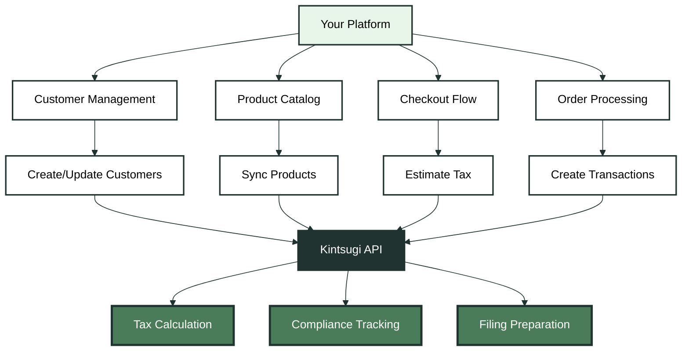
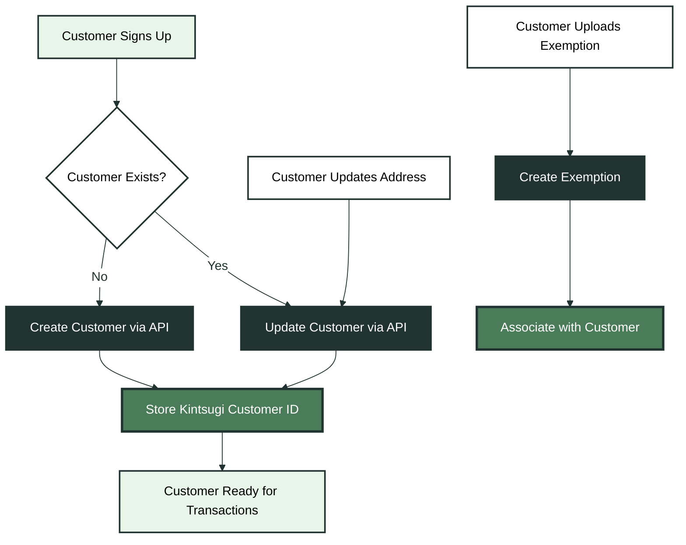
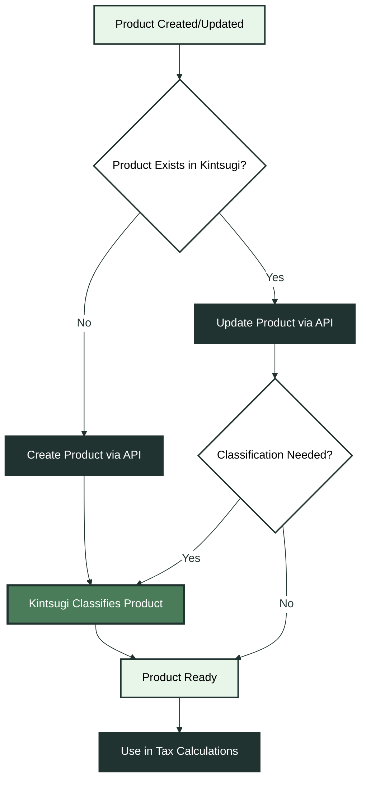
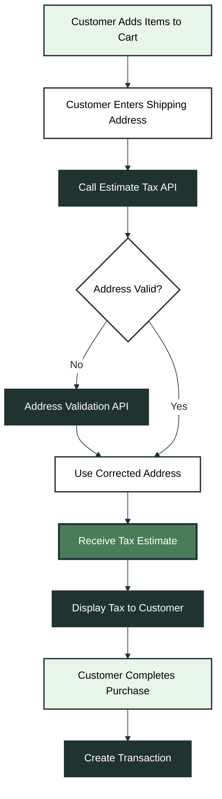
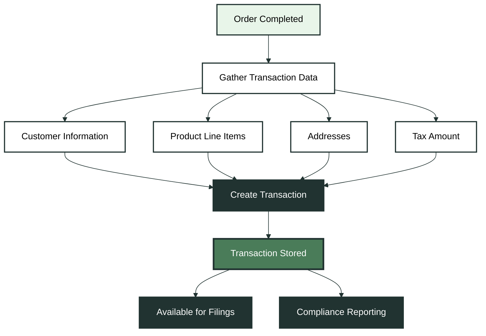

Integrating sales tax compliance into your platform requires careful architectural planning. This guide walks through the key decisions and design patterns needed to architect a robust Kintsugi integration, covering integration points, data flows, and implementation strategies from a Product Manager and Engineer's perspective.

## Understanding Your Integration Context

Before diving into implementation details, answer these foundational questions to shape your integration architecture:

<AccordionGroup>
  <Accordion title="When do sales tax calculations currently occur in your software?">
    Identifying the exact point in your transaction flow where tax calculations happen determines where to integrate Kintsugi's tax estimation endpoints. Common scenarios include checkout flow, payment processing, order confirmation, and subscription billing.
    
    <Tip>
    Most integrations use L2: transaction sync (L1) for compliance, plus the tax engine to calculate tax during checkout. Start with L1 (syncing transactions after order completion), then enable L2 to provide accurate totals before payment.
    </Tip>
  </Accordion>

  <Accordion title="Are you replacing another sales tax software provider's APIs?">
    If migrating from an existing tax solution, map existing API calls to Kintsugi's endpoints, identify data mapping differences, plan a migration strategy that minimizes disruption, and handle edge cases. Focus on maintaining feature parity while leveraging Kintsugi's additional capabilities like automatic product classification and exemption management.
  </Accordion>

  <Accordion title="Are you building a plugin from scratch?">
    Building a new integration offers flexibility to design optimal workflows. Consider webhook-based architectures for real-time updates, plan for initial data synchronization, design error handling and retry logic from the start, and build with scalability in mind. Start with the core tax estimation workflow, then expand to include customer management, product synchronization, and transaction reporting.
  </Accordion>
</AccordionGroup>

## Core Integration Architecture

Every Kintsugi integration revolves around four primary areas: Customers, Products, Sales Tax Estimates, and Transaction Reporting. Understanding how these components interact forms the foundation of your architecture.

<Expandable title="🔧 Integration Architecture Overview" icon="diagram">

</Expandable>

## Customer Management Integration

Customer data drives tax calculations through address validation, exemption status, and registration information. Your integration should handle customer creation, updates, and exemption management.

<Expandable title="👥 Customer Management Flow" icon="users">

</Expandable>

<CardGroup cols={2}>
  <Card title="Initial Customer Sync" icon="sync">
    <ul>
      <li>Batch create customers using the Create Customer endpoint</li> 
      <li>Store mapping between your customer IDs and Kintsugi customer IDs</li> 
      <li>Handle exemptions and tax registrations during sync</li> 
      <li>Consider rate limiting for large customer bases</li>
    </ul>
  </Card>
  
  <Card title="Real-time Customer Updates" icon="clock">
    <ul>
      <li>Create customers immediately when they register</li> 
      <li>Update customer addresses when shipping information changes</li> 
      <li>Handle exemption certificate uploads asynchronously</li> 
      <li>Maintain customer status synchronization</li>
    </ul>
  </Card>
</CardGroup>

Use the various `external_id` fields to maintain a stable reference between your system and Kintsugi, enabling efficient lookups and updates.

## Product Catalog Integration

Products require tax classification to determine taxability across jurisdictions. Kintsugi offers automatic product classification, but you can also provide product categories and codes directly.

<Expandable title="📦 Product Management Flow" icon="box">

</Expandable>

<CardGroup cols={2}>
  <Card title="Product Classification" icon="tag">
    <ul>
      <li>Submit product name and description</li> 
      <li>Receive taxability classification automatically</li> 
      <li>Products start with PENDING status</li> 
      <li>Classification happens asynchronously for scale</li>
    </ul>
  </Card>
  
  <Card title="Manual Product Codes" icon="code">
    <ul>
      <li>Provide product category and subcategory</li> 
      <li>Set tax_exempt flag for exempt products</li> 
      <li>Use product codes for specific tax rules</li> 
      <li>Accelerate classification approval</li>
    </ul>
  </Card>
</CardGroup>

Reference products by `external_product_id` in tax estimation requests to ensure accurate taxability calculations.

## Tax Estimation Integration

Tax estimation occurs during checkout when customers need to see accurate tax amounts before completing their purchase. This is typically the most performance-critical integration point.

<Expandable title="💰 Tax Estimation Flow" icon="calculator">

</Expandable>

<CardGroup cols={2}>
  <Card title="Real-time Estimation" icon="bolt">
    <ul>
      <li>Call Estimate Tax API when address changes</li> 
      <li>Include all cart items with product references</li> 
      <li>Handle customer exemptions automatically</li> 
      <li>Cache results for identical requests when appropriate</li>
    </ul>
  </Card>
  
  <Card title="Address Validation" icon="map-marker">
    <ul>
      <li>Validate addresses before tax estimation</li> 
      <li>Use address suggestions API for autocomplete</li> 
      <li>Store validated addresses for future use</li> 
      <li>Handle partial addresses gracefully</li>
    </ul>
  </Card>
</CardGroup>

Integrate tax estimation at the point in your checkout flow where customers review their order, typically after address entry and before payment confirmation. Consider implementing address validation as a prerequisite step to ensure accurate tax calculations.

## Transaction Reporting Integration

After a sale completes, create a transaction record in Kintsugi for compliance reporting and filing preparation. Transactions link customers, products, addresses, and tax calculations together.

<Expandable title="📊 Transaction Reporting Flow" icon="chart-bar">

</Expandable>

<CardGroup cols={2}>
  <Card title="Immediate Transaction Creation" icon="check-circle">
    <ul>
      <li>Create transactions immediately after order completion</li> 
      <li>Include all transaction details from the order</li> 
      <li>Link to previously estimated tax calculations</li> 
      <li>Handle partial refunds and credit notes</li>
    </ul>
  </Card>
  
  <Card title="Batch Transaction Sync" icon="layer-group">
    <ul>
      <li>Batch create transactions periodically</li> 
      <li>Process transactions asynchronously</li> 
      <li>Handle synchronization errors gracefully</li> 
      <li>Implement idempotency using external_id</li>
    </ul>
  </Card>
</CardGroup>

Create transactions after orders are confirmed and payment is processed. Use the same `external_id` from your order system to enable idempotent operations and easy reconciliation.

## Where to Implement Kintsugi Endpoints

Determining the right integration points depends on your platform's transaction flow and performance requirements. Map out your transaction lifecycle from cart creation through order fulfillment. Most integrations calculate tax during checkout to show accurate totals before payment. Plan data synchronization for initial setup and ongoing updates, design error handling with retry logic and graceful degradation, and optimize for performance with caching and batch operations where possible.

## Common Integration Patterns

Different platform types benefit from different integration approaches. E-commerce platforms typically use L2: real-time tax estimation during checkout (L2) with immediate transaction creation (L1). SaaS and subscription platforms use recurring tax estimation with batch transaction reporting for billing cycles. Marketplace platforms calculate tax per seller with centralized reporting, handling marketplace facilitator rules and supporting multiple tax jurisdictions simultaneously. See [Planning an Integration](/docs/api-guides/planning-an-integration) for the full L1/L2 model.

## Implementation Checklist

Ensure your integration covers setup and configuration, customer management with sync and exemption handling, product catalog synchronization and classification, tax estimation with address validation and error handling, transaction reporting with idempotency, and comprehensive testing with various address types and exemption scenarios.

<Note>
**L1 first, then L2**: Start with transaction sync (L1)—customer management, product synchronization, and transaction reporting. Once L1 is stable, add the tax estimation workflow (L2) for real-time checkout calculations. See [Planning an Integration](/docs/api-guides/planning-an-integration) for the full L1/L2 model.
</Note>

## Next Steps

<CardGroup cols={2}>
  <Card title="API Reference" icon="book">
    Explore detailed endpoint documentation in our [API Reference](/reference/api/tax-estimation/estimate-tax) to understand request formats, response structures, and error handling.
  </Card>
  
  <Card title="SDKs" icon="code">
    Accelerate development with our official [SDKs](/docs/sdks/overview) available in Python, TypeScript, Java, PHP, and Ruby.
  </Card>
</CardGroup>

---
