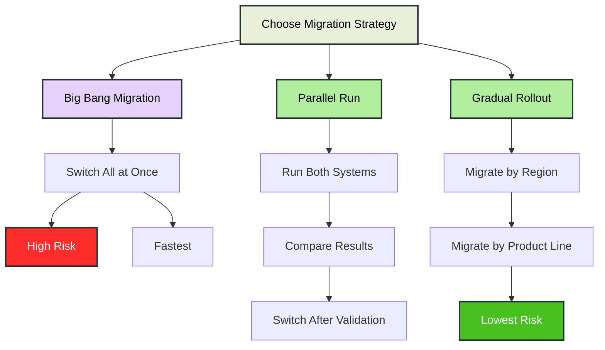

Migrating from Avalara or TaxJar to Kintsugi requires careful planning to ensure a smooth transition without disrupting your tax calculations or compliance workflows. This guide provides a comprehensive roadmap for mapping your existing integration to Kintsugi's API, migrating data, and validating your implementation.

<Tip>
Plan your migration during a low-traffic period and run both systems in parallel for at least one business cycle to validate results before fully switching over.
</Tip>

## Understanding Key Differences

Before starting your migration, understanding the architectural differences between providers helps you plan effectively.

<AccordionGroup>
  <Accordion title="API Structure Differences">
    Avalara and TaxJar use different API patterns compared to Kintsugi. Avalara typically uses transaction-based APIs with separate endpoints for calculation and recording. TaxJar treats estimations and transaction recording as separate requests. Kintsugi separates tax estimation from transaction recording, enabling more flexible integration patterns.

    For example, with Kintsugi, you can choose to instantiate a transaction record first, and then calculate and add the amount. Or, you could choose to calculate taxes first, and then send the complete transaction payload. This provides an easy migration pathway from any existing tax provider.
    
    <Tip>
    Kintsugi's separation of estimation and transaction creation allows you to estimate tax during checkout and record transactions after order completion, matching modern e-commerce workflows.
    </Tip>
  </Accordion>

  <Accordion title="Data Model Mapping">
    Customer, product, and transaction data structures differ between providers. Kintsugi uses `external_id` fields extensively to maintain references to your system, while Avalara relies on transaction codes and TaxJar uses transaction IDs. Understanding these mappings is crucial for maintaining data continuity.
  </Accordion>

  <Accordion title="Product Classification">
    Avalara uses TaxCode assignments, TaxJar uses product tax categories, and Kintsugi offers automatic AI-powered classification with optional manual override. This difference can simplify your integration by reducing manual product categorization work.
  </Accordion>
</AccordionGroup>

## API Endpoint Mapping

Mapping your existing API calls to Kintsugi's endpoints is the foundation of your migration.

```mermaid
flowchart TD
    A[Tax Calculation] --> B[Avalara POST /transactions/create]
    A --> C[TaxJar POST /taxes]
    B --> D[Kintsugi POST /v1/tax/estimate]
    C --> D
    
    E[Transaction Recording] --> F[Avalara Transaction API]
    E --> G[TaxJar Transaction API]
    F --> H[Kintsugi POST /v1/transactions]
    G --> H
    
    I[Customer Management] --> J[Avalara POST /customers]
    I --> K[TaxJar POST /customers]
    J --> L[Kintsugi POST /v1/customers]
    K --> L
    
    M[Product Management] --> N[Avalara TaxCode Assignment]
    M --> O[TaxJar Product Categories]
    N --> P[Kintsugi POST /v1/products]
    O --> P
    
    style A fill:#E8F0D9,stroke:#213331,stroke-width:2px,color:#000000
    style B fill:#E5D1FA,stroke:#213331,stroke-width:2px,color:#000000
    style C fill:#E5D1FA,stroke:#213331,stroke-width:2px,color:#000000
    style D fill:#C69CF4,stroke:#213331,stroke-width:2px,color:#FFFFFF
    style E fill:#E8F0D9,stroke:#213331,stroke-width:2px,color:#000000
    style F fill:#E5D1FA,stroke:#213331,stroke-width:2px,color:#000000
    style G fill:#E5D1FA,stroke:#213331,stroke-width:2px,color:#000000
    style H fill:#C69CF4,stroke:#213331,stroke-width:2px,color:#FFFFFF
    style I fill:#E8F0D9,stroke:#213331,stroke-width:2px,color:#000000
    style J fill:#E5D1FA,stroke:#213331,stroke-width:2px,color:#000000
    style K fill:#E5D1FA,stroke:#213331,stroke-width:2px,color:#000000
    style L fill:#C69CF4,stroke:#213331,stroke-width:2px,color:#FFFFFF
    style M fill:#E8F0D9,stroke:#213331,stroke-width:2px,color:#000000
    style N fill:#E5D1FA,stroke:#213331,stroke-width:2px,color:#000000
    style O fill:#E5D1FA,stroke:#213331,stroke-width:2px,color:#000000
    style P fill:#C69CF4,stroke:#213331,stroke-width:2px,color:#FFFFFF
```

<Expandable title="🔄 API Endpoint Mapping" icon="diagram">

</Expandable>

<CardGroup cols={2}>
  <Card title="Tax Calculation Mapping" icon="calculator">
    <ul>
      <li><strong>Avalara:</strong> `POST /transactions/create` → Kintsugi `POST /v1/tax/estimate`</li> 
      <li><strong>TaxJar:</strong> `POST /taxes` → Kintsugi `POST /v1/tax/estimate`</li> 
      <li>Both providers combine estimation and recording, while Kintsugi separates these operations</li> 
      <li>Kintsugi's estimation endpoint returns tax details without committing the transaction</li>
    </ul>
  </Card>
  
  <Card title="Transaction Recording" icon="file-invoice">
    <ul>
      <li><strong>Avalara:</strong> Uses same endpoint → Kintsugi `POST /v1/transactions`</li> 
      <li><strong>TaxJar:</strong> Uses same endpoint → Kintsugi `POST /v1/transactions`</li> 
      <li>Create transactions separately after order completion</li> 
      <li>Use `external_id` to maintain reference to your order system</li>
    </ul>
  </Card>
  
  <Card title="Customer Management" icon="users">
    <ul>
      <li><strong>Avalara:</strong> `POST /customers` → Kintsugi `POST /v1/customers`</li> 
      <li><strong>TaxJar:</strong> `POST /customers` → Kintsugi `POST /v1/customers`</li> 
      <li>Map customer IDs using `external_id` field</li> 
      <li>Exemptions handled separately via Exemptions API</li>
    </ul>
  </Card>
  
  <Card title="Product Management" icon="box">
    <ul>
      <li><strong>Avalara:</strong> TaxCode assignments → Kintsugi automatic classification</li> 
      <li><strong>TaxJar:</strong> Product tax categories → Kintsugi Product API</li> 
      <li>Sync products via `POST /v1/products`</li> 
      <li>Leverage automatic classification or provide manual codes</li>
    </ul>
  </Card>
</CardGroup>

## Migration Strategy

Choose a migration approach that minimizes risk and disruption to your business operations.

<Expandable title="📋 Migration Strategy Comparison" icon="chart-line">

</Expandable>

<CardGroup cols={2}>
  <Card title="Parallel Run Approach" icon="layer-group">
    <ul>
      <li>Run both systems simultaneously</li> 
      <li>Compare tax calculations for accuracy</li> 
      <li>Switch traffic gradually after validation</li> 
      <li>Recommended for production systems</li>
    </ul>
  </Card>
  
  <Card title="Gradual Rollout" icon="rocket">
    <ul>
      <li>Migrate by geographic region first</li> 
      <li>Or migrate by product category</li> 
      <li>Lowest risk approach</li> 
      <li>Allows for learning and adjustment</li>
    </ul>
  </Card>
</CardGroup>

## Step-by-Step Migration Process

Follow this structured approach to ensure a successful migration.

<Steps>
  <Step title="Phase 1: Preparation and Setup">
    Set up your Kintsugi account and configure your integration environment.
    
    <ul>
      <li>Create Kintsugi account and obtain API keys</li>
      <li>Configure organization settings and nexus information</li>
      <li>Set up test environment separate from production</li>
      <li>Document your current provider's API usage patterns</li>
      <li>Create mapping documentation for data structures</li>
    </ul>
  </Step>
  
  <Step title="Phase 2: Data Migration">
    Migrate existing customers, products, and historical transaction data.
    
    <ul>
      <li>Export customer data from current provider</li>
      <li>Map customer fields to Kintsugi's customer model</li>
      <li>Batch import customers using Create Customer API</li>
      <li>Sync product catalog and map tax classifications</li>
      <li>Optionally migrate historical transactions for reporting</li>
    </ul>
    
    <Warning>
    Ensure customer `external_id` mapping is consistent between systems to maintain data relationships.
    </Warning>
  </Step>
  
  <Step title="Phase 3: Integration Development">
    Build your Kintsugi integration following the mapping guide.
    
    <ul>
      <li>Replace tax calculation API calls with Kintsugi Estimate Tax endpoint</li>
      <li>Implement transaction creation after order completion</li>
      <li>Update customer management workflows</li>
      <li>Handle product classification workflow</li>
      <li>Implement error handling and retry logic</li>
    </ul>
  </Step>
  
  <Step title="Phase 4: Testing and Validation">
    Thoroughly test your integration before going live.
    
    <ul>
      <li>Test tax calculations across different jurisdictions</li>
      <li>Validate customer exemption handling</li>
      <li>Verify product taxability classifications</li>
      <li>Compare results with current provider during parallel run</li>
      <li>Test error scenarios and edge cases</li>
    </ul>
  </Step>
  
  <Step title="Phase 5: Cutover and Monitoring">
    Execute the migration and monitor closely for issues.
    
    <ul>
      <li>Execute cutover during low-traffic period</li>
      <li>Monitor API response times and error rates</li>
      <li>Validate tax calculations match expected results</li>
      <li>Keep current provider active as backup initially</li>
      <li>Have rollback plan ready if issues arise</li>
    </ul>
  </Step>
</Steps>

## Common Migration Challenges

Understanding potential pitfalls helps you avoid them during migration.

<AccordionGroup>
  <Accordion title="Address Validation Differences">
    Avalara and TaxJar handle address validation differently than Kintsugi. Kintsugi provides separate address validation endpoints that you should call before tax estimation to ensure accurate calculations.
    
    **Solution:** Implement address validation as a prerequisite step in your checkout flow, using Kintsugi's Address Validation API before calling Estimate Tax.
  </Accordion>

  <Accordion title="Exemption Certificate Handling">
    Exemption certificate workflows differ significantly between providers. Kintsugi manages exemptions separately from customers, requiring explicit association.
    
    **Solution:** Migrate exemption certificates using the Exemptions API, then associate them with customers using the exemption relationship endpoints.
  </Accordion>

  <Accordion title="Product Tax Code Mapping">
    Tax codes from Avalara or TaxJar don't directly map to Kintsugi's product classification system. Kintsugi uses automatic classification with product categories and codes.
    
    **Solution:** Leverage Kintsugi's automatic product classification for most products, or manually map critical products using product codes during initial sync.
  </Accordion>

  <Accordion title="Transaction ID Mapping">
    Maintaining transaction references between systems is critical for reconciliation. Your current provider's transaction IDs won't work in Kintsugi.
    
    **Solution:** Use Kintsugi's `external_id` field to store your original transaction identifiers, enabling easy reconciliation and lookups.
  </Accordion>
</AccordionGroup>

## Validation Checklist

Use this checklist to ensure your migration is complete and validated.

<CardGroup cols={2}>
  <Card title="Integration Completeness" icon="check-circle">
    <ul>
      <li>[ ] Tax estimation implemented</li> 
      <li>[ ] Transaction creation implemented</li> 
      <li>[ ] Customer sync completed</li> 
      <li>[ ] Product catalog synced</li> 
      <li>[ ] Exemption handling implemented</li>
    </ul>
  </Card>
  
  <Card title="Data Accuracy" icon="shield-check">
    <ul>
      <li>[ ] Tax calculations match expected results</li> 
      <li>[ ] All jurisdictions calculating correctly</li> 
      <li>[ ] Exemptions applying correctly</li> 
      <li>[ ] Product taxability accurate</li> 
      <li>[ ] Historical data migrated successfully</li>
    </ul>
  </Card>
  
  <Card title="Error Handling" icon="bug">
    <ul>
      <li>[ ] Retry logic implemented</li> 
      <li>[ ] Graceful degradation on failures</li> 
      <li>[ ] Error logging configured</li> 
      <li>[ ] Monitoring and alerting set up</li> 
      <li>[ ] Rate limiting handled</li>
    </ul>
  </Card>
  
  <Card title="Production Readiness" icon="rocket">
    <ul>
      <li>[ ] Load testing completed</li> 
      <li>[ ] Documentation updated</li> 
      <li>[ ] Team trained on new system</li> 
      <li>[ ] Rollback plan documented</li> 
      <li>[ ] Support contacts established</li>
    </ul>
  </Card>
</CardGroup>

## Post-Migration Optimization

After successful migration, optimize your integration to leverage Kintsugi's unique features.

<CardGroup cols={2}>
  <Card title="Leverage Automatic Classification" icon="sparkles">
    Kintsugi's automatic product classification can reduce manual work. Allow the system to classify products automatically, then review and approve classifications as needed rather than manually categorizing everything upfront.
  </Card>
  
  <Card title="Optimize API Calls" icon="bolt">
    Since Kintsugi separates estimation from transaction creation, you can cache tax estimates during checkout and only create transactions after order completion, reducing API calls and improving performance.
  </Card>
</CardGroup>

<Note>
A successful migration requires careful planning, thorough testing, and gradual rollout. Take time to validate your integration thoroughly before fully switching over to ensure accuracy and compliance.
</Note>

## Next Steps

<CardGroup cols={2}>
  <Card title="API Reference" icon="book">
    Review detailed endpoint documentation in our [API Reference](/reference/api/tax-estimation/estimate-tax) to understand request formats and response structures.
  </Card>
  
  <Card title="Support" icon="headset">
    Need help with your migration? Contact our [Support Team](https://trykintsugi.com/support) for assistance with your specific migration scenario.
  </Card>
</CardGroup>

---

