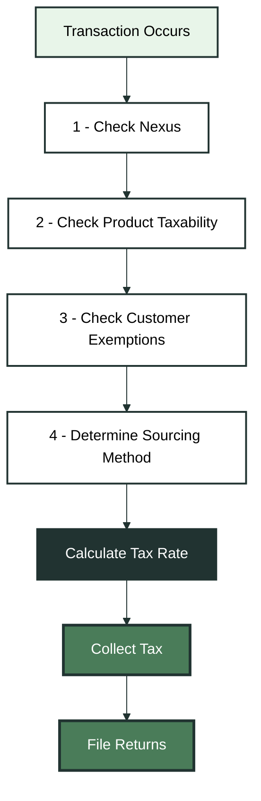
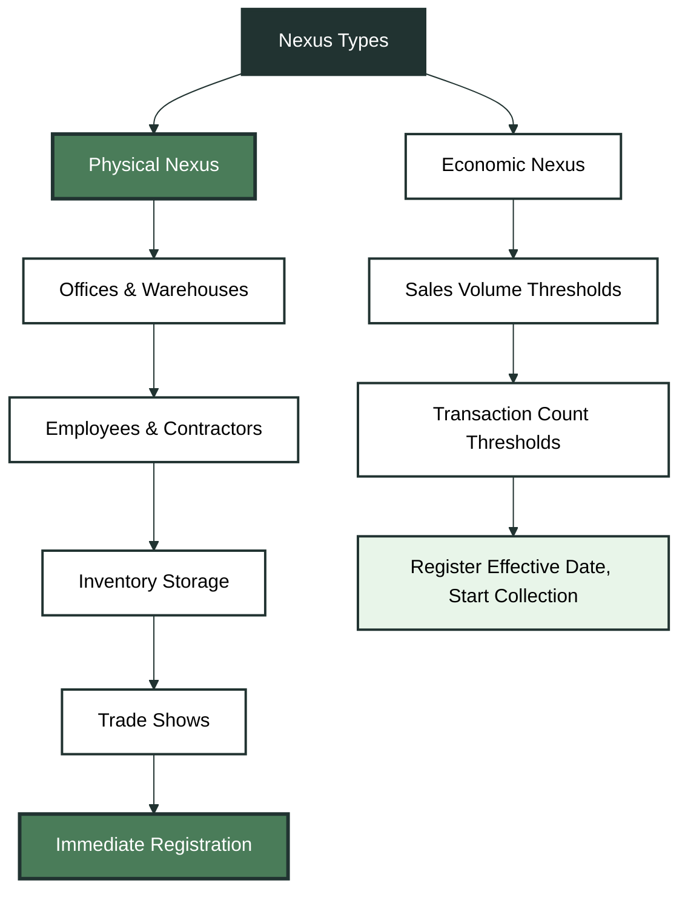
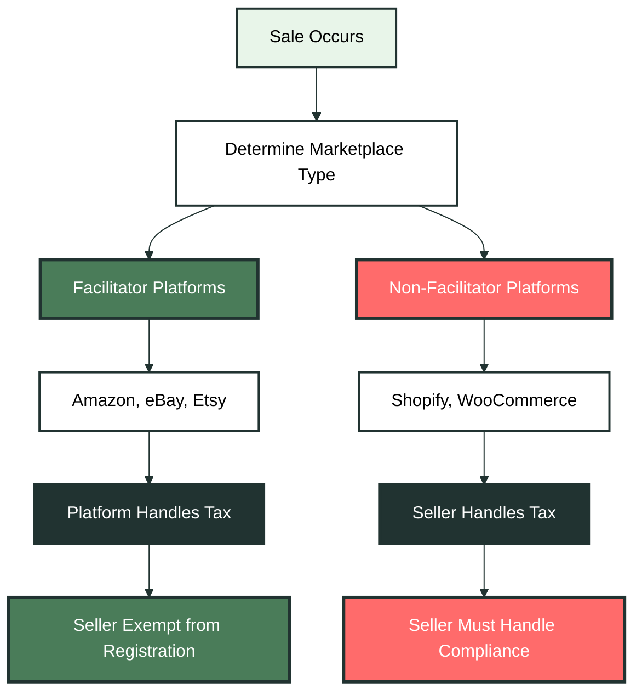

Building e-commerce platforms, SaaS applications, and marketplace solutions means navigating one of the most complex regulatory landscapes in software development: sales tax. Unlike federal income tax with consistent rules, sales tax operates across 47+ states and local jurisdictions, each with unique requirements, thresholds, and definitions.

<Note>
This guide covers the fundamental concepts every developer needs to build tax-compliant systems. For implementation details, see our [API Reference](/reference/api/tax-estimation/estimate-tax).
</Note>

## The Four-Factor Taxability Framework

Sales tax isn't a simple yes/no decision. Every transaction requires evaluating four interconnected factors:

<Expandable title="📊 Decision Flow Diagram" icon="diagram">



</Expandable>

<AccordionGroup>
  <Accordion title="1. Nexus - The Business Connection">
    **Does your business have a connection to the state?**
    
    Without nexus, you have no tax collection obligation in that jurisdiction. Nexus comes in two forms:
    
    - **Physical nexus**: Offices, warehouses, employees, inventory storage
    - **Economic nexus**: Sales volume or transaction count thresholds
    
    <Tip>
    Remote employees create physical nexus in their state, even if they work from home.
    </Tip>
  </Accordion>

  <Accordion title="2. Product Taxability - What's Actually Taxable">
    **Is your product or service taxable in that state?**
    
    Taxability varies wildly by state and product type:
    
    <Tabs>
      <Tab title="Physical Goods">
        - **Always taxable**: Electronics, clothing, furniture
        - **Often exempt**: Groceries, prescription drugs, medical devices
        - **State-specific**: Clothing (exempt in PA, taxable in CA)
      </Tab>
      <Tab title="Digital Products">
        - **Taxable**: Colorado, Connecticut, Hawaii
        - **Exempt**: California, New York, Florida
        - **Mixed rules**: Software vs. digital services
      </Tab>
      <Tab title="Services">
        - **Generally exempt**: Most states
        - **Always taxable**: Hawaii, New Mexico, South Dakota, West Virginia
        - **Selective**: Professional services, repair services
      </Tab>
    </Tabs>
  </Accordion>

  <Accordion title="3. Customer Exemptions - Who Gets Special Treatment">
    **Does the customer qualify for an exemption?**
    
    Common exempt customers:
    - Government agencies
    - Nonprofit organizations (501c3)
    - Businesses purchasing for resale
    - Educational institutions
    
    <Warning>
    Exempt sales require valid exemption certificates. Collecting tax on exempt sales creates audit liability.
    </Warning>
  </Accordion>

  <Accordion title="4. Sourcing - Where to Apply the Rate">
    **Which location determines the tax rate?**
    
    Two sourcing methods exist:
    - **Origin-based**: Rate based on seller's location
    - **Destination-based**: Rate based on customer's location
  </Accordion>
</AccordionGroup>

## Nexus Types: Physical vs Economic

The 2018 Wayfair Supreme Court decision fundamentally changed sales tax obligations, creating two distinct nexus types:

<Expandable title="🏢 Nexus Types Diagram" icon="building">

</Expandable>

<CardGroup cols={2}>
  <Card title="Physical Nexus" icon="building">
    **Traditional connection to a state**
    
    **Triggers:**
    - Retail stores or offices
    - Warehouses or inventory storage
    - Employees or contractors
    - Trade shows or pop-up shops
    
    **Timeline:** Immediate upon establishment
  </Card>
  
  <Card title="Economic Nexus" icon="chart-line">
    **Sales volume-based connection**
    
    **Common Thresholds:**
    - $100,000 annual sales OR
    - 200 transactions per year
    
    **High-volume states:**
    - CA, NY, TX: $500,000
    - NY: $500,000 + 100 transactions
    
    **Timeline:** Register with effective nexus start date, start collection
  </Card>
</CardGroup>

<Steps>
  <Step title="Monitor Sales by State">
    Track both revenue and transaction counts for each state where you sell.
  </Step>
  <Step title="Set Up Threshold Alerts">
    Configure notifications when approaching nexus thresholds.
  </Step>
  <Step title="Register Before Collecting">
    Never collect tax without a valid permit—it's illegal in most states.
  </Step>
  <Step title="Begin Collection Immediately">
    Start collecting tax on the very next transaction after registration.
  </Step>
</Steps>

## Sourcing Rules: Origin vs Destination

Once you have nexus and a taxable product, you need to determine which tax rate applies:

<AccordionGroup>
  <Accordion title="Origin-Based Sourcing">
    **Tax rate based on seller's location**
    
    **States:** Arizona, California, Illinois, Mississippi, Missouri, Ohio, Pennsylvania, Tennessee, Texas, Utah, Virginia
    
    **How it works:**
    - Austin, TX merchant charges Austin rate to all Texas customers
    - Same rate whether shipping to Dallas, Houston, or rural West Texas
    - Simplifies calculation but concentrates revenue in business locations
    
    <CodeGroup>
      <CodeGroupItem title="Example">
        ```javascript
        // Origin-based calculation
        const taxRate = getOriginRate(sellerLocation);
        const taxAmount = transactionAmount * taxRate;
        ```
      </CodeGroupItem>
    </CodeGroup>
  </Accordion>

  <Accordion title="Destination-Based Sourcing">
    **Tax rate based on customer's delivery address**
    
    **How it works:**
    - Los Angeles merchant charges San Diego rate for San Diego delivery
    - Must calculate different rates for each delivery address
    - Navigate 11,000+ tax jurisdictions across the US
    
    <CodeGroup>
      <CodeGroupItem title="Example">
        ```javascript
        // Destination-based calculation
        const taxRate = getDestinationRate(customerAddress);
        const taxAmount = transactionAmount * taxRate;
        ```
      </CodeGroupItem>
    </CodeGroup>
  </Accordion>

  <Accordion title="California's Mixed Sourcing">
    **Hybrid approach with complex rules**
    
    - **State, county, city taxes**: Origin-based
    - **District taxes**: Destination-based
    - Creates exceptional complexity for developers
  </Accordion>
</AccordionGroup>

## Marketplace Facilitators

E-commerce marketplaces have spawned specialized legislation that shifts compliance responsibility from sellers to platforms:

<Expandable title="🛒 Marketplace Facilitator Diagram" icon="store">

</Expandable>

<CardGroup cols={2}>
  <Card title="Marketplace Facilitators" icon="store">
    **Platforms that handle tax collection**
    
    **Examples:**
    - Amazon (FBA sellers)
    - eBay, Etsy
    - Walmart Marketplace
    - TikTok Shops
    
    **Responsibilities:**
    - Collect and remit sales tax
    - Act as "retailer of record"
    - Handle all tax compliance
  </Card>
  
  <Card title="Non-Facilitator Platforms" icon="code">
    **Platforms where sellers handle their own tax**
    
    **Examples:**
    - Shopify, WooCommerce
    - Wix, Squarespace
    - Custom-built solutions
    
    **Responsibilities:**
    - Sellers must register and collect
    - Platform provides tools only
    - Full compliance burden on seller
  </Card>
</CardGroup>

<Note>
**Key Distinction:** If you sell exclusively through facilitating platforms, you typically don't need separate state registrations—unless you have physical nexus or make direct sales outside the marketplace.
</Note>

## Collection Timeline

The timing of sales tax obligations follows a precise sequence that systems must automate:

<Steps>
  <Step title="Home State Registration">
    Register before making your first sale. Most states require permits regardless of volume.
  </Step>
  <Step title="Physical Nexus Registration">
    Register within 30 days of establishing physical presence (office, employee, inventory).
  </Step>
  <Step title="Economic Nexus Monitoring">
    Track sales by state and register within 30 days of exceeding thresholds.
  </Step>
  <Step title="Begin Collection">
    Start collecting tax immediately upon receiving your permit.
  </Step>
  <Step title="File Returns">
    File and remit taxes according to assigned frequency (monthly, quarterly, annually).
  </Step>
</Steps>

## System Architecture Requirements

Building tax-compliant systems requires several critical components. Kintsugi manages all of the below logic for you:

<AccordionGroup>
  <Accordion title="Nexus Tracking Engine">
    Continuously monitor sales data across all states, comparing volumes against current thresholds and alerting when registration becomes necessary.
    
    **Key features:**
    - Real-time sales aggregation by state
    - Threshold monitoring and alerts
    - Registration deadline tracking
    - Historical data analysis
  </Accordion>

  <Accordion title="Product Taxability Matrix">
    Map inventory SKUs to state-specific tax rules, accounting for exemptions and special rates.
    
    **Key features:**
    - SKU-to-taxability mapping
    - State-specific product rules
    - Exemption handling
    - Regular rule updates
  </Accordion>

  <Accordion title="Rate Calculation Engine">
    Determine appropriate rates based on precise geocoding of delivery addresses, distinguishing between origin and destination states.
    
    **Key features:**
    - Accurate address geocoding
    - Origin vs destination logic
    - 11,000+ jurisdiction support
    - Real-time rate updates
  </Accordion>

  <Accordion title="Exemption Certificate Management">
    Collect, validate, and store documentation for exempt sales with built-in workflows for renewal and expiration.
    
    **Key features:**
    - Certificate collection and storage
    - Validation and verification
    - Renewal tracking
    - Audit trail maintenance
  </Accordion>

  <Accordion title="Marketplace Sales Segregation">
    Clearly separate facilitated from direct sales in reporting systems.
    
    **Key features:**
    - Sales channel identification
    - Separate reporting streams
    - Compliance tracking
    - Audit trail maintenance
  </Accordion>

  <Accordion title="Comprehensive Audit Trails">
    Maintain detailed records of every tax calculation, including nexus determination, product taxability assessment, rate sourcing, and exemption application.
    
    **Key features:**
    - Complete calculation history
    - Decision point logging
    - Data integrity checks
    - Compliance reporting
  </Accordion>
</AccordionGroup>

<Note>
Sales tax compliance evolves as businesses grow, states change laws, and new sales channels emerge. Understanding these fundamental concepts—taxability factors, nexus types, sourcing rules, marketplace facilitator models, and collection timing—enables you to architect systems that scale with business growth while maintaining compliance across jurisdictions.
</Note>

## Next Steps

<CardGroup cols={2}>
  <Card title="Get Started" icon="rocket">
    Ready to implement sales tax? Start with our [Getting Started Guide](/docs/getting-started) and [API Reference](/reference).
  </Card>
  
  <Card title="Need Help?" icon="question">
    Have questions about your specific use case? Check our [Support Center](https://trykintsugi.com/support) or contact our team.
  </Card>
</CardGroup>

---