<Warning>
**Preview Mode** - While Kintsugi's new docs site is in preview, please use **https://kintsugi.mintlify.app/mcp** for MCP server access. Once we launch our production docs site, the MCP server will be available at **https://docs.trykintsugi.com/mcp**.
</Warning>

<Note>
**What is MCP?** Model Context Protocol (MCP) enables AI coding assistants like Claude in Cursor IDE to understand and use external APIs. Kintsugi's MCP server gives AI assistants direct access to our API documentation, making it easier for developers to build integrations with accurate, up-to-date code examples.
</Note>

Kintsugi's Model Context Protocol (MCP) integration transforms how developers build with our tax compliance API. Instead of manually reading documentation and writing API calls, AI assistants can understand Kintsugi's endpoints, generate accurate code, debug issues, and provide context-aware help—all while you code.

## Why Use Kintsugi MCP?

Building integrations with Kintsugi's API typically requires:
- Reading extensive API documentation
- Understanding request/response formats
- Handling authentication correctly
- Debugging API errors
- Writing boilerplate code

With MCP-enabled AI assistants, you get:

- **Accurate Code Generation** - AI understands Kintsugi's actual API endpoints and generates working code
- **Real-Time Documentation** - AI assistants access up-to-date API specs, not outdated docs
- **Context-Aware Help** - Get suggestions based on your actual code and integration needs
- **Faster Development** - Reduce time spent on API integration from hours to minutes

<AccordionGroup>
  <Accordion title="Example: Building a Checkout Integration">
    **You**: "How do I calculate tax for a checkout using Kintsugi?"
    
    **AI Assistant** (with Kintsugi MCP):
    - Understands the `/v1/tax/estimate` endpoint
    - Generates code with correct request format
    - Includes proper authentication headers
    - Handles response parsing
    
    **Result**: You get working code to integrate tax calculation into your checkout flow.
  </Accordion>
  
  <Accordion title="Example: Debugging API Issues">
    **You**: "My tax calculation is failing with a 400 error"
    
    **AI Assistant** (with Kintsugi MCP):
    - Tests the same endpoint with your parameters
    - Identifies missing required fields
    - Suggests fixes based on current API requirements
    - Provides corrected code
    
    **Result**: Fast resolution instead of manual API debugging.
  </Accordion>
  
  <Accordion title="Example: Understanding Complex Workflows">
    **You**: "How do I handle tax-exempt customers in my integration?"
    
    **AI Assistant** (with Kintsugi MCP):
    - Explains exemption endpoints
    - Shows how to link exemptions to transactions
    - Generates code for the complete workflow
    - Provides best practices
    
    **Result**: Complete understanding and implementation in one conversation.
  </Accordion>
</AccordionGroup>

## How It Works

Here's how Kintsugi MCP helps you build better integrations:

```mermaid
%%{init: {'theme':'base', 'themeVariables': {'primaryColor':'#FFFFFF','primaryTextColor':'#213331','primaryBorderColor':'#213331','lineColor':'#213331','secondaryColor':'#FFFFFF','tertiaryColor':'#213331','edgeLabelBackground':'transparent','edgeStrokeWidth':'2px','edgeStroke':'#213331','arrowheadColor':'#213331','clusterBkg':'transparent','clusterBorder':'#213331','defaultLinkColor':'#213331'}}}%%
graph TB
    Developer["👨‍💻 Developer<br/>Building Integration"] --> Question["❓ Asks Question<br/>about API"]
    Question --> AIClient["🤖 AI Assistant<br/>Cursor/Claude Desktop"]
    AIClient --> MCPQuery["📡 Queries via MCP"]
    MCPQuery --> MCPServer["🔄 Kintsugi MCP Server"]
    MCPServer --> ReadDocs["📖 Reads OpenAPI Spec"]
    ReadDocs --> OpenAPI["📄 Kintsugi openapi.json<br/>API Documentation"]
    OpenAPI --> Context["💡 Provides Context"]
    Context --> MCPServer
    MCPServer --> Generate["⚙️ Generates Code"]
    Generate --> Code["💻 Working Code<br/>Calls Kintsugi API"]
    Code --> HTTPReq["🌐 HTTP Requests"]
    HTTPReq --> KintsugiAPI["🔌 Kintsugi API<br/>api.trykintsugi.com"]
    KintsugiAPI --> Response["📥 API Responses"]
    Response --> Code
    Code --> Complete["✅ Integration Complete"]
    Complete --> Developer
    
    style Developer fill:#e8f5e9,stroke:#213331,stroke-width:2px,color:#000000
    style Question fill:#FFFFFF,stroke:#213331,stroke-width:2px,color:#000000
    style AIClient fill:#FFFFFF,stroke:#213331,stroke-width:2px,color:#000000
    style MCPQuery fill:#FFFFFF,stroke:#213331,stroke-width:2px,color:#000000
    style MCPServer fill:#4a7c59,stroke:#213331,stroke-width:3px,color:#FFFFFF
    style ReadDocs fill:#FFFFFF,stroke:#213331,stroke-width:2px,color:#000000
    style OpenAPI fill:#213331,stroke:#213331,stroke-width:3px,color:#FFFFFF
    style Context fill:#FFFFFF,stroke:#213331,stroke-width:2px,color:#000000
    style Generate fill:#FFFFFF,stroke:#213331,stroke-width:2px,color:#000000
    style Code fill:#e8f5e9,stroke:#213331,stroke-width:2px,color:#000000
    style HTTPReq fill:#FFFFFF,stroke:#213331,stroke-width:2px,color:#000000
    style KintsugiAPI fill:#213331,stroke:#213331,stroke-width:3px,color:#FFFFFF
    style Response fill:#FFFFFF,stroke:#213331,stroke-width:2px,color:#000000
    style Complete fill:#4a7c59,stroke:#213331,stroke-width:3px,color:#FFFFFF
```



<AccordionGroup>
  <Accordion title="1. Developer Asks Question">
    You ask an AI assistant: *"How do I call Kintsugi's tax estimation endpoint?"*
  </Accordion>
  
  <Accordion title="2. AI Queries MCP Server">
    The AI assistant queries Kintsugi's MCP server, which provides access to our OpenAPI specification with all endpoint details.
  </Accordion>
  
  <Accordion title="3. AI Understands API Structure">
    The MCP server gives the AI context about:
    - Available endpoints (like `POST /v1/tax/estimate`)
    - Request/response schemas
    - Authentication requirements
    - Error handling patterns
  </Accordion>
  
  <Accordion title="4. AI Generates Accurate Code">
    Based on the API spec, the AI generates working code:
    ```python
    import requests
    
    response = requests.post(
        'https://api.trykintsugi.com/v1/tax/estimate',
        headers={
            'x-api-key': 'your-api-key',
            'x-organization-id': 'your-org-id'
        },
        json={
            'amount': 100.00,
            'shipping_address': {...}
        }
    )
    ```
  </Accordion>
  
  <Accordion title="5. Developer Uses Code">
    You integrate the generated code into your application, customize it for your needs, and start making API calls.
  </Accordion>
</AccordionGroup>

## Quick Setup

<Steps>
  <Step title="Choose Your Development Environment">
    Kintsugi MCP works with MCP-compatible AI coding assistants:
    
    <Tabs>
      <Tab title="Cursor IDE">
        Cursor's AI assistant can use MCP servers, making it perfect for developers building Kintsugi integrations. The AI understands your codebase and Kintsugi's API simultaneously.
      </Tab>
      <Tab title="Claude Desktop">
        Claude Desktop supports MCP servers and can help with API integration code, even outside an IDE.
      </Tab>
      <Tab title="VS Code with MCP Extension">
        VS Code extensions that support MCP can connect to Kintsugi's MCP server for API-aware code assistance.
      </Tab>
    </Tabs>
  </Step>
  
  <Step title="Configure MCP Server">
    Add Kintsugi's MCP server to your AI assistant configuration:
    
    ```json
    {
      "mcpServers": {
        "kintsugi": {
          "url": "https://kintsugi.mintlify.app/mcp"
        }
      }
    }
    ```
    
    <Note>
    The MCP server URL will change to `https://docs.trykintsugi.com/mcp` once our production docs site launches.
    </Note>
  </Step>
  
  <Step title="Get Your API Key & Organization ID">
    You'll need both an API key and Organization ID for authentication:
    
    1. Sign in to [app.trykintsugi.com](https://app.trykintsugi.com)
    2. Navigate to **Settings** → **API Keys**
    3. Create a new API key
    4. Store it securely (never commit to version control)
    5. Find your **Organization ID** in the **lower left-hand corner** of the dashboard after logging in
  </Step>
  
  <Step title="Start Building">
    Once configured, your AI assistant understands Kintsugi's API. Try asking:
    
    - "Show me how to estimate tax for a transaction"
    - "Generate code to create a customer in Kintsugi"
    - "How do I handle address validation?"
    - "What's the request format for creating a registration?"
  </Step>
</Steps>

## Available API Endpoints

Kintsugi MCP exposes all endpoints from our **API Reference - Partners** section, giving AI assistants knowledge of:

<CardGroup cols={2}>
  <Card title="Tax Estimation" icon="calculator">
    `POST /v1/tax/estimate` - Calculate tax for transactions before committing
  </Card>
  <Card title="Transaction Management" icon="receipt">
    `POST /v1/transactions`, `GET /v1/transactions` - Create and manage sales transactions
  </Card>
  <Card title="Customer Management" icon="users">
    `POST /v1/customers`, `GET /v1/customers/{id}` - Manage customer records and exemptions
  </Card>
  <Card title="Nexus & Registrations" icon="map">
    `GET /v1/nexus`, `POST /v1/registrations` - Determine nexus and manage registrations
  </Card>
  <Card title="Products & Categories" icon="box">
    `POST /v1/products`, `GET /v1/product-categories` - Manage product taxability
  </Card>
  <Card title="Filings & Compliance" icon="file-check">
    `GET /v1/filings`, `POST /v1/filings` - Track and manage tax filings
  </Card>
  <Card title="Address Validation" icon="location-dot">
    `POST /v1/address_validation/search` - Validate addresses for accurate tax calculation
  </Card>
  <Card title="Organization Management" icon="building">
    `GET /v1/organizations`, `POST /v1/api-keys` - Manage organization settings
  </Card>
</CardGroup>

## Real-World Example

Here's a complete example of building a checkout integration with MCP:

**Developer**: "I need to add tax calculation to my e-commerce checkout. How do I integrate with Kintsugi?"

**AI Assistant** (with Kintsugi MCP):

1. **Understands the requirement** - Needs tax calculation in checkout flow
2. **Identifies the endpoint** - `POST /v1/tax/estimate` from Kintsugi's API
3. **Generates code**:
   ```python
   import requests
   
   def calculate_tax(cart_total, shipping_address, api_key, organization_id):
       response = requests.post(
           'https://api.trykintsugi.com/v1/tax/estimate',
           headers={
               'x-api-key': api_key,
               'x-organization-id': organization_id,
               'Content-Type': 'application/json'
           },
           json={
               'amount': cart_total,
               'shipping_address': {
                   'street_1': shipping_address['street'],
                   'city': shipping_address['city'],
                   'state': shipping_address['state'],
                   'zip': shipping_address['zip']
               }
           }
       )
       response.raise_for_status()
       return response.json()
   ```
4. **Explains next steps** - How to handle the response, error cases, and commit the transaction

**Result**: Developer has working code in minutes instead of hours of API documentation reading.

## Benefits for Developers

<CardGroup cols={2}>
  <Card title="Faster Integration" icon="rocket">
    Reduce integration time from days to hours with AI-generated code
  </Card>
  <Card title="Fewer Errors" icon="shield-check">
    AI understands API schemas and generates correct request formats
  </Card>
  <Card title="Always Up-to-Date" icon="clock">
    MCP provides current API specs, not outdated documentation
  </Card>
  <Card title="Better Debugging" icon="bug">
    AI can test endpoints and identify issues faster than manual debugging
  </Card>
</CardGroup>

## Next Steps

<CardGroup cols={2}>
  <Card title="Explore Use Cases" icon="lightbulb" href="/docs/mcp/use-cases">
    See how developers use Kintsugi MCP in real projects
  </Card>
  <Card title="Integration Guide" icon="code" href="/docs/mcp/integration">
    Step-by-step setup for your development environment
  </Card>
  <Card title="Browse API Endpoints" icon="list" href="/mcp">
    View all endpoints available through MCP
  </Card>
  <Card title="Full API Reference" icon="book" href="/reference">
    Complete API documentation
  </Card>
</CardGroup>

<Warning>
**Authentication Required** - While the MCP server helps AI assistants understand Kintsugi's API, you'll still need valid API credentials to make actual API calls. 

Kintsugi uses **API key authentication via headers** (not bearer token). Every request requires:
- `x-api-key` header with your API key
- `x-organization-id` header with your organization ID

Generate API keys in your [Kintsugi dashboard](https://app.trykintsugi.com). Your Organization ID can be found in the **lower left-hand corner** after logging in.
</Warning>
