This guide showcases how developers use Kintsugi MCP to build integrations more efficiently. From e-commerce checkouts to compliance automation, see how AI assistants with MCP understanding help write better code faster.

<CardGroup cols={2}>
  <Card title="E-Commerce Integration" icon="shopping-cart" href="#ecommerce">
    Build tax calculation into checkout flows
  </Card>
  <Card title="API Debugging" icon="bug" href="#debugging">
    Quickly identify and fix API integration issues
  </Card>
  <Card title="Complex Workflows" icon="diagram-project" href="#workflows">
    Implement multi-step tax compliance processes
  </Card>
  <Card title="Code Generation" icon="code" href="#code-generation">
    Generate boilerplate and integration code
  </Card>
</CardGroup>

## E-Commerce Checkout Integration

One of the most common use cases: adding tax calculation to an e-commerce checkout flow.

### Developer Workflow

**Developer**: "I need to add tax calculations to my custom store's checkout. How do I integrate Kintsugi?"

**AI Assistant** (with Kintsugi MCP):

1. **Understands the context** - E-commerce checkout needs real-time tax calculation
2. **Identifies the endpoint** - `POST /v1/tax/estimate` from Kintsugi's API
3. **Generates integration code**:

```python
# Generated by AI with Kintsugi MCP understanding
from flask import Flask, request, jsonify
import requests

app = Flask(__name__)
KINTSUGI_API_KEY = os.getenv('KINTSUGI_API_KEY')
KINTSUGI_API_URL = 'https://api.trykintsugi.com'

@app.route('/api/checkout/calculate-tax', methods=['POST'])
def calculate_tax():
    cart_data = request.json
    
    # Prepare tax estimation request
    tax_request = {
        'amount': cart_data['subtotal'],
        'shipping_address': {
            'street_1': cart_data['shipping']['address1'],
            'street_2': cart_data['shipping'].get('address2'),
            'city': cart_data['shipping']['city'],
            'state': cart_data['shipping']['province_code'],
            'zip': cart_data['shipping']['zip']
        },
        'line_items': [
            {
                'product_id': item['product_id'],
                'quantity': item['quantity'],
                'price': item['price']
            }
            for item in cart_data['items']
        ]
    }
    
    # Call Kintsugi API
    response = requests.post(
        f'{KINTSUGI_API_URL}/v1/tax/estimate',
        headers={
            'x-api-key': KINTSUGI_API_KEY,
            'x-organization-id': ORGANIZATION_ID,
            'Content-Type': 'application/json'
        },
        json=tax_request
    )
    
    if response.status_code == 200:
        tax_data = response.json()
        return jsonify({
            'tax_amount': tax_data['tax_amount'],
            'total': cart_data['subtotal'] + tax_data['tax_amount'],
            'breakdown': tax_data.get('breakdown', [])
        })
    else:
        return jsonify({'error': 'Tax calculation failed'}), response.status_code
```

4. **Explains the flow** - How to handle the response, store transactions, and commit tax

### Key Benefits

<AccordionGroup>
  <Accordion title="Accurate Request Format">
    AI understands the exact schema required by Kintsugi's API, generating correct request structures without manual documentation lookup.
  </Accordion>
  
  <Accordion title="Error Handling">
    AI includes proper error handling based on Kintsugi's API error patterns, reducing debugging time.
  </Accordion>
  
  <Accordion title="Best Practices">
    Generated code follows Kintsugi's recommended patterns for authentication, request formatting, and response handling.
  </Accordion>
</AccordionGroup>

## API Debugging and Troubleshooting

When API calls fail, MCP-enabled AI assistants can help debug faster than manual investigation.

### Example: Debugging Failed Tax Calculation

**Developer**: "My tax calculation is returning a 400 error. Here's my code:"

```python
response = requests.post(
    'https://api.trykintsugi.com/v1/tax/estimate',
    headers={
        'x-api-key': api_key,
        'x-organization-id': organization_id
    },
    json={'amount': 100, 'address': 'Seattle, WA'}
)
```

**AI Assistant** (with Kintsugi MCP):

1. **Tests the endpoint** - Uses MCP to understand required parameters
2. **Identifies the issue** - The request is missing required fields
3. **Provides fix**:

```python
# Fixed code based on actual API schema
response = requests.post(
    'https://api.trykintsugi.com/v1/tax/estimate',
    headers={
        'x-api-key': api_key,
        'x-organization-id': organization_id,
        'Content-Type': 'application/json'
    },
    json={
        'amount': 100.00,
        'shipping_address': {  # Required field name
            'street_1': '123 Main St',  # Required
            'city': 'Seattle',           # Required
            'state': 'WA',               # Required
            'zip': '98101'               # Required
        }
    }
)
```

4. **Explains the error** - Why `address` string format isn't supported, needs structured object

### Debugging Workflow

```mermaid
%%{init: {'theme':'base', 'themeVariables': {'primaryColor':'#FFFFFF','primaryTextColor':'#213331','primaryBorderColor':'#213331','lineColor':'#213331','secondaryColor':'#FFFFFF','tertiaryColor':'#213331','edgeLabelBackground':'#FFFFFF','edgeLabelColor':'#213331','edgeStrokeWidth':'2px','edgeStroke':'#213331','arrowheadColor':'#213331','clusterBkg':'transparent','clusterBorder':'#213331','defaultLinkColor':'#213331'}}}%%
graph TB
    Dev["👨‍💻 Developer<br/>Reports Error"] --> ShowCode["📝 Shows Code"]
    ShowCode --> AI["🤖 AI Assistant<br/>with MCP"]
    AI --> QueryMCP["📡 Queries MCP"]
    QueryMCP --> MCP["🔄 Kintsugi MCP Server"]
    MCP --> Schema["📋 Provides Schema"]
    Schema --> AI
    AI --> Analyze["🔍 Analyzes Request"]
    Analyze --> Analysis["⚖️ Compares Code vs Schema"]
    Analysis --> Identify["⚠️ Identifies Issues"]
    Identify --> Issues["❌ Missing Fields<br/>Wrong Format<br/>Invalid Values"]
    Issues --> GenerateFix["🔧 Generates Fix"]
    GenerateFix --> FixedCode["✅ Corrected Code"]
    FixedCode --> Explain["💡 Provides Explanation"]
    Explain --> Dev
    
    style Dev fill:#e8f5e9,stroke:#213331,stroke-width:2px,color:#000000
    style ShowCode fill:#FFFFFF,stroke:#213331,stroke-width:2px,color:#000000
    style AI fill:#FFFFFF,stroke:#213331,stroke-width:2px,color:#000000
    style QueryMCP fill:#FFFFFF,stroke:#213331,stroke-width:2px,color:#000000
    style MCP fill:#213331,stroke:#213331,stroke-width:3px,color:#FFFFFF
    style Schema fill:#FFFFFF,stroke:#213331,stroke-width:2px,color:#000000
    style Analyze fill:#FFFFFF,stroke:#213331,stroke-width:2px,color:#000000
    style Analysis fill:#e8f5e9,stroke:#213331,stroke-width:2px,color:#000000
    style Identify fill:#FFFFFF,stroke:#213331,stroke-width:2px,color:#000000
    style Issues fill:#ff6b6b,stroke:#213331,stroke-width:3px,color:#FFFFFF
    style GenerateFix fill:#FFFFFF,stroke:#213331,stroke-width:2px,color:#000000
    style FixedCode fill:#4a7c59,stroke:#213331,stroke-width:3px,color:#FFFFFF
    style Explain fill:#FFFFFF,stroke:#213331,stroke-width:2px,color:#000000
```



## Complex Multi-Step Workflows

Building complete tax compliance workflows often involves multiple API calls. MCP helps AI assistants understand the entire flow.

### Example: Customer Exemption Workflow

**Developer**: "How do I handle tax-exempt customers? I need to check if they have an exemption, apply it to transactions, and store the exemption certificate."

**AI Assistant** (with Kintsugi MCP):

1. **Understands the workflow** - Multiple endpoints involved
2. **Generates complete implementation**:

```python
class TaxExemptHandler:
    def __init__(self, api_key, organization_id):
        self.api_key = api_key
        self.organization_id = organization_id
        self.base_url = 'https://api.trykintsugi.com'
    
    def check_customer_exemption(self, customer_id):
        """Check if customer has active exemption"""
        response = requests.get(
            f'{self.base_url}/v1/customers/{customer_id}/exemptions',
            headers={
                'x-api-key': self.api_key,
                'x-organization-id': self.organization_id
            }
        )
        response.raise_for_status()
        exemptions = response.json()
        
        # Return active exemption if exists
        active = [e for e in exemptions if e['status'] == 'active']
        return active[0] if active else None
    
    def upload_exemption_certificate(self, customer_id, certificate_file):
        """Upload exemption certificate for customer"""
        with open(certificate_file, 'rb') as f:
            files = {'file': f}
            data = {'customer_id': customer_id}
            
            response = requests.post(
                f'{self.base_url}/v1/exemptions/upload',
                headers={
                    'x-api-key': self.api_key,
                    'x-organization-id': self.organization_id
                },
                files=files,
                data=data
            )
            response.raise_for_status()
            return response.json()
    
    def create_transaction_with_exemption(self, transaction_data, exemption_id):
        """Create transaction with exemption applied"""
        transaction_data['exemption_id'] = exemption_id
        
        response = requests.post(
            f'{self.base_url}/v1/transactions',
            headers={
                'x-api-key': self.api_key,
                'x-organization-id': self.organization_id,
                'Content-Type': 'application/json'
            },
            json=transaction_data
        )
        response.raise_for_status()
        return response.json()
```

3. **Explains the workflow**:
   - Step 1: Check for existing exemption
   - Step 2: Upload certificate if needed
   - Step 3: Link exemption to transaction
   - Step 4: Handle edge cases (expired exemptions, invalid certificates)

### Workflow Diagram


## Code Generation and Boilerplate

Reduce repetitive code by having AI generate complete integration modules.

### Example: Complete SDK Wrapper

**Developer**: "Generate a Python SDK wrapper for Kintsugi's main endpoints"

**AI Assistant** (with Kintsugi MCP):

Generates a complete, production-ready SDK:

```python
import requests
from typing import Optional, Dict, List

class KintsugiClient:
    def __init__(self, api_key: str, organization_id: str, base_url: str = 'https://api.trykintsugi.com'):
        self.api_key = api_key
        self.organization_id = organization_id
        self.base_url = base_url
        self.session = requests.Session()
        self.session.headers.update({
            'x-api-key': api_key,
            'x-organization-id': organization_id,
            'Content-Type': 'application/json'
        })
    
    def estimate_tax(self, amount: float, shipping_address: Dict, 
                     line_items: Optional[List[Dict]] = None) -> Dict:
        """Estimate tax for a transaction"""
        payload = {
            'amount': amount,
            'shipping_address': shipping_address
        }
        if line_items:
            payload['line_items'] = line_items
            
        response = self.session.post(
            f'{self.base_url}/v1/tax/estimate',
            json=payload
        )
        response.raise_for_status()
        return response.json()
    
    def create_transaction(self, transaction_data: Dict) -> Dict:
        """Create a new transaction"""
        response = self.session.post(
            f'{self.base_url}/v1/transactions',
            json=transaction_data
        )
        response.raise_for_status()
        return response.json()
    
    def get_customer(self, customer_id: str) -> Dict:
        """Get customer by ID"""
        response = self.session.get(
            f'{self.base_url}/v1/customers/{customer_id}'
        )
        response.raise_for_status()
        return response.json()
    
    # ... more methods generated based on API endpoints
```

**Result**: Complete, typed, production-ready SDK in minutes instead of hours of manual implementation.

## Integration Testing

MCP helps generate comprehensive test suites for Kintsugi integrations.

### Example: Test Suite Generation

**Developer**: "Generate tests for my Kintsugi tax calculation integration"

**AI Assistant** (with Kintsugi MCP):

Generates test cases covering:
- Successful tax calculation
- Invalid address handling
- Missing required fields
- Authentication errors
- Rate limiting scenarios

```python
import pytest
from unittest.mock import Mock, patch
from your_app import TaxCalculator

class TestTaxCalculation:
    @patch('requests.post')
    def test_successful_tax_calculation(self, mock_post):
        # Mock successful API response based on actual schema
        mock_post.return_value.status_code = 200
        mock_post.return_value.json.return_value = {
            'tax_amount': 10.00,
            'tax_rate': 0.10,
            'breakdown': [...]
        }
        
        calculator = TaxCalculator(api_key='test-key')
        result = calculator.calculate(100.00, {'city': 'Seattle', 'state': 'WA'})
        
        assert result['tax_amount'] == 10.00
        mock_post.assert_called_once()
    
    def test_invalid_address_handling(self):
        # Test cases for various address validation scenarios
        ...
```

## Next Steps

<CardGroup cols={2}>
  <Card title="Getting Started" icon="rocket" href="/docs/mcp/getting-started">
    Learn the basics of using Kintsugi MCP
  </Card>
  <Card title="Integration Guide" icon="code" href="/docs/mcp/integration">
    Set up MCP in your development environment
  </Card>
  <Card title="API Endpoints" icon="list" href="/mcp">
    Browse all available endpoints
  </Card>
  <Card title="API Reference" icon="book" href="/reference">
    Complete API documentation
  </Card>
</CardGroup>

<Note>
**Your Use Case** - These examples show common patterns, but Kintsugi MCP can help with any integration scenario. Whether you're building webhooks, batch processing, or complex compliance workflows, AI assistants with MCP understanding can accelerate your development.
</Note>
