## What is Partner Certification?

A streamlined validation process that helps ensure your integration with Kintsugi provides the best experience for our mutual customers.

```mermaid
%%{init: {'theme':'base', 'themeVariables': {'primaryColor':'#FFFFFF','primaryTextColor':'#213331','primaryBorderColor':'#213331','lineColor':'#213331','secondaryColor':'#FFFFFF','tertiaryColor':'#213331','edgeLabelBackground':'#FFFFFF','edgeLabelColor':'#213331','edgeStrokeWidth':'2px','edgeStroke':'#213331','arrowheadColor':'#213331','clusterBkg':'transparent','clusterBorder':'#213331','defaultLinkColor':'#213331'}}}%%
flowchart TD
    A["🔧 Build<br/>Your Integration"] --> B["📋 Review<br/>Checklist"]
    B --> C["🤝 Validate<br/>Together"]
    C --> D["✨ Kintsugi<br/>Certified"]
    style D fill:#F5E6D3,stroke:#213331,stroke-width:2px
```

*Your path from build to badge: we validate together, you ship with confidence.*

## Why Get Certified?

### For Partners

- ✅ Clear expectations and guidance throughout implementation
- ✅ Validation that your integration works correctly
- ✅ "Kintsugi Certified" badge for marketing materials
- ✅ Reduced support burden and faster issue resolution
- ✅ Priority support from Solutions Engineering team

### For Mutual Customers

- ✅ Confidence in integration quality
- ✅ Consistent, reliable tax calculations
- ✅ Fewer integration-related issues

## What Certification Means

Being **Kintsugi Certified** means your integration has passed our validation and is ready for production:

- ✅ Tax calculations are accurate across all supported jurisdictions
- ✅ Transaction syncing works reliably for orders, refunds, and lifecycle events
- ✅ Error handling gracefully manages edge cases and API responses
- ✅ Address validation provides clear, actionable feedback to users

Certification is **binary**: you're either Kintsugi Certified or not. No tiers, no levels—just a clear validation that your integration meets our quality standards.

## How It Works

1. **Review Integration Checklist** - Clear requirements for your integration type
2. **Build to API Specifications** - Follow our developer documentation
3. **Validation Testing** - We test your integration together
4. **Receive Certification** - Get your badge and go live

**Typical Timeline:** 2-4 weeks depending on platform complexity

## Who Should Get Certified?

All technology partners building integrations with Kintsugi should pursue certification:

- E-commerce platforms
- ERP and accounting software
- Billing and subscription platforms
- Order management systems
- Inventory management systems
- Custom integrations

## Integration Patterns
Kintsugi may be able to meet you half way, and build the transaction sync aspect of the integration for you. In these cases, you would only need to build the "L2", or tax calculation flow.

In other cases, partners would need to build the integration end-to-end.

### L1: Transaction Sync

- Kintsugi or Partner builds and maintains the **transaction sync** integration
- **Certification required** if partner-built.
- We provide guidance and validate functionality, if Partner-built

### L2: Partner-Built Integrations

- Partner builds and maintains the *tax estimate* integration
- **Certification required**
- We provide guidance and validate functionality

### Hybrid: L1 Base + L2 Extensions

- Kintsugi or Partner builds core integration (L1)
- Partner extends with additional features (L2)
- **Certification required for partner-built components**

## Support Throughout the Process

Our Solutions Engineering team guides you through every step:

- Technical implementation support
- API question responses
- Validation testing coordination
- Certification completion

## Get Started

Ready to begin? Review our [Integration Checklist](/docs/partner-certification/checklist) to understand the requirements for your platform type.

Have questions? Contact our Solutions Engineering team at partnerships@kintsugi.com

<Card title="Integration Checklist" icon="list-check" href="/docs/partner-certification/checklist">
  Review requirements for your integration type
</Card>

<Card title="Validation Process" icon="check-circle" href="/docs/partner-certification/validation-process">
  Learn what to expect during validation
</Card>
